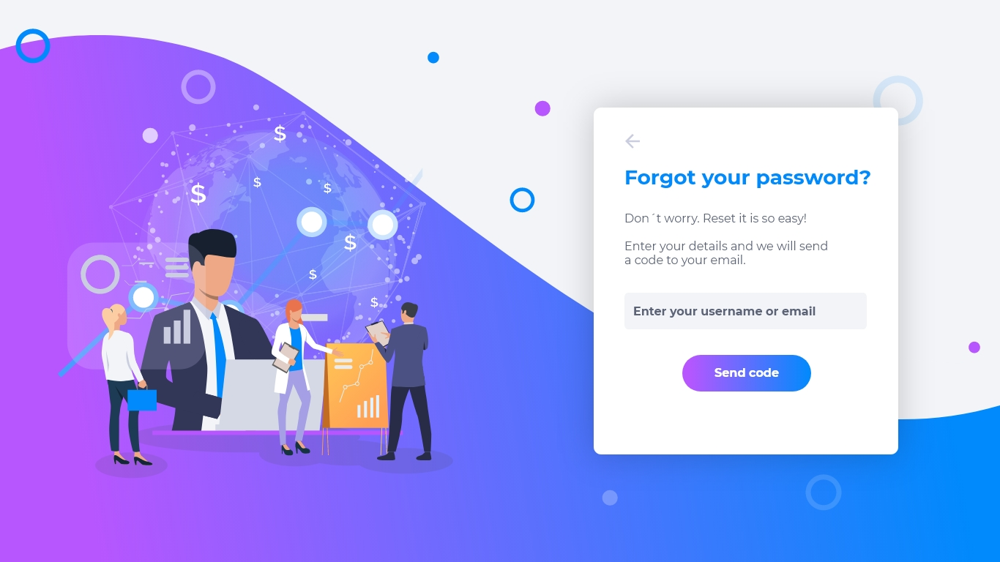
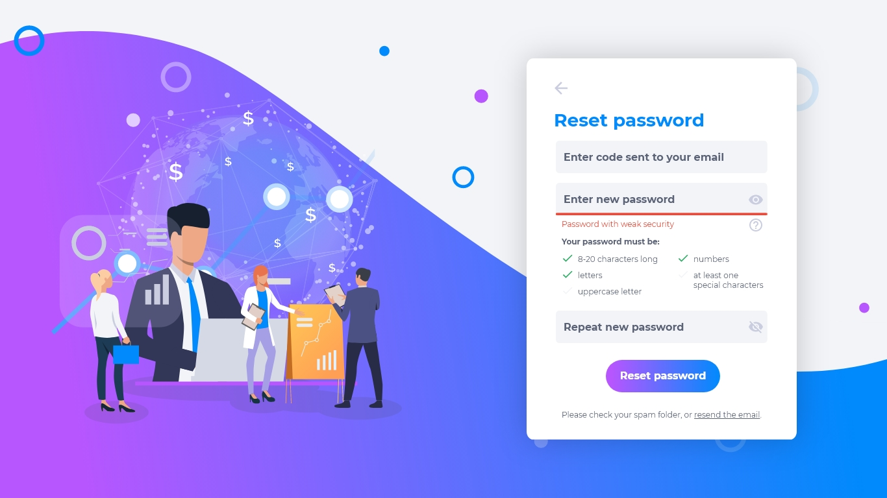

# 1.2. Recuperação de conta

Caso tenha perdido o acesso à sua conta, siga as próximas instruções.
 
## Esqueci minha senha

1. Clique em **esqueci a senha** na na página de login.

2. Na página de recuperação, insira o mesmo e-mail usado para o cadastro da sua conta na Axia Chronos.

3. Clique em **enviar código** e enviaremos um código de acesso que permitirá a troca da senha.

4. Insira o código recebido em seu e-mail ou copie e cole.

5. Redefina sua senha.

6. Caso não tenha recebido o código de acesso para a recuperação em seu e-mail, verifique em sua caixa de spam ou clique em **reenviar e-mail**.

💡 O código de acesso é gerado para garantir a autenticidade do usuário que está trocando a senha. É gerado um código novo para cada tentativa de resetar a senha. O código é individual, nunca compartilhe.

