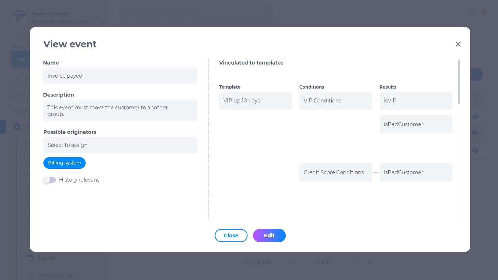

# Eventos
Eventos são quaisquer gatilhos que resultam na transição para uma nova etapa do processo. Os eventos podem vir de uma fonte externa, como um pagamento de cliente em um sistema de contas a receber, ou podem ser disparados internamente, como a expiração de um cronômetro, por exemplo o pagamento da fatura e desativação de contrato. Após um evento chegar ao sistema, o núcleo ficará responsável por executar uma tabela de decisão, para verificar o que deve acontecer após o evento. O sistema pode atualizar os dados ou fazer com que as contas a receber em atraso executem ações específicas. Deve ser possível configurar linhas do tempo para eventos, por isso, ao receber um evento deve ser possível atribuir a instância do cliente à outra linha do tempo que será considerado como **cronograma do evento**, diferente dos cronogramas permanentes e, ao atribuir ao evento, a linha do tempo original será pausada.

## Lista de eventos
A lista de eventos contém:
* Nome do evento
* Editar
* Deletar
* Visualizar

## Como adicionar um evento
1. Clique em **adicionar**.
2. Insira o nome.
3. Insira uma descrição.
4. Selecione a origem.
5. Opção para selecionar o histórico.
6. Opção para vincular à um template.

## Como configurar um template de evento
Quando o eventor for vinculado à um template:
1. Selecione o template.
2. Selecione as condições.
3. Selecione o resultado.

## Como editar um evento
Para editar um evento, clique em **editar**. É possível modificar:
* Nome do evento
* Descrição
* Origem
* Histórico
* Template

## Como deletar um evento
Para deletar um evento, clique em **deletar**. Excluir um evento é um procedimento irreversível e fará com que todas as suas configurações sejam deletadas. Caso queira recuperá-lo, terá que criar um novo.

## Como visualizar um evento
Para visualizar um evento, clique em **visualizar**. Pesquise o nome na caixa de pesquisa caso não esteja visualizando o que procura.

