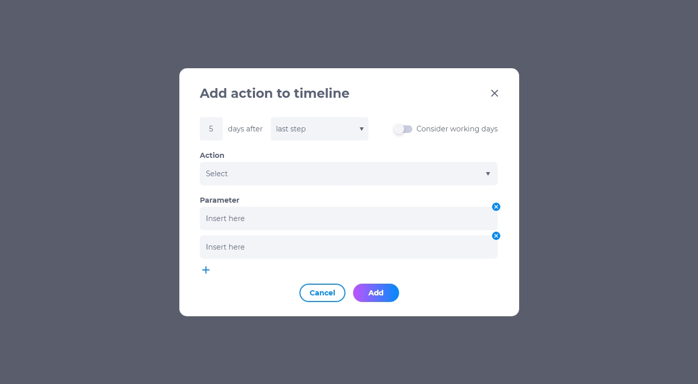
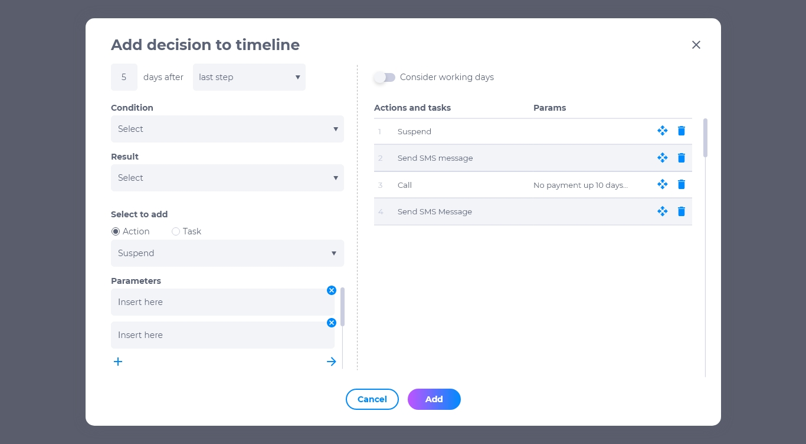
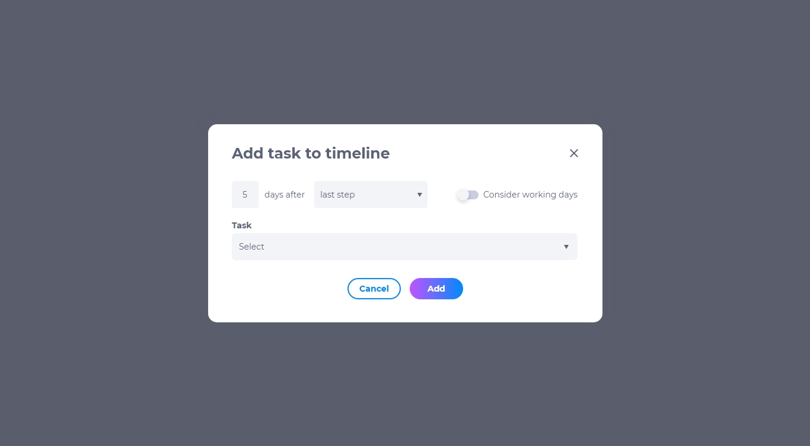

# Ações, decisões e tarefas

## Adicionando ações à linha do tempo
Ao selecionar uma ação, deve-se permitir selecionar das listas de ações, uma a ser executada. Podem haver várias etapas a serem executadas em um único dia, a lista na tela define a sequência a ser executada em um determinado dia. A ação também deve permitir seguir o calendário de negócios. Para adicionar à linha do tempo:
1. Clique em **+ ação**.
2. Configure quantos dias a ação deverá ocorrer após a última ação, decisão ou tarefa ocorrida.
3. Selecione se deve ser considerado os dias úteis.
4. Selecione a ação.
5. Insira os parâmetros.

## Adicionando decisões à linha do tempo
As decisões são um conjunto de condições configuradas em [Decisões de linha do tempo](11.2.md). Para adicionar à linha do tempo:
1. Clique em **+ decisão**
2. Configure quantos dias a decisão deverá ocorrer após a última ação, decisão ou tarefa ocorrida.
3. Selecione a condição.
4. Selecione o resultado.
5. Selecione uma ação ou tarefa para ser executada após a decisão.
6. Insira os parâmetros.
7. Selecione se deve ser considerado os dias úteis.

## Adicionando tarefas à linha do tempo
Tarefas são qualquer ação que requer interações humanas. Para saber mais sobre tarefas, clique [aqui](3/../../3/3.md). Para adicionar à linha do tempo:
1. Clique em **+ tarefa**.
2. Configure quantos dias a tarefa deverá ocorrer após a última ação, decisão ou tarefa ocorrida.
3. Selecione se deve ser considerado os dias úteis.
4. Selecione a tarefa.

