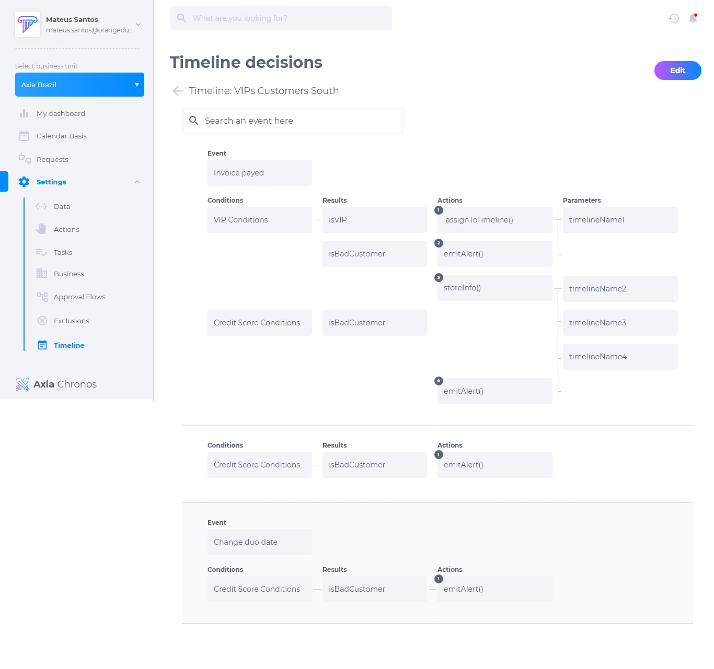

# Decisões de linha do tempo
A decisão é um conjunto de condições "e", "se", "senão" e "ou", que deve corresponder a um valor variável para determinar se algo é verdadeiro ou não. O resultado da decisão é a execução de uma ação, método de cobrança ou a atribuição de uma tarefa.

Deve haver uma decisão para configurar as possibilidades globais de tratamento de eventos. Deve-se inserir uma lista de eventos, adicionar as condições para cada evento e permitir as seguintes possibilidades como resultado:
* Ações
* Tarefas
* Métodos de cobrança

## Como configurar uma decisão de linha do tempo
1. Selecione a linha do tempo.
2. Selecione o evento.
3. Selecione as condições.
4. Selecione os resultados.
5. Selecione a ação.
6. Selecione os parâmetros.

## Como editar uma decisão de linha do tempo
Para editar uma decisão de linha do tempo, clique em **editar**. É possível modificar:
* Evento
* Condições
* Resultados
* Ações
* Parâmetros

