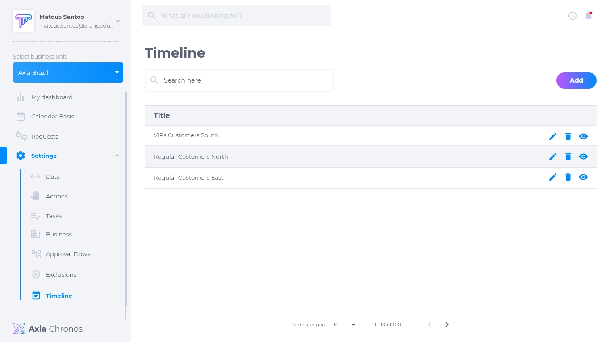
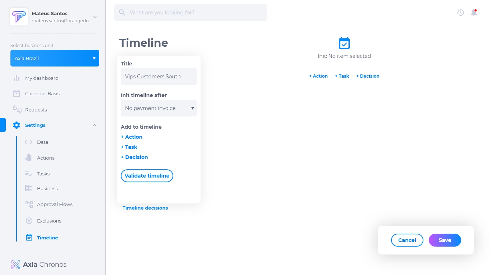
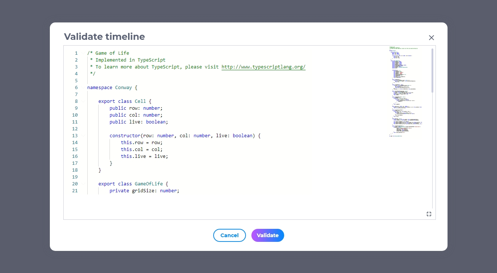
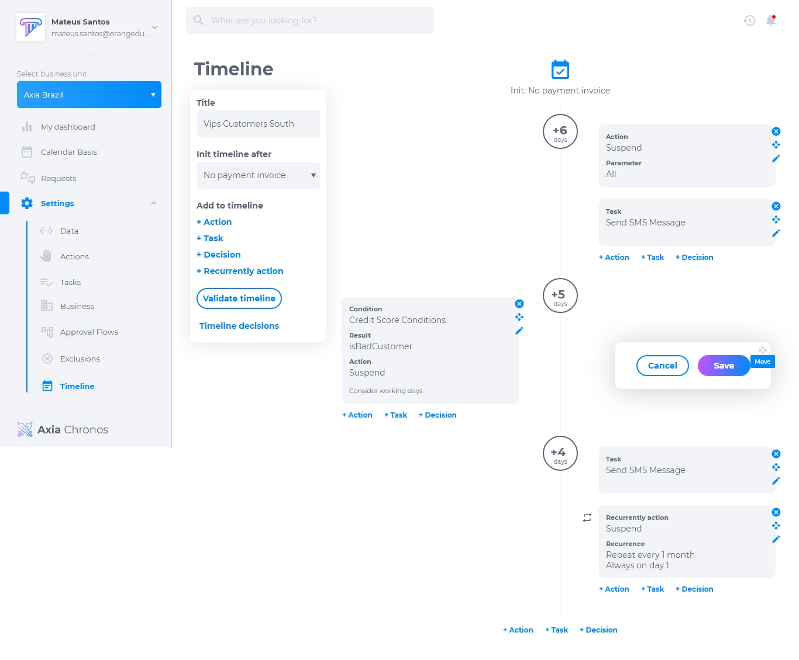
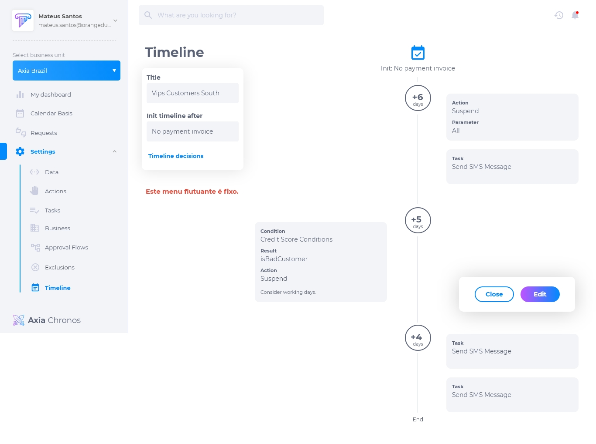

# Linha do tempo

O Axia Chronos usa a linha do tempo como núcleo para gerenciar as diferentes configurações do ciclo de vida. A linha do tempo representa uma sequência de possibilidades a serem executadas em dias específicos da vida do cliente. As possibilidades de execução são **ações, decisões e tarefas**.

A linha do tempo permite ao usuário definir a data de início de sua contagem, sendo que cada ação posterior é definida em um número de dias após a primeira data ou número de dias após a última etapa executada. Os eventos são informações externas que vão atingir a linha do tempo e podem modificar sua sequência, ou mesmo fazer com que ela termine.

O objetivo do cronograma é traduzir um calendário em um processo de negócios. Permitindo gerenciar os cenários de Cobranças de forma fácil, com uma interface amigável e lógica, e permitindo que os testes ocorram com facilidade, pois é possível simular datas para realização das execuções dos testes

## Lista de linha do tempo

A lista de linha do tempo contém:

* Título
* Editar
* Deletar../img/Timeline-List.jpg
* Visualizar

## Como adicionar uma linha do tempo

1. Clique em **adicionar**.
2. Insira o título.
3. Seleci../img/Timeline-Add.jpginha do tempo dará inicio.
4. Adicione à linha do tempo as ações, decisões e tarefas.
5. Clique../img/Timeline-Validate.jpgzar.

## Como editar a linha do tempo

Para editar uma linha do tempo, clique em **editar**. É possível modificar:

* Título../img/Timeline-Edit.jpg
* Condição de início
* Adicionar ações, decisões e tarefas
* Remover ações, decisões e tarefas
* Editar ações, decisões e tarefas

## Como delete uma linha do tempo

Para deletar uma linha do tempo, clique em **deletar**. Excluir uma linha do tempo é um procedimento irreversível e fará com que todas as suas configurações sejam apagadas. Caso queira recuperá-la, terá que criar uma nova.

## Como visualizar uma linha do tempo

Para visualizar uma linha do tempo, clique em **visualizar**. Pesquise o título na caixa de pesquisa caso não esteja visualizando o que procura.

