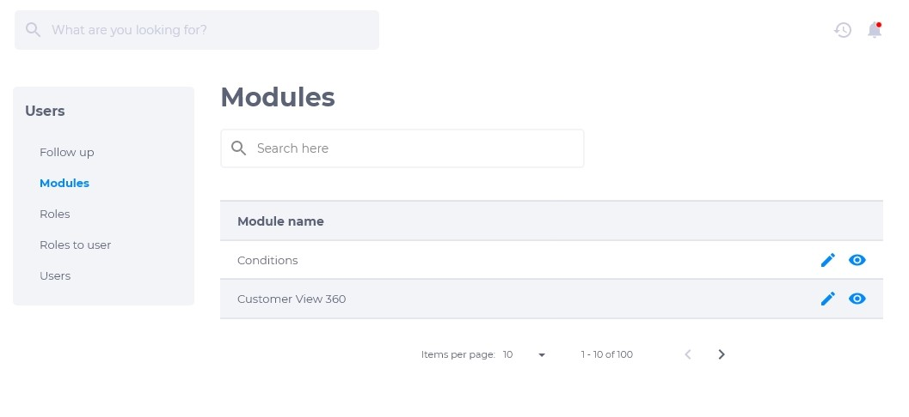

# 2.1. Módulos

Módulos são todas as funcionalidades que o sistema da Axia Chronos consegue executar. Podem ser tanto ações externas (para o consumidor), quanto internas (para os usuários). Na página de módulos é possível visualizar a lista dessas funcionalidades e editar sua descrição.

## Como editar descrição dos módulos
Para editar a descrição dos módulos, clique em **editar**. Descreva de acordo com o que o usuário desejar para o melhor entendimento sobre o módulo escolhido.

## Como visualizar módulos
Para visualizar a descrição de um módulo, clique em **visualizar**. A descrição deve conter os detalhes que o módulo executa.
