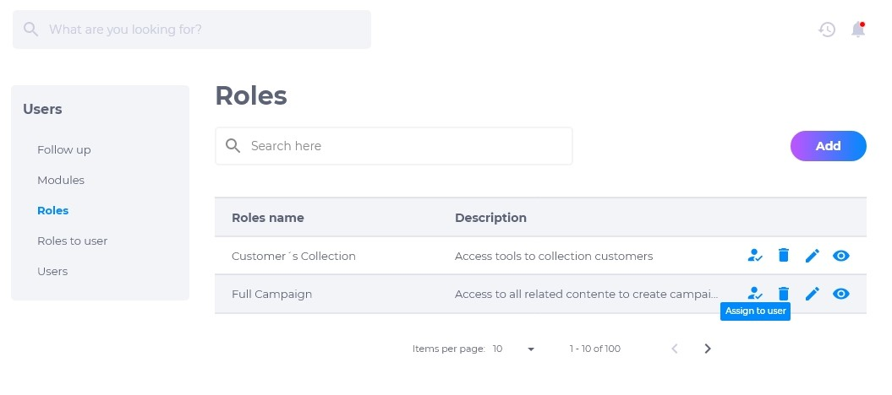
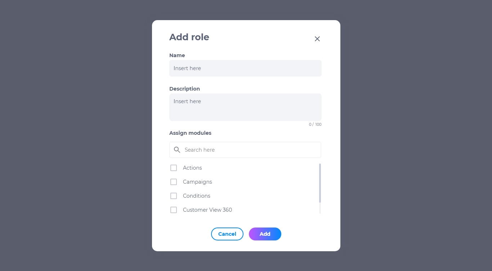
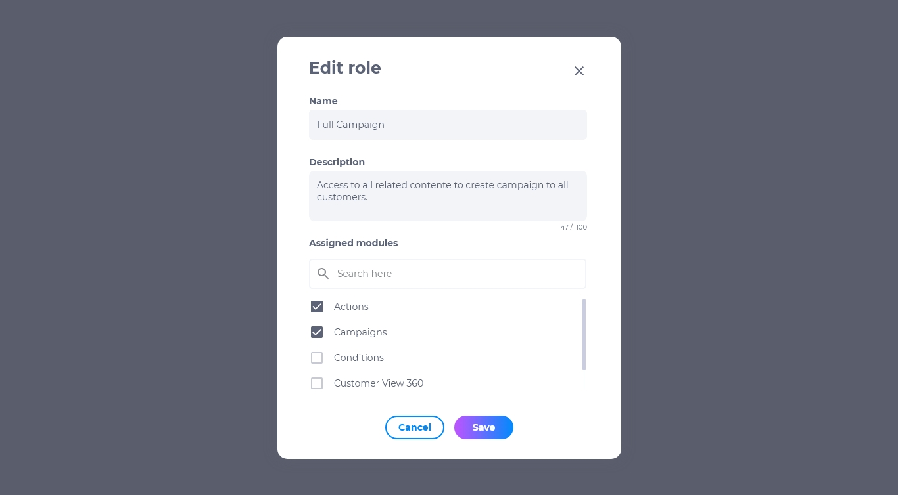
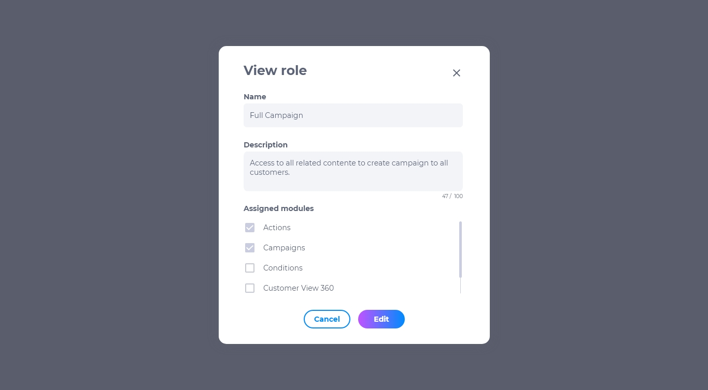

# 2.2. Função

As funções de um usuário podem variar de acordo com cada empresa. Cargos diferentes possuem funções diferentes, podendo ser executadas várias funções em um só cargo. Alguns exemplos de funções: administrador, gerente, operador, presidente.

## Lista de Funções
A lista de funções contém:

* Nome da função
* Atribuir à um usuário
* Editar
* Deletar
* Visualizar

## Como adicionar novas funções
1. Na página de funções, clique em **adicionar**.
2. Insira o nome do cargo a ser criado.
3. Selecione os módulos que este cargo poderá operar.
4. Clique no botão **adicionar**.

## Como editar função
Para editar uma função existente, procure a função desejada e clique em **editar**. É possível modificar:

* Nome do cargo
* Quais módulos a função pode operar

## Como deletar função
Para deletar uma função, clique em **deletar**. Excluir uma função é um procedimento irreversível e fará com que todas as suas configurações sejam apagadas. Caso queira recuperar a função, terá que criar uma nova.

## Como visualizar função
Para visualizar uma função, clique em **visualizar**. Pesquise o nome da função na caixa de pesquisa caso não esteja visualizando a função que procura.

