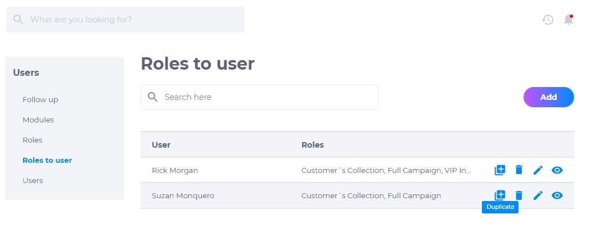
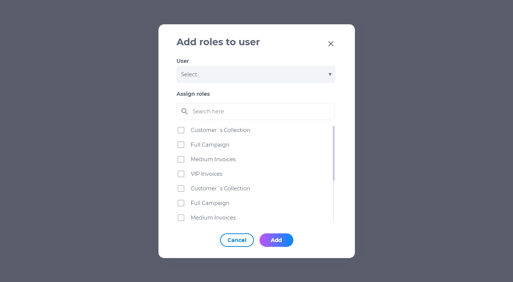
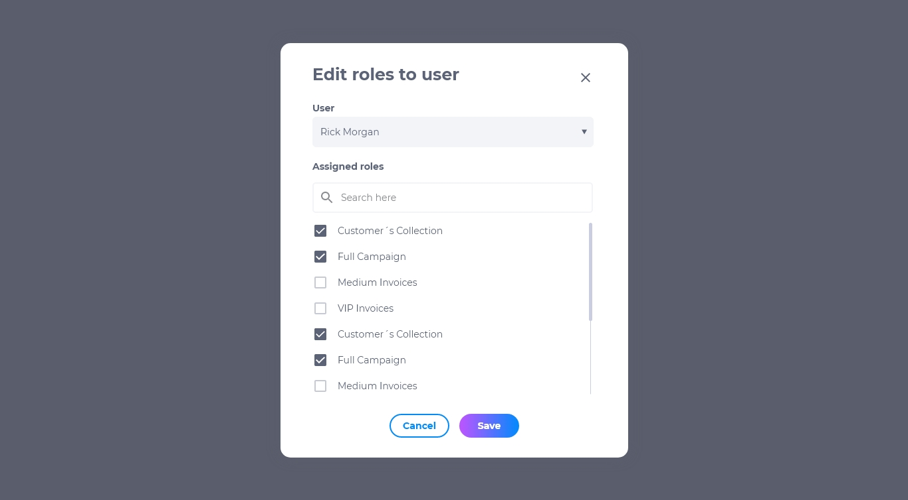
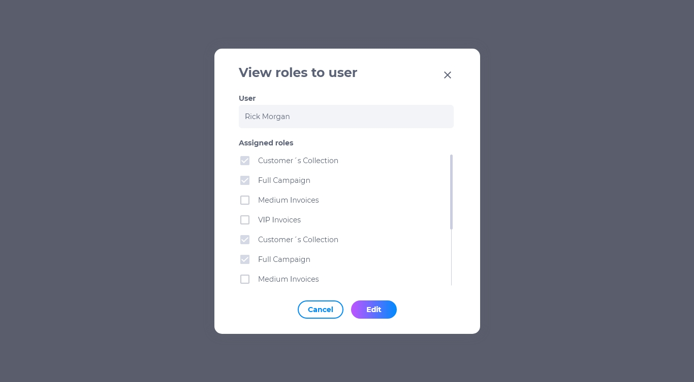

# 2.3 Funções de usuários 
Nesta sessão você poderá designar as funções de sua empresa para os usuários.

## Lista de funções de usuários
A lista de funções de usuários contém:

* Nome do usuário
* Função do usuário
* Duplicar
* Editar
* Deletar
* Visualizar
  

## Como adicionar uma função a um usuário

1. Na página de Funções de Usuários, clique em **adicionar**.
2. Selecione o nome do usuário.
3. Marque a função designada.
4. Clique no botão **adicionar** para concluir.

## Como editar função de usuários
Para editar uma função de usuário, procure o usuário desejado e clique em **editar**. É possível modificar:

* Trocar a função atual
* Acrescentar novas funções, sendo que um usuário poderá possuir mais de uma função na empresa

## Como deletar função de usuário
Para deletar uma função de usuário, clique em **deletar**. Excluir esta função é um procedimento irreversível e fará com que todas as suas configurações sejam deletadas. Caso queira recuperá-la, terá que criar uma nova.

## Como visualizar função de usuário
Para visualizar as funções de um usuário, clique em **visualizar**. Pesquise a função na caixa de pesquisa caso não esteja visualizando o que procura.

