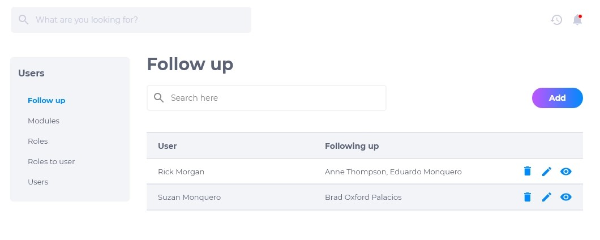
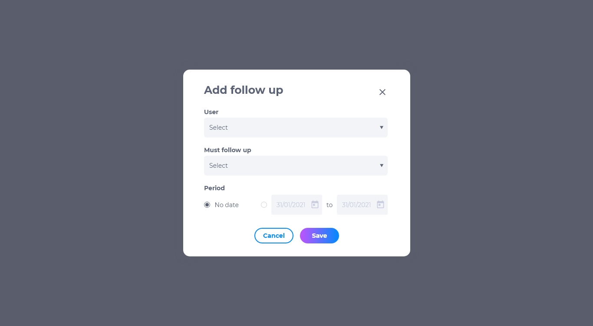
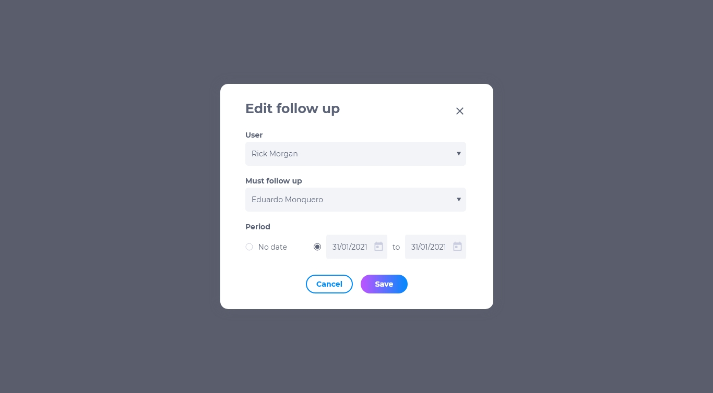

# 2.4 Acompanhar Usuário 
É possível designar um usuário para acompanhar e executar as tarefas de outro que esteja ausente ou impossibilitado de executá-las.

## Lista de acompanhamento de usuário
A lista de acompanhamento de usuário contém:

* Nome do usuário que está fazendo o acompanhamento
* Nome do usuário que está sendo acompanhado
* Editar
* Deletar
* Visualizar

## Como adicionar um acompanhamento de usuário
1. Clique em **adicionar**.
2. Selecione o nome do usuário que fará o acompanhamento.
3. Selecione o nome do usuário que será acompanhado.
4. Selecione as datas de início e término de vigencia.

## Como editar um acompanhamento de usuário
Para editar um acompanhamento, procure pelo acompanhamento que deseja modificar e clique em **editar**. É possível modificar:

* Usuário que está fazendo o acompanhamento
* Usuário que está sendo acompanhado
* Período em que ocorrerá o acompanhamento

## Como deletar um acompanhamento de usuário
Para deletar um acompanhamento de usuário, clique em **deletar**. Excluir um acompanhamento é um procedimento irreversível e fará com que todas as suas configurações sejam deletadas. Caso queira recuperar estas configurações, terá que criar um novo acompanhamento de usuário.

## Como visualizar um acompanhamento de usuário
Para visualizar um acompanhamento de usuário, clique em **visualizar**. É possível visualizar o usuários e o período de duração do acompanhamento.

