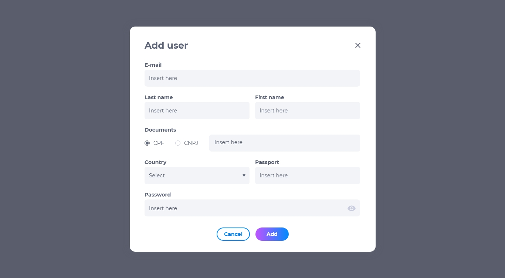

# 1. Usuários

Os usuários são funcionários ou entidades que possuem permissão para operar dentro da Axia Chronos, contanto que essas ações sejam permitidas dentro de suas funções. 

## Lista de usuários
A lista de usuários contém:

* E-mail do usuário
* Nome do usuário
* Editar
* Deletar
* Visualizar

## Como adicionar um usuário
* Na página de usuários, clique em **adicionar**.
* Preencha as informações pessoais do Usuário.
* Crie uma senha para o usuário.

## Como editar um usuário
Para editar um usuário, procure o usuário desejado e clique em **editar**. É possível modificar:

* E-mail
* Nome e sobrenome
* Número de CPF ou CNPJ
* País
* Passaporte
* Senha de acesso

## Como deletar um usuário
Para deletar um usuário, clique em **deletar**. Excluir um usuário é um procedimento irreversível fará com que todas as suas informações sejam deletadas. Caso queira recuperar estas informações, terá que criar um novo usuário.

## Como visualizar um usuário
Para visualizar um usuário, clique em **visualizar**. É possível visualizar todas as informações pessoais do usuário.

