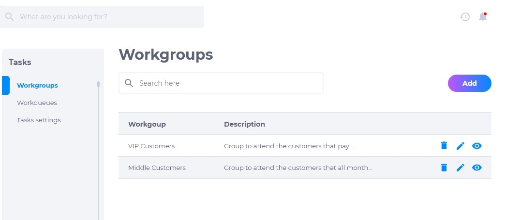
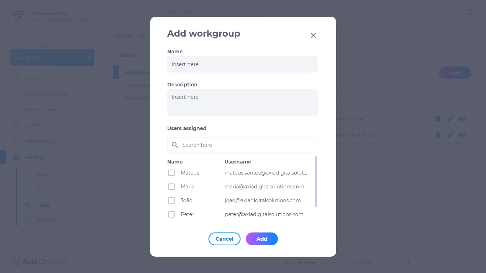
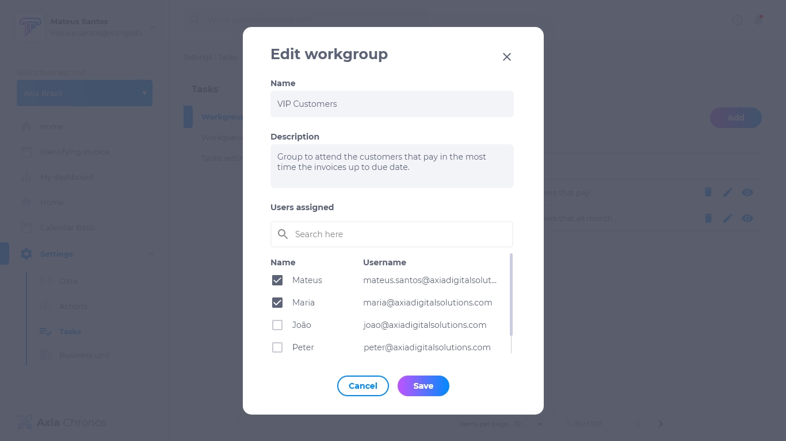
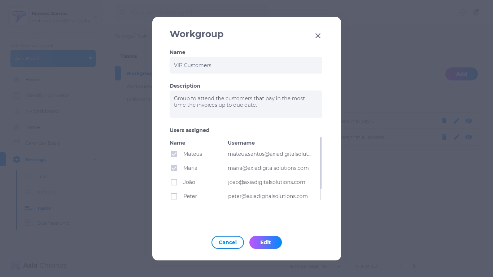

# 3. Grupos de Trabalho
Os grupos de trabalho são grupos formados por usuários de acordo com a divisão de departamentos da empresa. Cada grupo é responsável por executar certos tipos de tarefas.

## Lista de grupos de trabalho
A lista de grupos de trabalho contém:

* Nome designado ao grupo
* Descrição do grupo
* Editar
* Deletar
* Visualizar

## Como adicionar um grupo de trabalho
1. Na página de grupo de trabalho, clique em **adicionar**.
2. Insira o nome do grupo.
3. Insira a descrição do grupo.
4. Selecione os usuários designados.

## Como editar um grupo de trabalho
Para editar uma grupo de trabalho existente, procure o grupo desejado e clique em **editar**. É possível modificar:

* Nome
* Descrição
* Usuários

## Como deletar um grupo de trabalho
Para deletar uma grupo de trabalho, clique em **deletar**. Excluir um grupo é um procedimento irreversível e fará com que todas as suas configurações sejam deletadas. 
Caso queira recuperá-lo, terá que criar um novo.

## Como visualizar um grupo de trabalho
Para visualizar um grupo de trabalho, clique em **visualizar**. Pesquise o nome do grupo na caixa de pesquisa caso não esteja visualizando o que procura.

