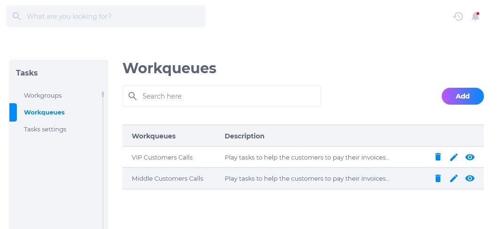
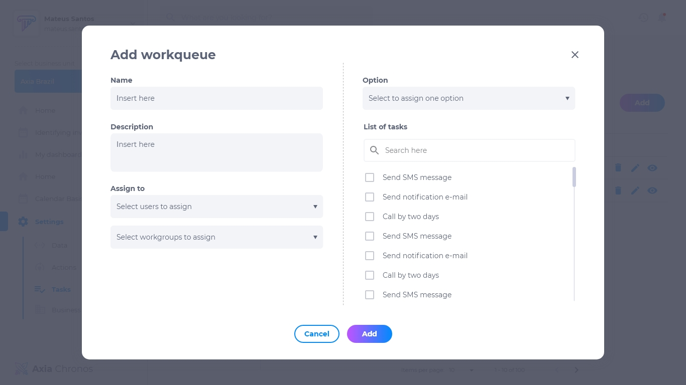
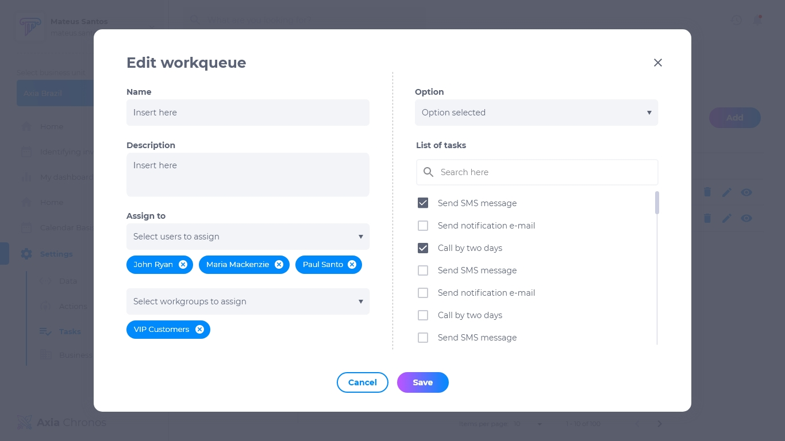
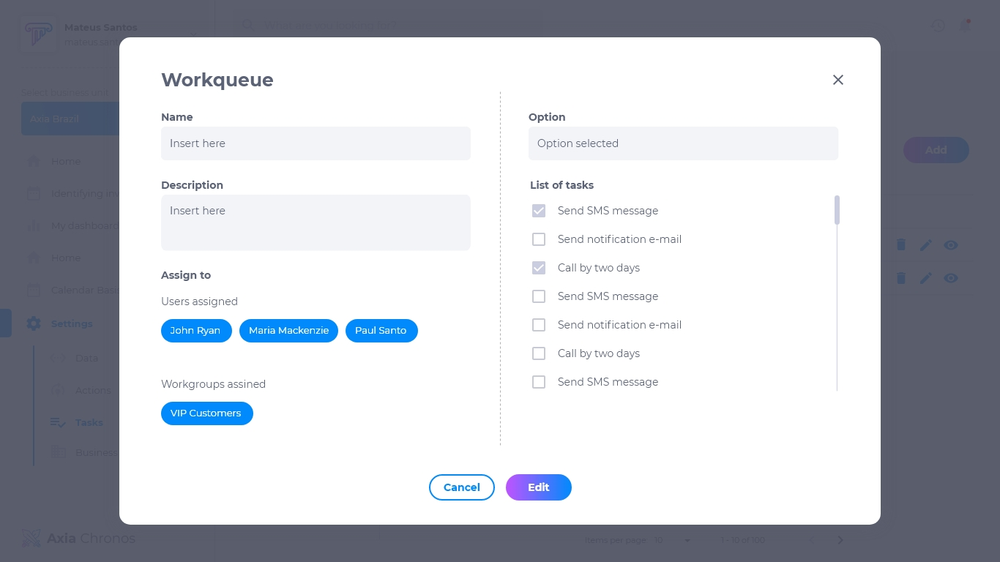

# 3.2. Fila de tarefas
A fila de tarefas configura a ordem de distribuição de tarefas para cada grupo ou usuário.

## Lista de fila de tarefas
A lista de fila de tarefas contém:

* Nome da fila de tarefas
* Descrição da fila de tarefas
* Editar
* Deletar
* Visualizar

## Como adicionar uma fila de tarefas
1. Na página de fila de tarefas, clique em **adicionar**.
2. Insira o nome.
3. Insira a descrição.
4. Selecione o grupo ou usuários designados.
5. Selecione se a tarefa é manual ou automatizada.
6. Selecione quais tarefas devem ser realizadas.

## Como editar uma fila de tarefas
Para editar uma fila de tarefa, procure a fila de tarefa desejada e clique em **editar**. É possível modificar:

* Nome
* Descrição
* Usuários
* Opção manual ou automática
* Lista de tarefas

## Como deletar uma fila de tarefas
Para deletar uma fila de tarefa, clique em **deletar**. Excluir uma fila é um procedimento irreversível e fará com que todas as suas configurações sejam deletadas. Caso queira recuperá-la, terá que criar uma nova.

## Como visualizar uma fila de tarefas
Para visualizar uma fila de tarefa, clique em **visualizar**. Pesquise o nome da fila na caixa de pesquisa caso não esteja visualizando o que procura.

## Tarefa manual
Uma tarefa manual é uma tarefa realizada por um usuário.

## Tarefa automatizada
Uma tarefa automatizada é uma tarefa realizada pelo sistema da Axia Chronos.
