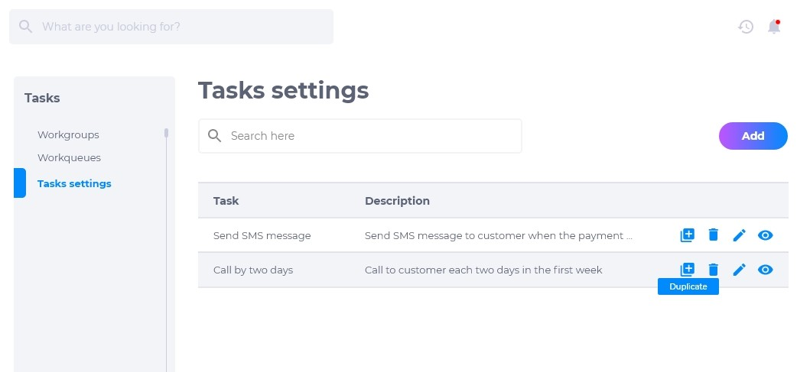
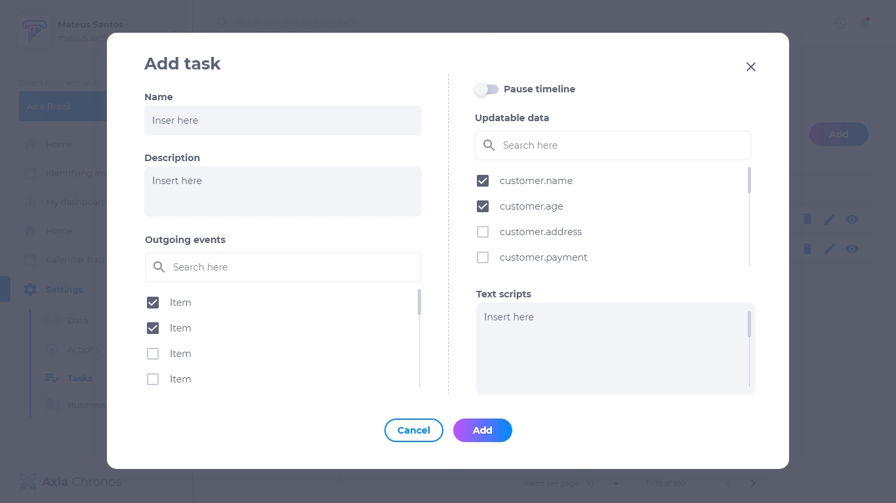
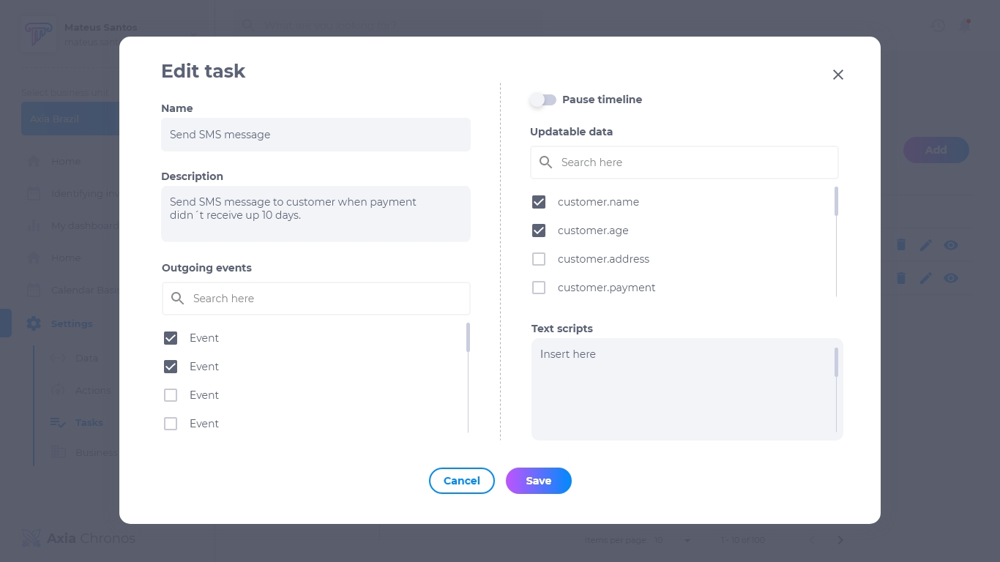
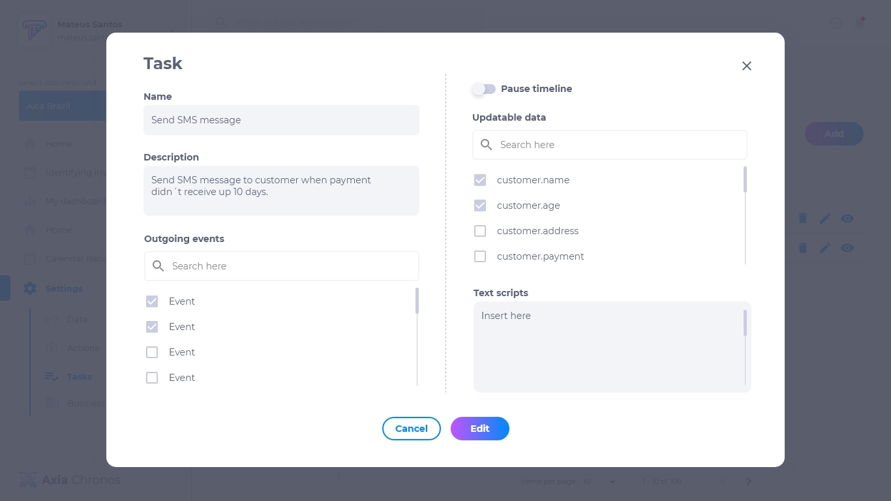

# Configuração de tarefas
Nesta seção é possível configurar quais tarefas necessitam ser executadas manualmente por um usuário, e designá-las para os grupos de trabalho ou usuários responsáveis por executá-las. É possível, também, configurar uma fila de trabalho que ajude a distribuir as tarefas.

## Lista de tarefas
A lista de tarefas contém:

* Nome da tarefa
* Descrição
* Duplicar
* Editar
* Deletar
* Visualizar

## Como criar uma tarefa
1. Na página de configuração de tarefas, clique em **adicionar**. 
2. Insira o nome da tarefa.
3. Insira a descrição da tarefa.
4. Selecione os eventos.
5. Se necessário, pause a linha do tempo.
6. Selecione os dados atualizáveis.
7. Escreva o roteiro de conversa que a empresa utilizará.

## Como duplicar uma tarefa
Para duplicar uma tarefa, clique em **duplicar**. Isso fará com que a tarefa seja duplicada com as mesmas configurações da original para que possa editá-la.

## Como editar uma tarefa
Para editar uma tarefa, clique em **editar**. É possível modificar:

* Nome da tarefa
* Descrição da tarefa
* Eventos
* Pausar linha do tempo
* Dados atualizáveis
* Roteiro de conversa

## Como deletar uma tarefa
Para deletar uma tarefa, clique em **deletar**. Excluir uma tarefa é um procedimento irreversível e fará com que todas as suas configurações sejam deletadas. Caso queira recuperá-la, terá que criar uma nova.

## Como visualizar uma tarefa
Para visualizar uma tarefa, clique em **visualizar**. É possível visualizar as atuais configurações.

## Eventos
Os eventos podem variar para cada empresa. Confira as opções que sua empresa oferece e escolha os eventos de acordo com o objetivo da tarefa que está sendo configurada.

## Pausar a linha do tempo
É possível pausar a linha do tempo de um cliente para que seja planejado os próximos passos do processo. Caso a linha do tempo seja pausada, qualquer atividade automatizada será suspensa.

## Dados atualizáveis
Os dados atualizáveis são informações do cliente que podem ou devem ser atualizados durante esta tarefa.

## Roteiro de conversa
O roteiro de conversa serve para auxiliar o usuário a interagir com o cliente de acordo com o que a empresa demanda.
