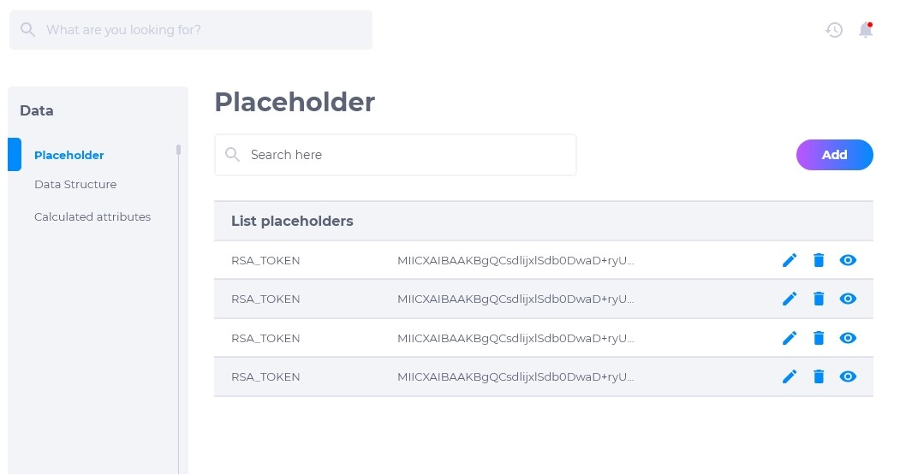
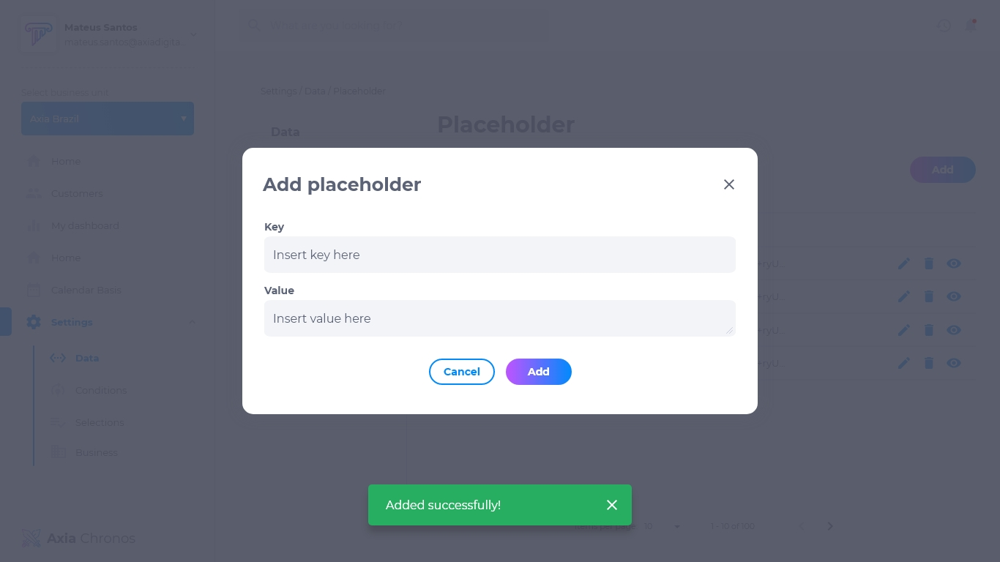
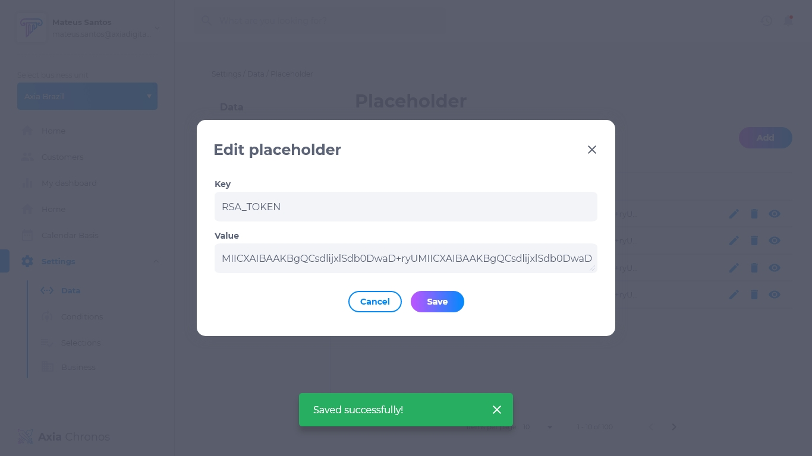

# 4.1. Placeholder

No placeholder pode ser feita configurações pré-definidas de chaves, ou seja, o operador pode configurar uma chave que representa um código para ser usado posteriormente, facilitando na estruturação de dados.

## Lista de placeholders
A lista de placeholder contém:
* Nome da chave
* Código da chave
* Editar
* Deletar
* Visualizar

## Como adicionar um placeholder
1. Na página Placeholder, clique em **adicionar**.
2. Insira o nome da chave a ser criada.
3. Insira o valor da chave.
4. Clique no botão **adicionar**.

## Como editar um placeholder
Para editar um placeholder existente, procure o placeholder que deseja e clique em **editar**. É possível modificar:
* Nome da chave
* Valor da chave

## Como deletar um placeholder
Para deletar um placeholder, clique em **deletar**. Excluir um placeholder é um procedimento irreversível e fará com que todas as suas configurações sejam apagadas. Caso queira recuperá-los, terá que criar uma nova chave.

## Como visualizar em placeholder
Para visualizar um placeholder, clique em **visualizar**. Pesquise o nome da chave na caixa de pesquisa caso não esteja visualizando o que procura.

