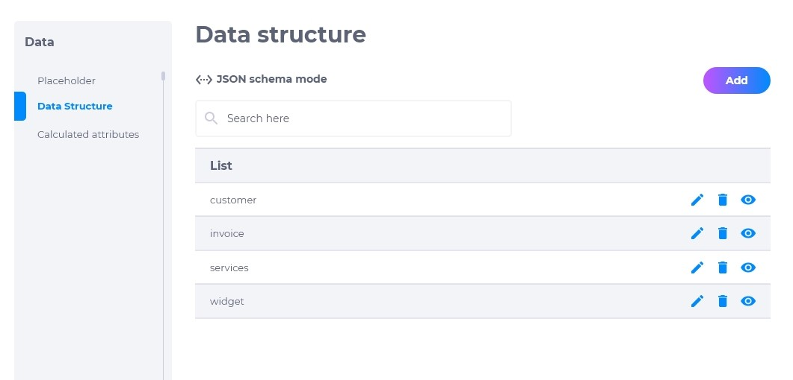
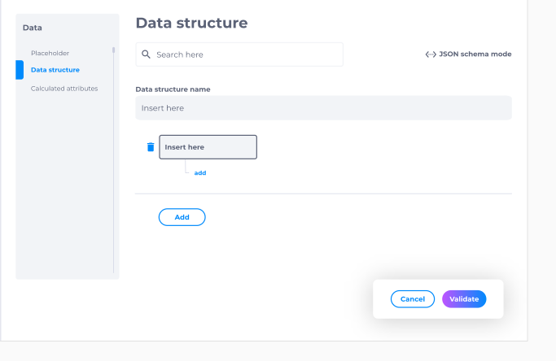
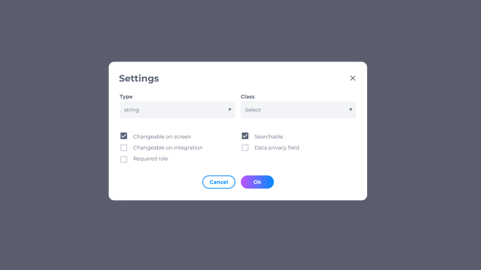
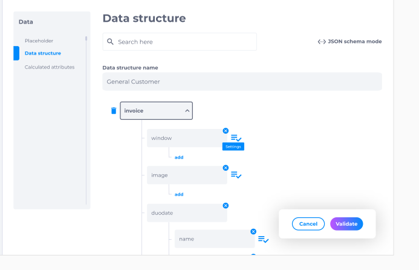
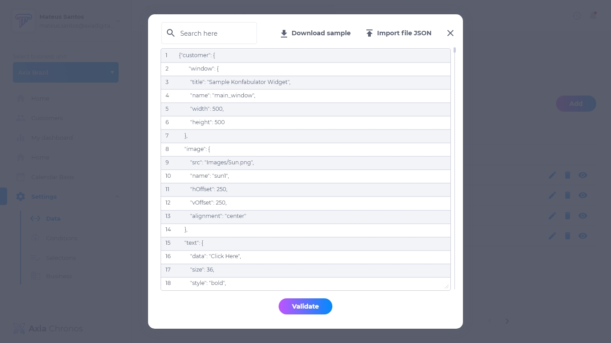

# 4.2. Data Structure

No Data Struture é possível customizar a estrutura da Axia Chronos, de acordo com o que a empresa deseja. A customização pode ser feita manualmente na plataforma do Chronos, ou pode ser importado um arquivo JSON já completo.

## Lista de data structure
A lista do data structure contém:
* Nome do dado
* Editar
* Deletar
* Visualizar

## Como adicionar uma estrutura de dados
Para adicionar uma estrutura de dados, clique em **adicionar**. Insira o nome do dado a ser configurado e selecione as opções e configurações que deseja.

## Como editar dados
Para editar um dado existente, procure o dado desejado e clique em **editar**. É possível modificar manualmente toda a estrutura do dado escolhido.

## JSON schema mode
Para fazer o upload de uma estrutura JSON:
1. Clique em **editar**.
2. Clique en **JSON schema mode**.
3. Clique em **importar arquivo**.
4. Selecione o arquivo JSON.
5. Clique em **validar**.

💡 Faça o download da amostra JSON para facilitar na estruturação de dados.

