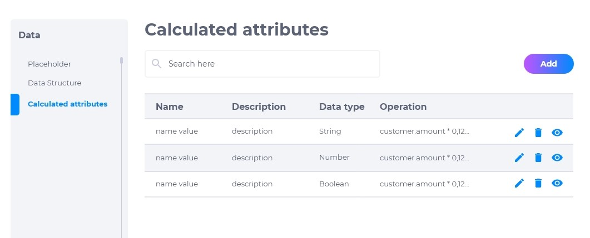
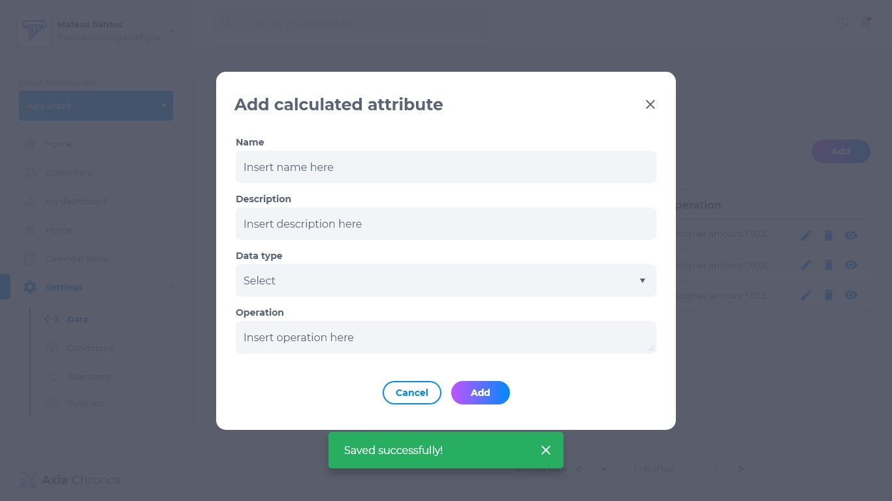
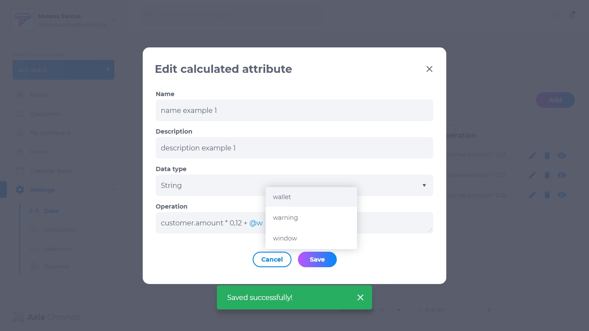

# 4.3. Atributo Calculado

Este é um atributo calculado que forneceremos por padrão para nossos clientes. É calculável, com base em um cálculo matemático em contas a receber vencidas e existentes, parâmetros que devemos dar um número de pontuação. Isso pode ser usado na tabela de decisão de seleção, na tela de agentes, no aprendizado de máquina, etc.

É necessário ter uma GUI interna para configurar propriedades de atributos. Será possível criar atributos calculados internos, esses atributos serão calculados com base nos atributos recebidos. Nesta GUI será possível criar, pesquisar, ler, deletar e modificar os atributos calculados internos.

Um atributo calculado executa operações básicas:

* Pode ser um valor booleano, nesse caso, ele irá considerar os atributos recebidos para retornar se é verdadeira ou não alguma condição.
* Pode ser um número calculado, neste caso, é um valor flutuante, que pode considerar um número flutuante usando operações matemáticas (+, -, /, *,%) em um atributo recebido.
* Pode ser uma string correspondente, nesse caso, ele pode usar a expressão Regex para criar uma nova string.

 Os atributos recebidos que serão usados no cálculo, é qualquer valor dentro da estrutura do cliente, é necessário permitir a iteração entre as partes e os atributos para realizar o cálculo. Os atributos calculados devem ser gerados antes da execução da decisão.
 
 ## Lista de Atributo Calculado
 A lista de atributo calculado contém:
 * Nome do atributo
 * Descrição
 * Tipo de dado
 * Operação
 * Editar
 * Deletar.
 * Visualizar

## Como adicionar um atributo calculado
1. Clique em **adicionar**.
2. Insira o nome.
3. Insira a descrição.
4. Selecione o tipo de dado.
5. Insira a operação.
6. Clique em **adicionar** para finalizar.

## Como editar um atributo calculado
Para editar um atributo calculado, clique em **editar**. Será possível modificar:
* Nome
* Descrição
* Tipo de dado
* Operação

## Como deletar um atributo calculado
Para deletar um atributo, clique em **deletar**. Excluir um atributo é um procedimento irreversível e fará com que todas as suas configurações sejam apagadas. Caso queira recuperá-lo, terá que criar um novo.

## Como visualizar um atributo calculado
Para visualizar um atributo, clique em **visualizar**. Pesquise o nome do atributo na caixa de pesquisa caso não esteja visualizando o que procura.

