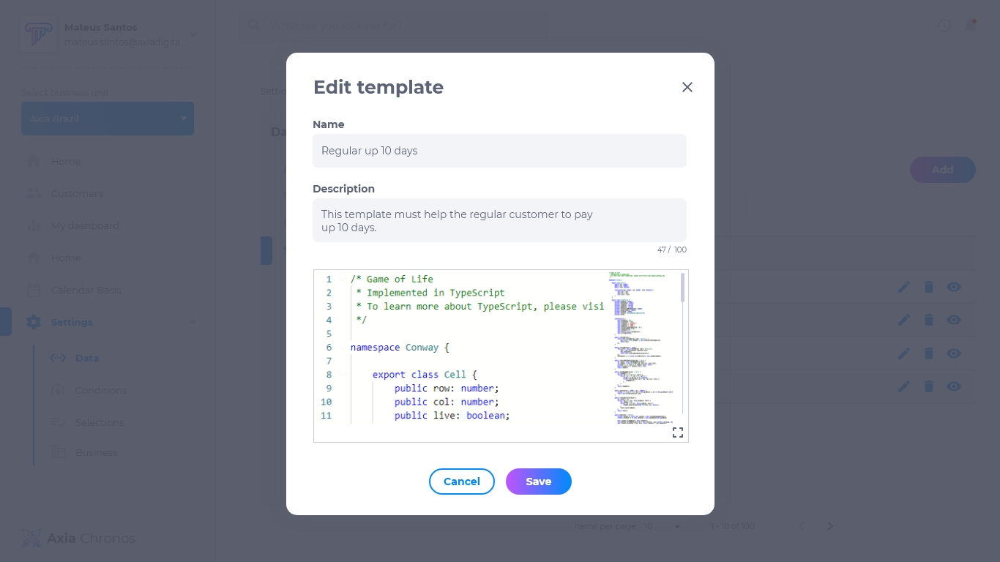

# 4.4 Templates

A seção de Templates serve para criar um padrão já definido de configurações de dados gerais para aplicação em massa de dados.

## Lista de templates
A lista de templates contém:
* Nome do template
* Editar
* Deletar
* Visualizar

## Como adicionar um template
1. Clique em **adicionar**.
2. Insira o nome.
3. Insira a descrição.
4. Digite ou copie e cole o código.

## Como editar um template
Para editar um template, clique em **editar**. Será possível modificar:
* Nome
* Descrição
* Código

## Como deletar um template
Para deletar um template, clique em **deletar**. Excluir um template é um procedimento irreversível e fará com que todas as suas configurações sejam apagadas. Caso queira recuperá-lo, terá que criar um novo.

## Como visualizar um template
Para visualizar um template, clique em **visualizar**. Pesquise o nome do template na caixa de pesquisa caso não esteja visualizando o que procura.

