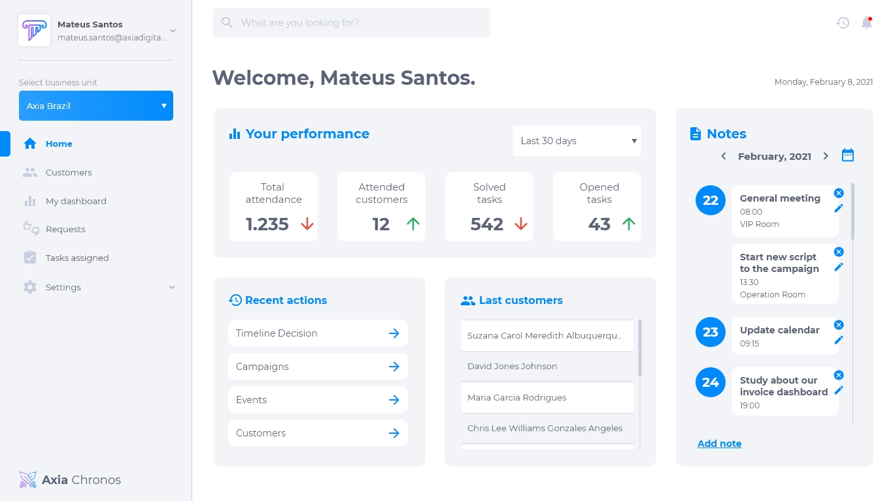
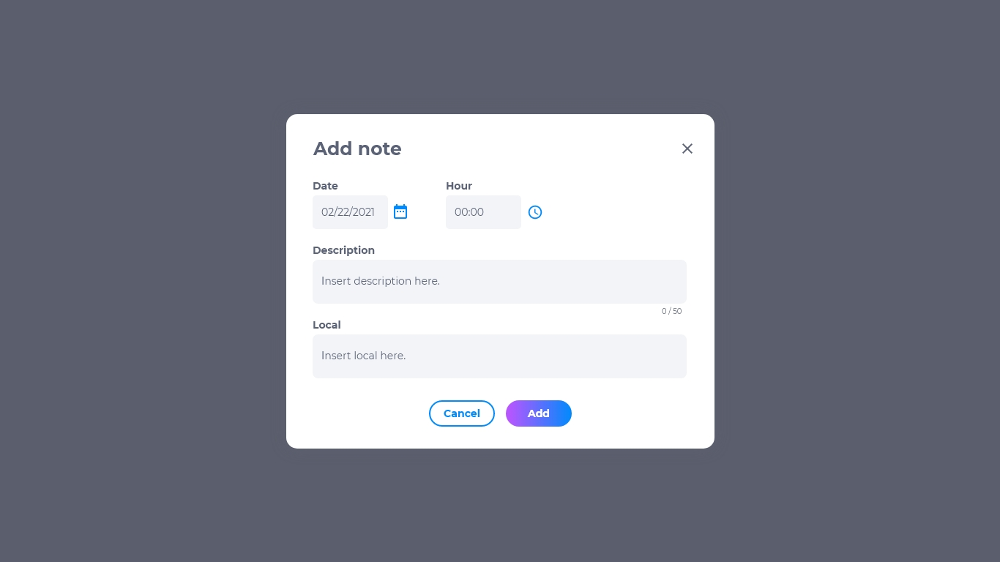
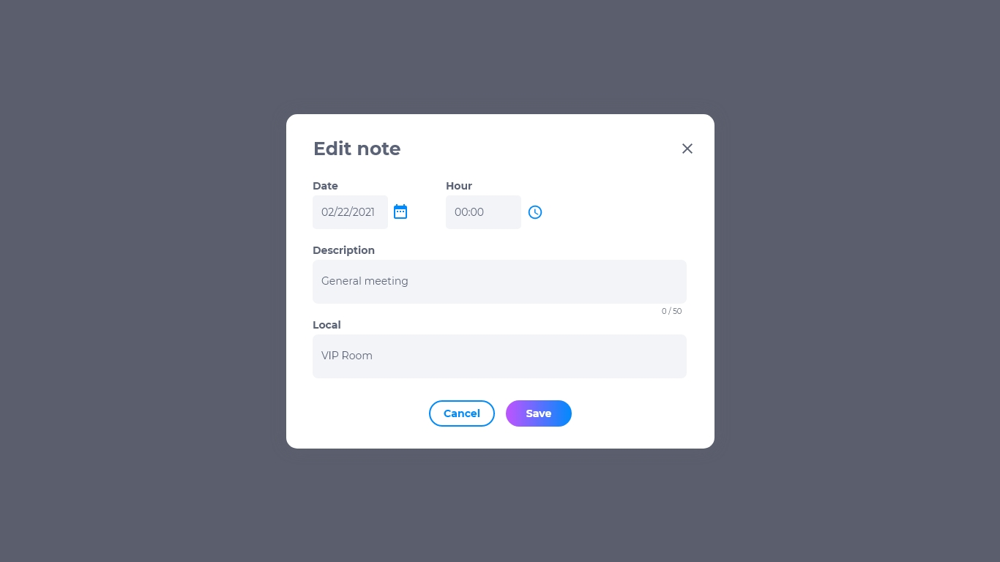

# Página inicial

A página inicial possui informações úteis para o operador, como o desempenho, ações recentes, registro de chamadas com clientes e um quadro com anotações de lembretes. Esse ambiente possibilita a maximização do desempeho do usuário através de informações organizadas e registro de dados.

## Desempenho
O quadro de desempenho possui um filtro, no qual o usuário pode escolher configurar os dados de desempenho baseado no números de dias ou meses anteriores. É possível observar o total de atendimentos, clientes atendidos, tarefas resolvidas e tarefas em aberto.

## Ações recentes
As ações recentes mostram quais foram as últimas ações executadas por aquele usuário. É possível clicar na ação para ver mais detalhes sobre aquela tarefa.

## Registro de chamadas
O registro de chamadas informa quais foram os últimos clientes atendidos por aquele usuário.

## Notas
O quadro de notas está atrelado à um calendário, no qual o usuário poderá adicionar as suas próprias anotações sobre tarefas e ações que ele precisa executar. É possível visualizar o calendário para consultar anotações passadas e futuras.

## Como adicionar uma nota
1. Na página inicial, clique em **adicionar** no quadro de notas.
2. Insira a data em que a nota deve aparecer.
3. Insira a hora.
4. Insira uma descrição.
5. Insira um local, se necessário.

## Como editar uma nota
Para editar uma nota, clique no botão **editar** localizado ao lado da nota desejada. É possível modificar:
* Data
* Hora
* Descrição
* Local

## Como deletar uma nota
Para deletar uma nota, clique no botão **deletar (X)**, localizado ao lado da nota desejada.
