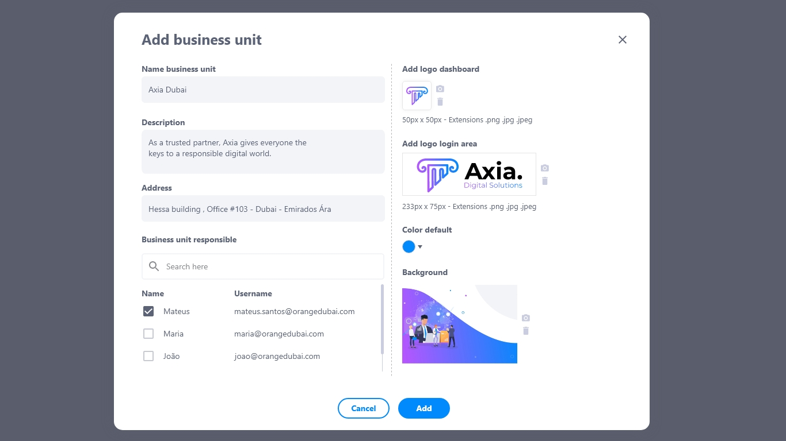

## Dados de unidades
Nos dados de unidades é possível visualizar todas as unidades que a empresa possui em diferentes regiões ou países.

## Lista de dados de unidades
A lista de dados de unidades possui:
* Nome e especificação da unidade
* Descrição
* Deletar
* Editar
* Visualizar

💡 A unidade matriz não pode ser deletada

## Como adicionar uma unidade de negócio
1. Clique em **adicionar**.
2. Insira o nome da unidade.
3. Insira a descrição.
4. Informe o endereço.
5. Selecione o usuário responsável pela unidade.
6. Configure a identidade visual.

## Como editar uma unidade de negócio
Para editar uma unidade, clique em **editar**. Será possível modificar:
* Nome da unidade
* Descrição
* Endereço
* Usuário responsável 
* Identidade visual

## Como deletar uma unidade de negócio
Para deletar uma unidade, clique em **deletar**. Excluir uma unidade é um procedimento irreversível e fará com que todas as suas configurações sejam deletadas. Caso queira recuperá-la, terá que criar uma nova.

## Como visualizar uma unidade de negócio
Para visualizar uma unidade, clique em **visualizar**. Pesquise o nome da unidade na caixa de pesquisa caso não esteja visualizando o que procura.