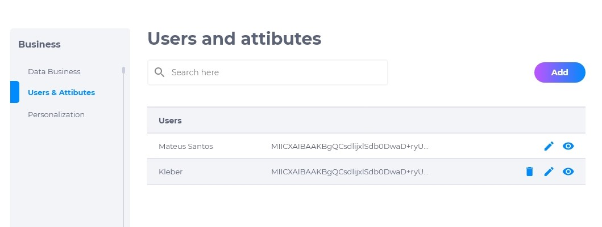
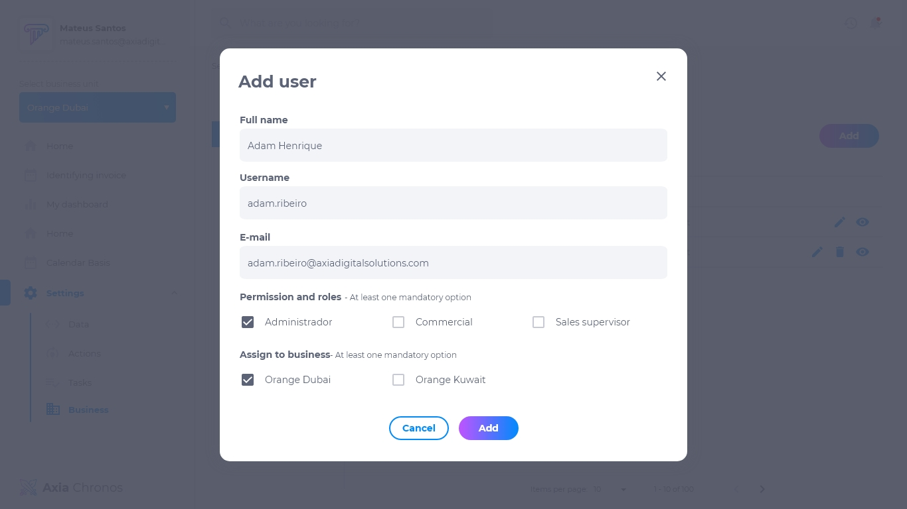

# Usuários e atributos
Nesta seção é possível atribuir usuários para unidades de negócios diversos, ou seja, se a empresa possui unidades espalhadas pelo país ou pelo mundo, é possível selecionar em qual das unidades o usuário estará atuando.

## Como atribuir um usuário
1. Clique em **adicionar**.
2. Insira o nome.
3. Insira o username.
4. Informe o e-mail do usuário.
5. Assinale qual é a função.
6. Assinale qual é a unidade de negócio.

## Como editar uma atribuição
Para editar uma atribuição, clique em **editar**. É possível modificar:
* Nome
* Username
* E-mail
* Função
* Unidade de negócio

## Como deletar uma atribuição
Para deletar um atribuição, clique em **deletar**. Excluir uma atribuição de negócios é um procedimento irreversível e fará com que todas as suas configurações sejam apagadas. Caso queira recuperá-la, terá que criar uma nova.

