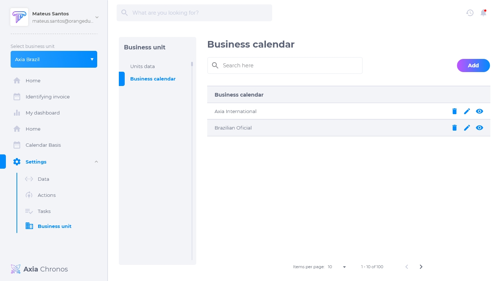
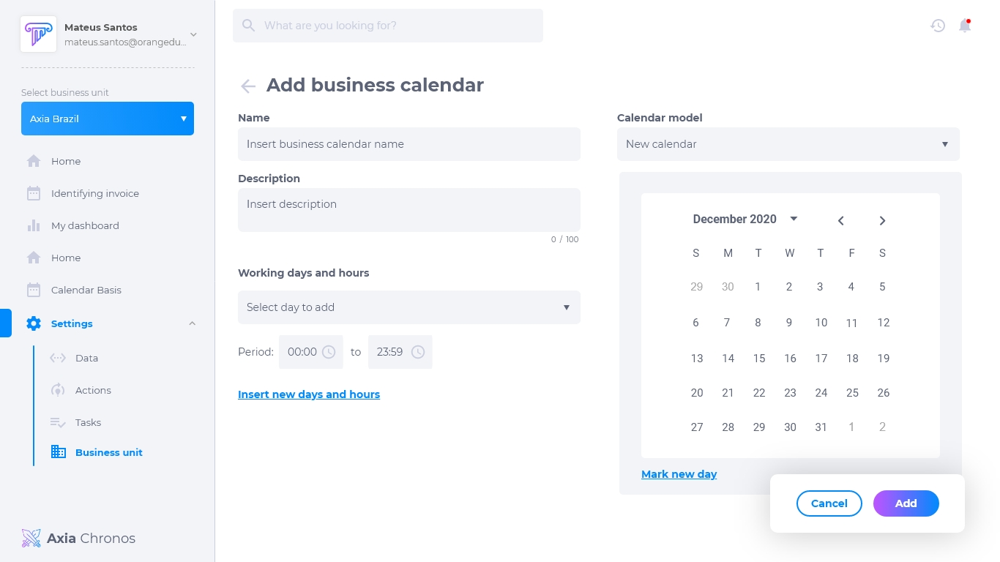
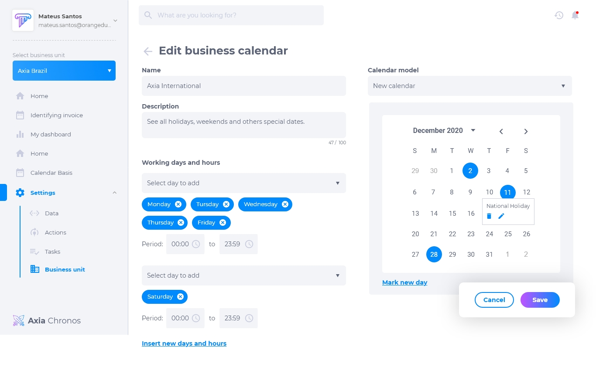
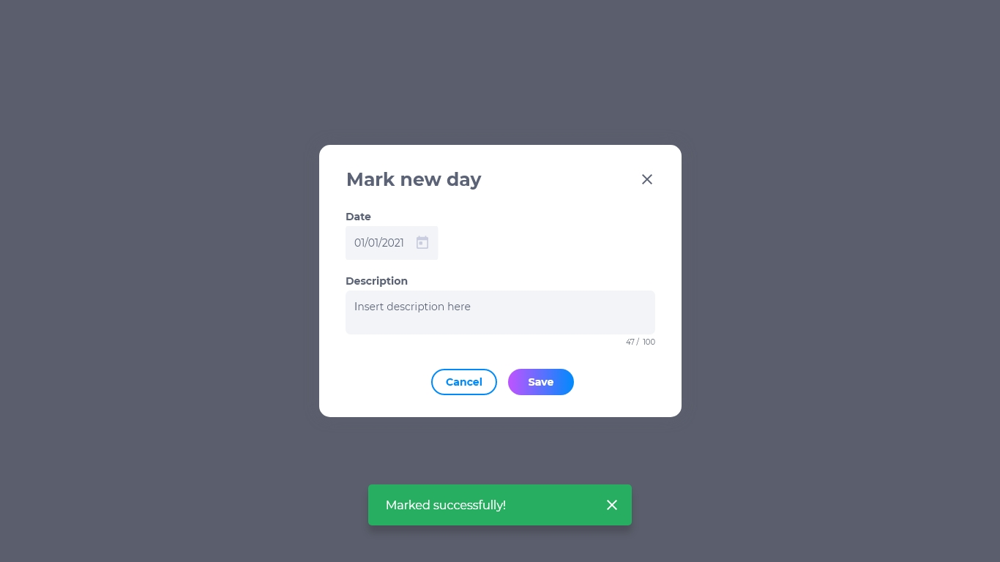
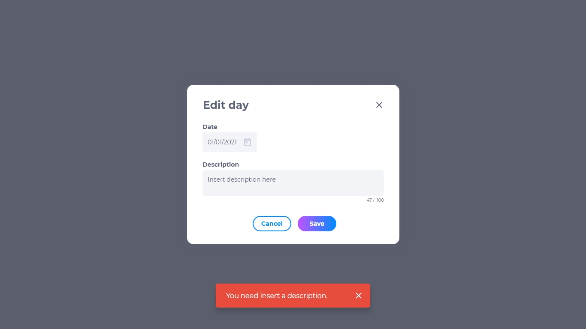
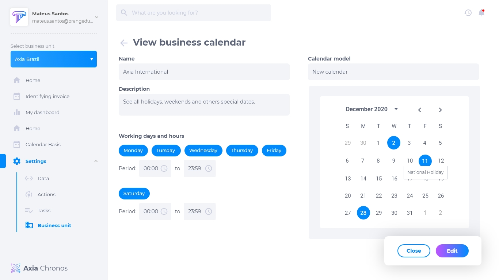

## Calendário de negócios
O calendário de negócios permite a criação de calendários personalizados para cada unidade de negócios. Isso permite que a unidade trabalhe de acordo com os dias que melhor convém para a sua cidade ou país, respeitando os feriados de cada um.

## Lista de calendário de negócios
A lista de calendário contém:
* Nome da unidade
* Editar
* Deletar
* Visualizar

## Como adicionar um calendário
1. Clique em **adicionar**.
2. Insira o nome
3. Insira a descrição
4. Selecione os dias e horas de trabalho

## Como editar um calendário
Para editar um calendário, clique em **editar**. Será possível modificar:
* Nome
* Descrição
* Dias e horas trabalhadas
* Dias com eventos

## Como marcar um evento do calendário
1. Clique em **adicionar** se for um calendário novo, ou clique em **editar** se for um calendário existente. 
2. Clique em **marcar novo dia**.
3. Confira a data e insira uma descrição.

## Como editar um evento do calendário
1. Selecione o calendário desejado.
2. Na figura do calendário, selecione o dia do evento.
3. Clique em **editar**.

É possivel alterar:
* Dia do evento
* Descrição 

## Como deletar um calendário
Para deletar um calendário, clique em **deletar**. Excluir um calendário é um procedimento irreversível e fará com que todas as suas configurações sejam deletadas. Caso queira recuperá-lo, terá que criar um novo.

## Como visualizar um calendário
Para visualizar um calendário, clique em **visualizar**. Pesquise o nome na caixa de pesquisa caso não esteja visualizando o que procura.

