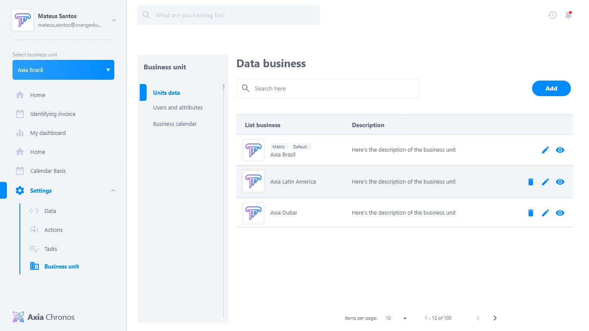

# Unidade de negócio
A unidade de negócio é a sessão de administração de unidades que a empresa possui. É possível criar uma lista com todas as unidades, atribuir usuários responsáveis por essas unidades e personalizar de acordo com a identidade da empresa.

