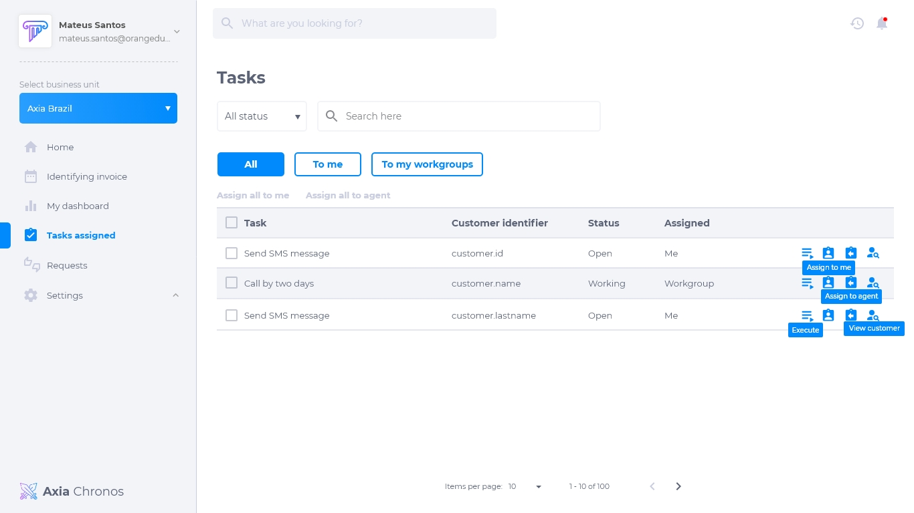
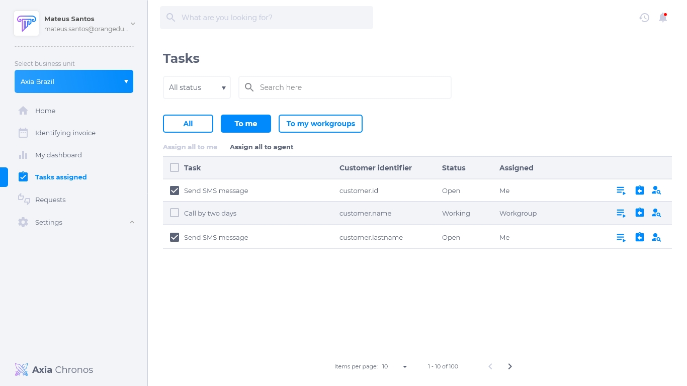
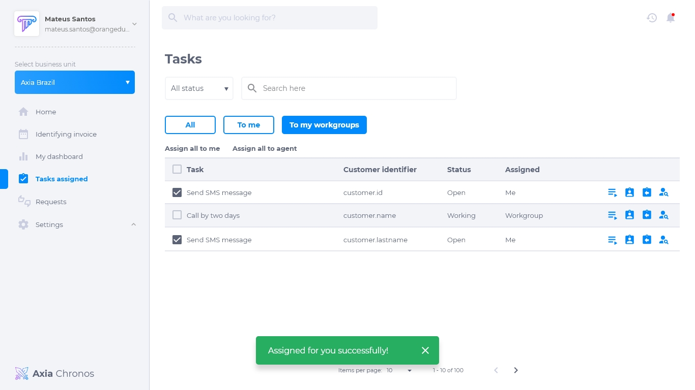
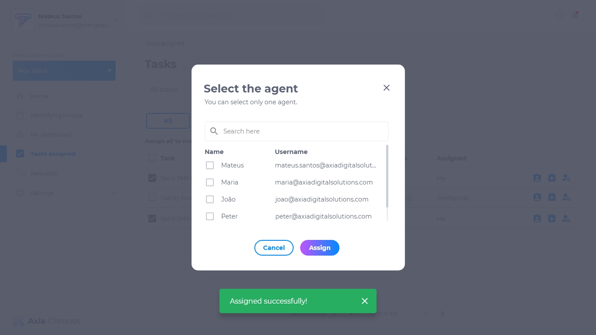

# Tarefas Atribuídas
Nesta sessão é possível visualizar as tarefas atribuídas à todos, ao usuário e ao grupo de trabalho que o usuário faz parte.
  
## Lista de tarefas atribuídas à todos: 
A lista de tarefas atribuídas à todos possui:
* Nome da tarefa
* Identificação do cliente
* Status da tarefa
* Usuário atribuido
* Botão para executar a tarefa
* Botão para atribuir a tarefa à si mesmo
* Botão para executar a tarefa ã outro usuàrio
* Botão para visualizar as informações do cliente

## Lista de tarefas atribuídas ao usuário
A lista de tarefas atribuídas ao usuário possui:
* Nome da tarefa
* Identificação do cliente
* Status da tarefa
* Usuário atribuido
* Botão para executar a tarefa
* Botão para visualizar as informações do cliente

# Lista de tarefas atribuidas ao grupo de trabalho
A lista de tarefas atribuidas ao grupo de trabalho possui:
* Nome da tarefa
* Identificação do cliente
* Status da tarefa
* Usuário atribuido
* Botão para executar a tarefa
* Botão para atribuir a tarefa à si mesmo
* Botão para executar a tarefa ã outro usuàrio
* Botão para visualizar as informações do cliente

## Como atribuir tarefa à um usuário
1. Clique no botão **atribuir à um agente**.
2. Selecione o usuário desejado.
3. Se necessário, pesquise o nome do usuário na caixa de pesquisa.

