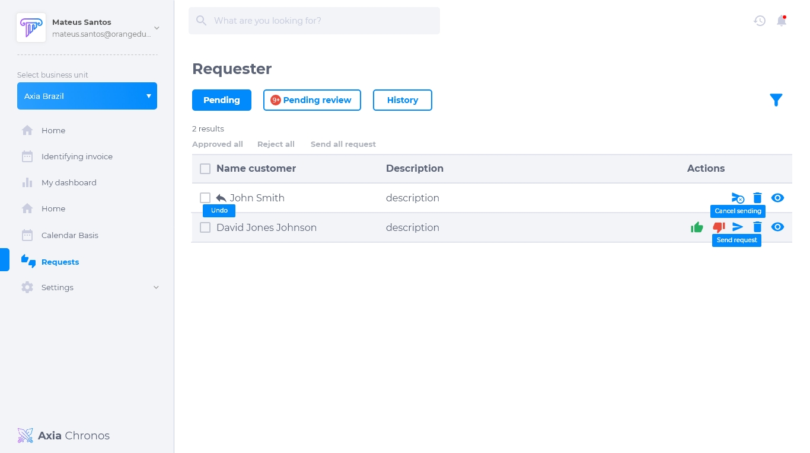
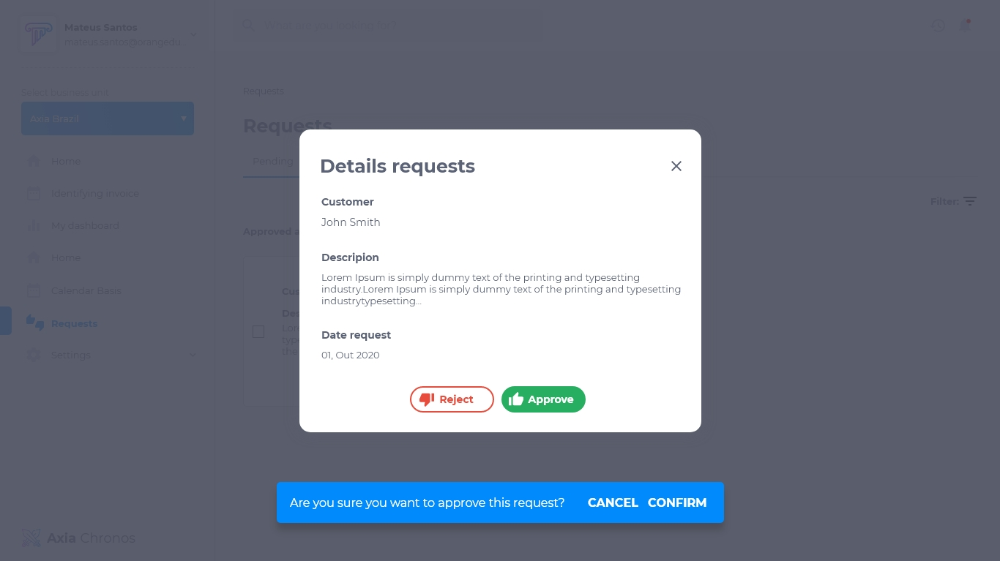
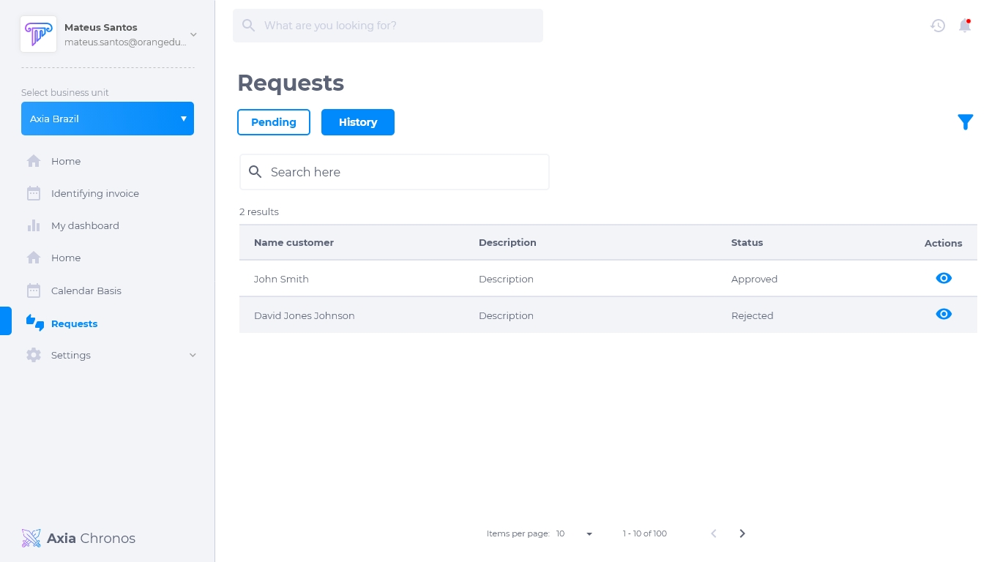
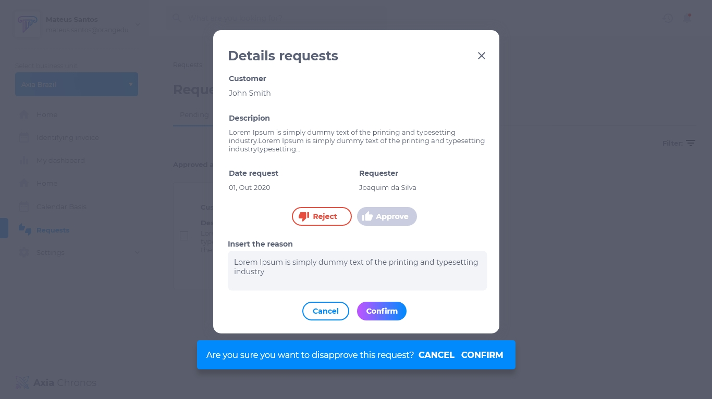
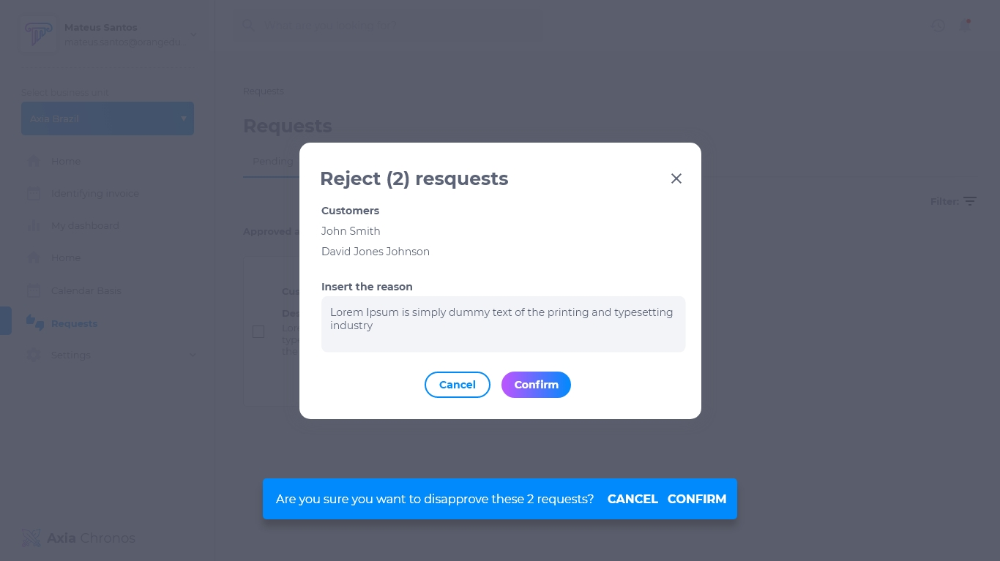

# Fluxos de Aprovação
Fluxos de aprovação são processos usados ​​para definir se algo deve ocorrer ou não. Para algumas tarefas ou operações é necessário ter a aprovação de outros usuários para permitir a execução da operação.

## Lista de solicitações
A lista de solicitação de fluxo de aprovação possui:
* Nome do cliente
* Descrição da solicitação
* Ícone de aprovação
* ícone de rejeição
* Enviar solicitação
* Deletar
* Visualizar

## Visualizar solicitação
Quando a atividade estiver para ser executada e tiver um fluxo de aprovação relacionado, será aberto um diálogo para inserir o motivo da solicitação, isso fará uma entrada em uma tabela com as informações da solicitação, o motivo da solicitação e o solicitante.

## Histórico de solicitações
O usuário deve ser capaz de ver todas as solicitações que ele fez e o status da solicitação. Quando for aprovado, deve receber uma notificação avisando. A atividade solicitada é executada automaticamente assim que a aprovação acontecer. Deve ser possível cancelar um pedido e deve ser mantido o rastreamento de todos os aprovadores e as respectivas datas de aprovação no histórico.

## Rejeitar uma solicitação
Quando uma solicitação é rejeitada, deve ser possível inseri-la novamente e adicionar um novo motivo. Toda rejeição deve conter um motivo de rejeição. Apenas as interações humanas podem levar a fluxos de aprovação.

É possível rejeitar mais de uma solicitação por vez.

