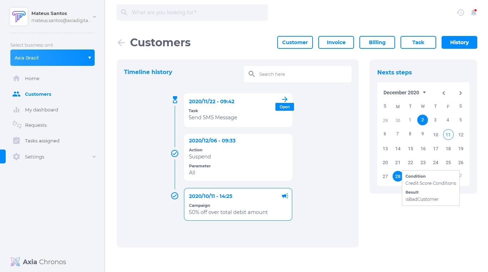

# Clientes
Nesta seção é possível visualizar todas as informações que o cliente possui. As informações estão divididas nas abas cliente, fatura, cobrança, tarefa e histórico. Elas são todas customizáveis, dependendo do que a empresa necessecita, basta configurar no [data structure](../4/4.2.md).

## View 360
A view 360 contém todas as informações pessoais, financeiras e relacionadas à empresa. Como foi dito acima, essas informações podem ser customizadas, podendo adicionar ou retirar opções. Uma vez configurado as informações no Data Structure é possível customizar a forma de exibição através da propriedade `class`, com as seguintes opções: `default`, `highlighted`, `title-view`, `graph-score` com value de 0 a 1000. Segue o exemplo:

## Fatura
Na aba da fatura é possível visualizar:
* Total de faturas
* Quantidade de faturas abertas
* Quantidade de faturas atrasadas
* Quantidade de faturas pagas
* Data da fatura mais antiga
* Faturas atuais e detalhes

## Cobrança
A aba de cobrança mostra faturas abertas e pendentes.

## Tarefa
A aba de tarefas aparece quando há alguma tarefa disponível para aquele cliente em específico, a tarefa pode ser executada a partir desta aba e o agente atribuído pode ser alterado. É possível visualizar:
* Nome da tarefa a ser realizada
* Opções de eventos
* Template
* Script
* Dados atualizáveis

## Histórico
A aba do histórico possui uma linha do tempo e um calendário que contém informações sobre quais tarefas já foram realizadas e quais são as próximas tarefas a serem executadas para o cliente. Isso permite que o atendimento seja totalmente customizável e flexível para cada cliente, além de abranger feriados personalizados para cada país.

