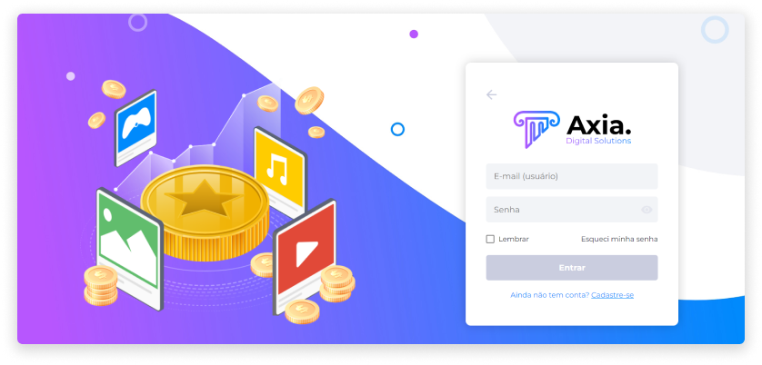

# Axia

No geral, os tokens são um recurso de segurança que gera um código identificador digital exclusivo e aleatório para proteger dados sensíveis, e isto aliado a várias camadas de segurança que proporcionam total tranquilidade e transparência para a realização das transações.

Atualmente, a tokenização é muito usada em transações financeiras, e o motivo para que o token esteja dominando este tipo de transação é bem simples: ao excluir o fator humano, a segurança aumenta, enquanto a margem de erro diminui.

O ecossistema Axia é uma plataforma digital de tokenização de produtos que utiliza de diversas tecnologias em um só lugar para facilitar sua vida e dos seus clientes. Tudo pode ser transformado em token. Qualquer projeto, produto ou ideia pode ter esta forma segura e colaborativa de negociação, e todos saem ganhando, pois através do ambiente digital Axia é possível realizar todas as operações de forma simples.

