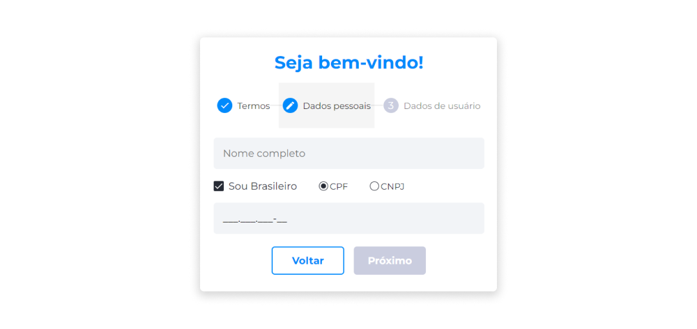
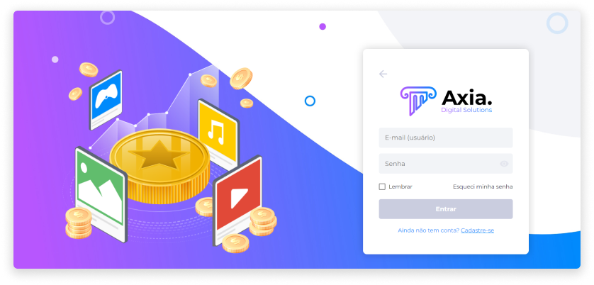

# Conta
::: info Acesso sem Conta
É possível acessar e navegar pelo Eniato sem criar uma conta. Porém, não é possível realizar a compra de NFTs sem criar uma.

A criação da conta, além de garantir um espaço seguro e de fácil navegação para a realização de compras e negociação de ativos, [<feature><🔐 **FIAT_DEPOSITS**</feature>](../about/licenses.md) viabiliza as funcionalidades de [depósitos](../profile/profile.md) [<feature>**FIAT_DEPOSITS**></feature>](../about/licenses.md) e [<feature><🔐 **WITHDRAWAL_HANDLING**</feature>](../about/licenses.md) [<feature><🔐 **TOKEN_WITHDRAWAL**</feature>](../about/licenses.md) [saques](../profile/profile.md) [<feature> **WITHDRAWAL_HANDLING**></feature>](../about/licenses.md) [<feature> **TOKEN_WITHDRAWAL**></feature>](../about/licenses.md), que facilitam as transações de compra e venda de ativos.
:::

## Criar uma Conta
1. Acesse o site do Axia Eniato.
2. Na página inicial, clique no ícone de usuário.
3. Na página de login, clique em **Cadastre-se**.

### Termos de Uso

4. Leia e aceite os Termos de Uso.

### Dados Pessoais

5. Informe o nome completo.
6. Selecione se você possui nacionalidade brasileira. Se for Pessoa Física, forneça seu CPF. Se for Pessoa Jurídica, forneça seu CNPJ. Caso possua nacionalidade estrangeira, forneça o número de um documento internacional.

### Dados de Usuário

7. Insira um e-mail.
8. Crie uma senha que atenda aos critérios solicitados.
9. Repita a senha.

10. Verifique seu e-mail para visualizar o código de acesso enviado.
11. No primeiro acesso à conta, insira o e-mail, a senha e o código de acesso.

::: warning ⚠️ <warningblocktitle>Atenção</warningblocktitle>
<warningblocktext>Valide o e-mail para garantir a autenticidade e segurança da conta.</warningblocktext>
:::

## Conta para Empresas
Ao adquirir o Eniato, a empresa poderá comercializar ativos de forma fácil e segura. Após criar a conta, todo o site se torna customizável, desde cores, logotipo, abas, até configurações de ativos. Porém, por motivos de segurança, o e-mail utilizado para criar a conta não pode ser alterado.

Após a compra do produto e a assinatura do contrato, a Axia irá disponibilizar um login e uma senha de acesso à plataforma com a [permissão Administrador](../account/account_permissions#administrador) da loja.

Após o recebimento dos dados, a pessoa proprietária pode mudar a senha clicando em **Esqueci minha senha** na página de login. Saiba mais em [Recuperação de Conta](../account/account_recovery.md).

