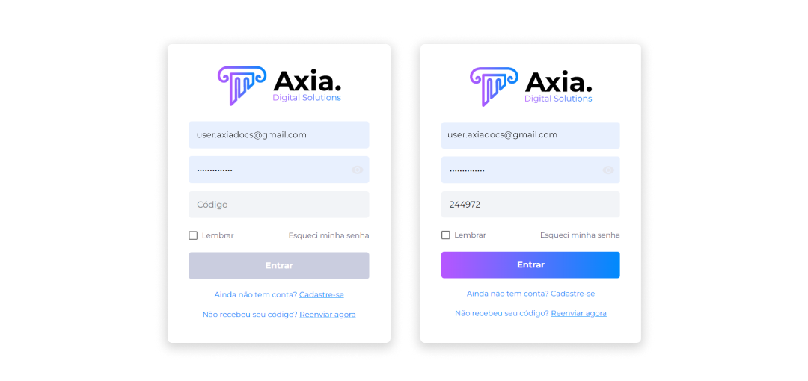

# Autenticação de Conta
Uma vez que o Midas irá lidar com ativos digitais, além do modo de autenticação padrão (Usuário e Senha), ele deve ser integrado à Autenticação de Dois Fatores (2FA).

## Autenticação de Dois Fatores (2FA)
Para aumentar a segurança dentro da plataforma, a Autenticação de Dois Fatores é um requisito importante. É possível criar uma conta sem habilitar a 2FA, porém, não será possível realizar nenhuma transação de ativos.

Assim, para conseguir realizar qualquer transação, o usuário deverá configurar a Autenticação de Dois Fatores. 

O Midas oferece ao usuário a possibilidade de configuração do 2FA por meio do aplicativo **Authy**. Após a configuração, sempre que o usuário fizer login ou [transferências](../wallet/transfer.md), o código 2FA será solicitado.

Para configurar a autenticação com o Authy, siga os seguintes passos:

1. Em seu dispositivo móvel, faça download de um aplicativo de autenticação, como por exemplo, o **Authy Authenticator**.

2. Registre sua conta.

3. Vincule sua conta **Midas**.

4. Copie ou memorize o código.
5. Insira o código na página de login do **Midas**.

::: info ℹ️ <infoblocktitle>Info</infoblocktitle>
<infoblocktext>Para desativar a Autenticação de Dois Fatores, é necessário entrar em contato com o Suporte da Axia, realizando o processo KYC (<i>Know Your Customer</i>) com uma foto do usuário segurando o documento usado no cadastro.</infoblocktext>
:::