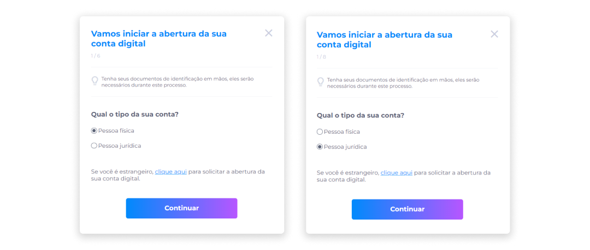

::: tip 🔐 Ativação da Licença <feature>DIGITAL_BANKING</feature>
O conteúdo desta página é válido somente se a licença [<feature>**DIGITAL_BANKING**</feature>](../about/licenses.md) estiver ativada.
:::

 

# Conta no Banco Digital
O funcionamento das operações bancárias dentro do Midas é feito por meio da ativação da licença [<feature>🔐 **DIGITAL_BANKING**</feature>](../about/licenses.md). Somente a partir da ativação desta licença os usuários poderão acessar a solicitação do processo de abertura de conta bancária digital.

::: info ℹ️ <infoblocktitle>Abertura de Conta</infoblocktitle>
<infoblocktext>A abertura de conta no Banco Digital será possível somente se o usuário já tiver uma conta cadastrada no <a href="../account/account_ecosystem">ecossistema Midas</a></infoblocktext>.
:::

Para abrir uma conta no Banco Digital:

1. Com a sessão ativa no ecossistema Midas, na tela inicial, clique no ícone **Banco Digital**.

2. Após visualizar a tela de boas-vindas, clique em **Abrir minha conta**.

::: info ℹ️ <infoblocktitle>Documentos de Identificação</infoblocktitle>
<infoblocktext>Tenha seus documentos de identificação em mãos, pois eles serão necessários durante este processo.</infoblocktext>
:::

## Tipos de Conta
3. Selecione o tipo da conta que será criada (Pessoa Física ou Pessoa Jurídica).

4. Clique em **Continuar**.

Caso possua nacionalidade estrangeira, clique no link em destaque para ser direcionado à solicitação de abertura da conta digital.

