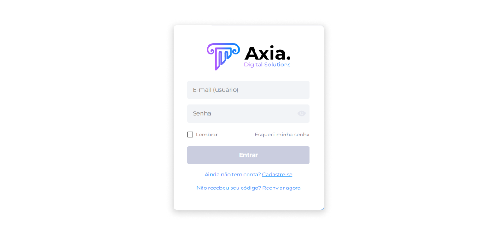

# Conta no Ecossistema
Ter uma conta no ecossistema Midas possibilita o acesso a outras funcionalidades que operam dentro da plataforma, como a funcionalidade bancária Banco Digital.

Para criar uma conta no ecossistema Midas:

1. Acesse o **Midas**.
2. Na página de login, clique em **Cadastre-se**.

### Termos de Uso
3. Leia e aceite os Termos de Uso.

### Dados Pessoais
4. Informe seu nome completo.
5. Selecione se você possui nacionalidade brasileira. 
- Se for Pessoa Física, forneça seu CPF. 
- Se for Pessoa Jurídica, forneça seu CNPJ. 

Caso possua nacionalidade estrangeira, forneça o número de um documento internacional.

### Dados de Usuário
6. Insira um e-mail.
7. Crie uma senha que atenda aos critérios solicitados.
8. Repita a senha.

::: info ℹ️ <infoblocktitle>Validação de Código de Convite</infoblocktitle>
<infoblocktext>Ao receber um convite de um amigo para ingressar no Midas, você pode aplicá-lo para validação na tela de cadastro. Desta forma, você poderá receber diversos benefícios.</infoblocktext>
:::

Caso ainda não tenha configurado o mecanismo de autenticação, verifique as instruções para o processo de [autenticação de conta](../account/authentication).

Se a Autenticação de Dois Fatores já tiver sido configurada:

9. Abra o aplicativo **Authy** para obter o código de validação.
10. Insira o código do **Authy** antes que o tempo expire.

Caso tenha perdido o acesso à sua conta, siga as instruções para a [recuperação de conta](../account/recovery.md).