# Pessoa Física
No tipo de conta Pessoa Física, o processo de abertura de conta será feito nas seguintes etapas: **Dados Pessoais**, **Confirmação de Identidade (Configuração KYC)**, **Sobre você**, **Endereço** e **Senha de 4 Dígitos**.

Após indicar o tipo da conta como Pessoa Física:

1. Clique em **Continuar**.

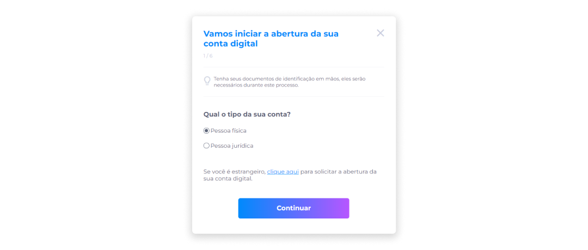

## Dados Pessoais
Na etapa de Dados Pessoais:

1. Informe seu nome completo.
2. Insira um e-mail válido.
3. Forneça o número do celular (com DDD).

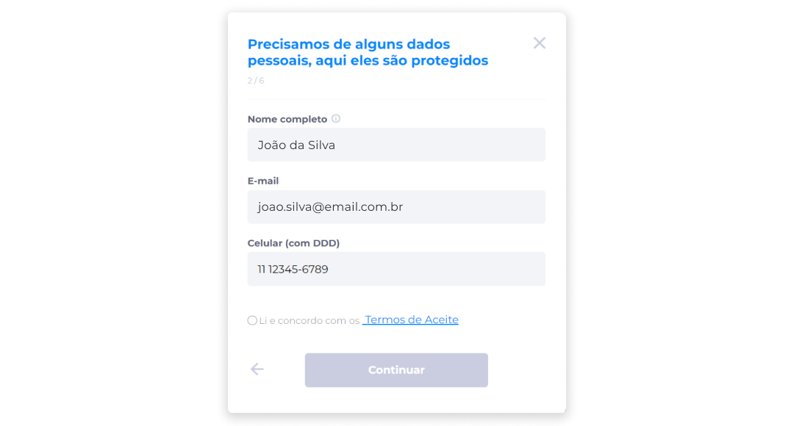

4. Clique no link **Termos de Aceite**.

> ::: warning ⚠️ <warningblocktitle>Atenção</warningblocktitle>
> <warningblocktext>A opção <b>Li e concordo com os Termos de Aceite</b> será habilitada somente após o clique no link para consulta e leitura dos termos.</warningblocktext>

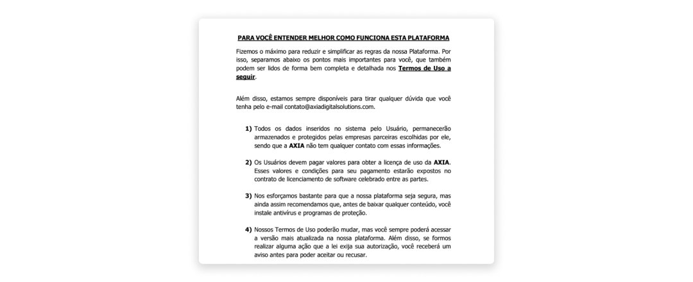

5. Após a abertura do link, a opção será habilitada. Selecione se leu e concorda com os Termos de Aceite.

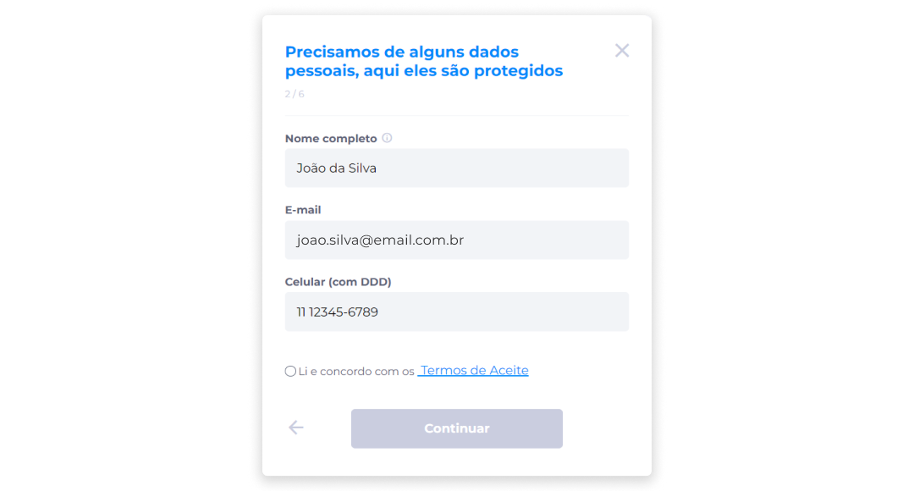

6. Clique em **Continuar**.

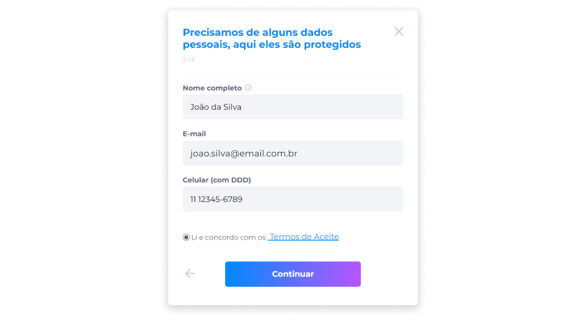

## Confirmação de Identidade (Configuração KYC)
1. Devido ao usuário já ter uma conta no ecossistema, o campo **CPF** nesta etapa estará automaticamente preenchido.

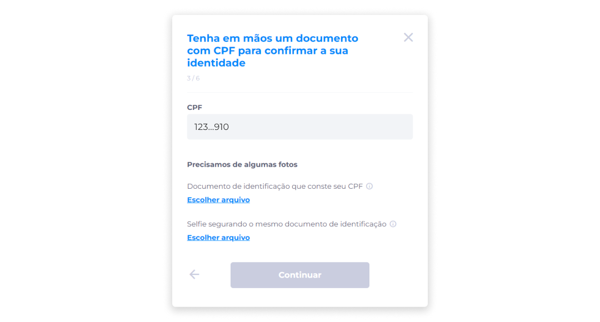

> ::: info ℹ️ <infoblocktitle>Proteção de Dados</infoblocktitle>
> <infoblocktext>A fim de atender aos requisitos da LGPD, o número do CPF sempre será exibido de forma mascarada, deixando visível apenas os três primeiros e últimos dígitos para evitar a exposição deste dado.</infoblocktext>

2. Clique em **Escolher arquivo** para anexar um documento de identificação que conste o número do CPF.

::: info ⚙️ <infoblocktitle>Especificações de Arquivo</infoblocktitle>
 
<infoblocktext><li><b>Formatos aceitos</b>: PDF, PNG, JPEG e JPG.</li>
<li><b>Tamanho máximo permitido</b>: 10MB.</li> 
ℹ️ Será permitido o envio de apenas um arquivo em cada anexo.</infoblocktext>
:::

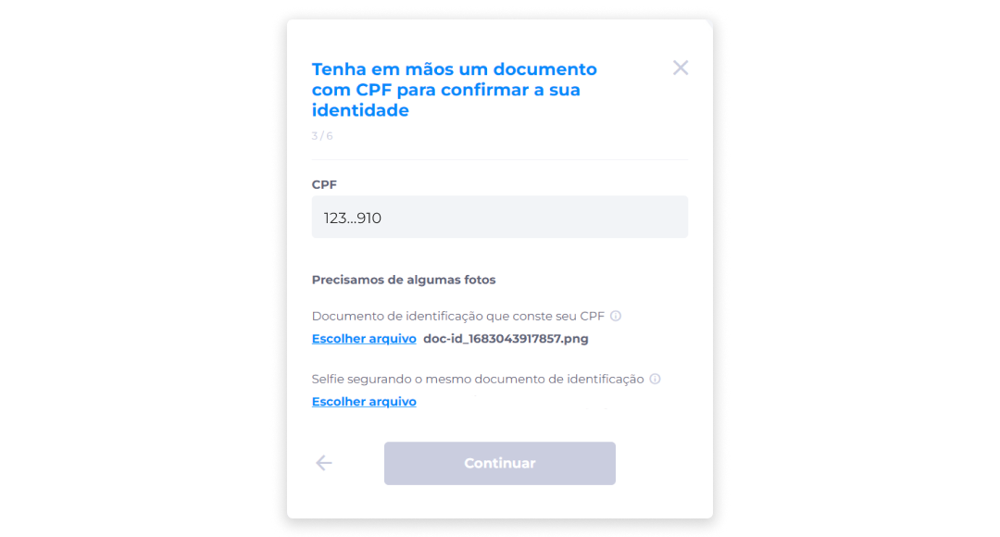

3. Clique em **Escolher arquivo** para anexar uma selfie segurando o mesmo documento de identificação enviado anteriormente.

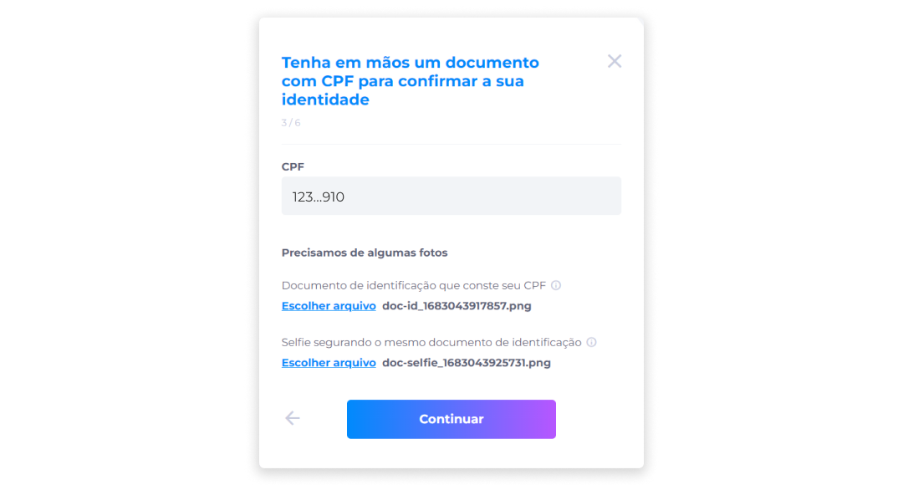

4. Clique em **Continuar**.

## Endereço
1. Insira o CEP do seu endereço.

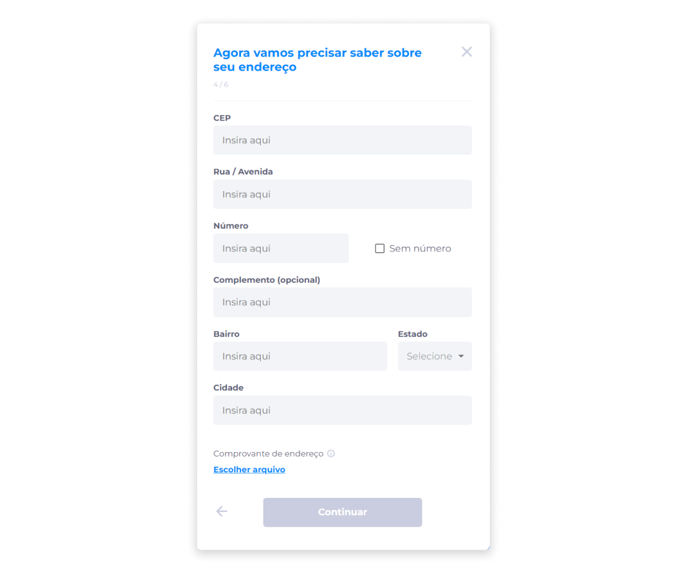

2. Após fornecer o CEP, os campos **Rua/Avenida**, **Bairro**, **Estado** e **Cidade** serão preenchidos automaticamente.

3. Informe o número da sua residência. Caso a residência não tenha um número, marque a caixa de seleção **Sem número** para indicar esta informação.
4. Informe o complemento (opcional).

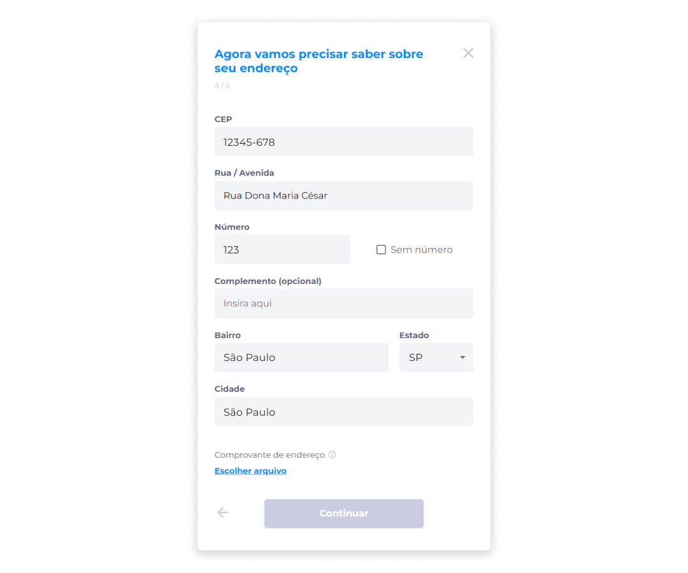

5. Clique em **Escolher arquivo** para anexar um comprovante de endereço.

::: info ⚙️ <infoblocktitle>Especificações de Arquivo</infoblocktitle>
 
<infoblocktext><li><b>Formatos aceitos</b>: PDF, PNG, JPEG e JPG.</li>
<li><b>Tamanho máximo permitido</b>: 10MB.</li> 
ℹ️ Será permitido o envio de apenas um arquivo em cada anexo.</infoblocktext>
:::

6. Após preencher todos os campos obrigatórios, clique em **Continuar**.

> ::: warning ⚠️ <infoblocktitle>Atenção</infoblocktitle>
> <infoblocktext>Se um dos campos obrigatórios não for preenchido, o botão <b>Continuar</b> ficará desabilitado e o usuário não conseguirá avançar para a próxima etapa.</infoblocktext>

## Sobre você
1. Informe como gostaria de ser chamado.
2. Informe sua data de nascimento.
3. Informe o nome completo da mãe.

> ::: info ℹ️ <infoblocktitle>Declaração de Filiação em Documentos</infoblocktitle>
> <infoblocktext>Caso não tenha o nome da mãe declarado em seu documento, basta digitar "Nome ausente" e prosseguir.</infoblocktext>

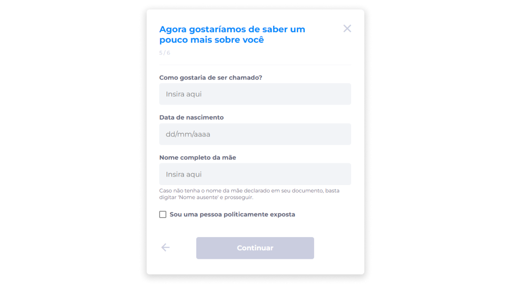

4. Caso você seja uma pessoa politicamente exposta, marque a caixa de seleção para indicar esta informação.

> ::: info ℹ️ <infoblocktitle>Qualificação como Pessoa Exposta Politicamente</infoblocktitle>
> <infoblocktext>De acordo com a <a href="https://normativos.bcb.gov.br/Lists/Normativos/Attachments/50905/Circ_3978_v4_P.pdf">Circular n. 3.978</a> de 23/01/2020, seção VII do Banco Central, que trata das regras e procedimentos de prevenção à lavagem de dinheiro, ao financiamento do terrorismo e ao combate à corrupção, uma pessoa definida como politicamente exposta é aquela que exerce ou exerceu cargos, empregos ou funções públicas relevantes, no Brasil ou no exterior.  Pode incluir, por exemplo, chefes de Estado, membros do governo, parlamentares, magistrados, altos funcionários de órgãos governamentais, militares de alta patente, dirigentes de partidos políticos, entre outros.  Também podem ser consideradas como politicamente expostas as pessoas que possuem relações de negócios próximas com as pessoas mencionadas anteriormente.</infoblocktext>

5. Clique em **Continuar**.

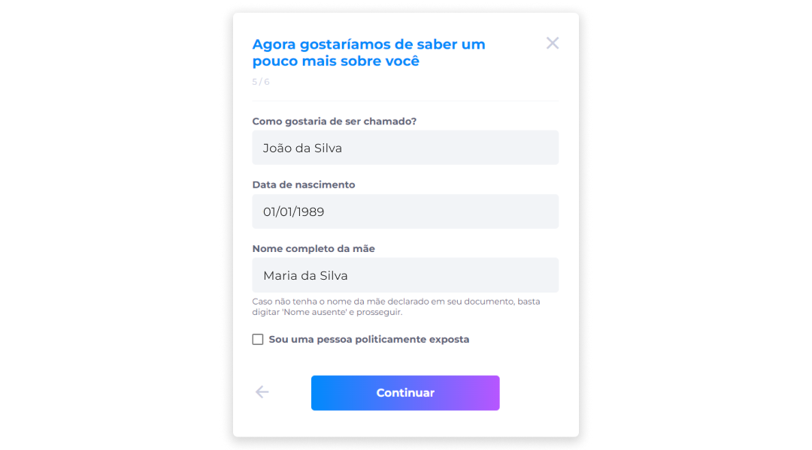

## Senha de 4 Dígitos
Tanto para contas do tipo Pessoa Física ou Pessoa Jurídica, a criação da senha de 4 dígitos será a última etapa do processo. Esta senha deverá ser utilizada para a validação de transações dentro do sistema do Banco Digital.

Para cadastrar a senha de 4 dígitos pela primeira vez:

1. Crie uma senha.

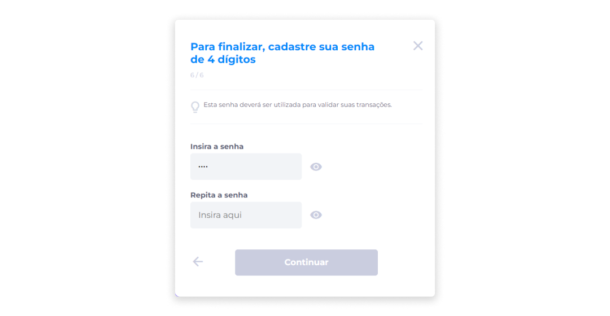

::: info ℹ️ <infoblocktitle>Requisitos para a Criação da Senha de 4 Dígitos</infoblocktitle>
<infoblocktext>Para a criação da senha de 4 dígitos, é importante entender quais formatos de senha serão permitidos e não permitidos dentro do sistema.  
✅ <b>Formatos permitidos</b> 
<li>Sequências numéricas de até três números (Ex.: 1235).</li>
<li>Repetição de até dois ou três números seguidos de um número diferente (Ex.: 2244 ou 2224).</li> 
🚫 <b>Formatos não permitidos</b>
<li>Sequências numéricas de forma crescente ou decrescente (Ex.: 1234 ou 4321).</li>
<li>Mais de três repetições do mesmo número (Ex.: 2222).</li> </infoblocktext>
:::

2. Repita a senha.

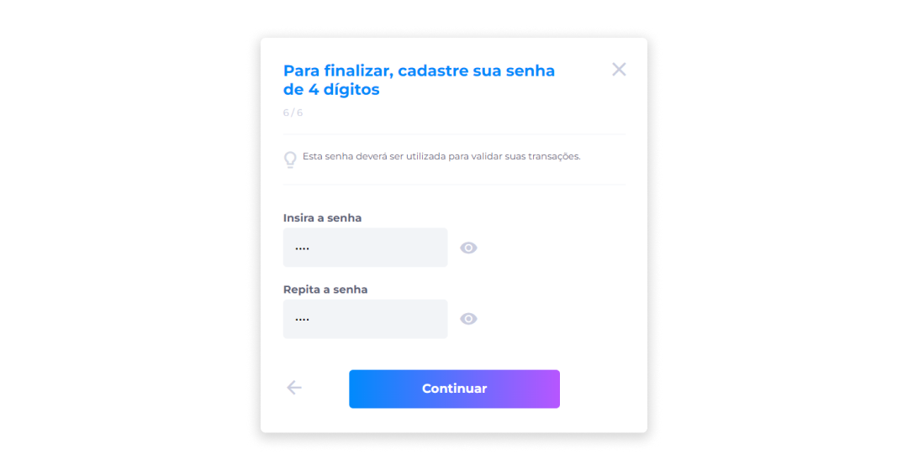

3. Clique em **Continuar**.

::: warning ⚠️ <infoblocktitle>Atenção</infoblocktitle>
<infoblocktext>Após 3 tentativas falhas, a senha será bloqueada, e todas as operações ficarão desabilitadas até que a senha seja redefinida.  O usuário poderá redefinir a senha logo após a terceira tentativa falha, ou pela página inicial do Banco, na área de alteração de dados de usuário, por meio da opção <b>Alterar senha de 4 dígitos</b>.  Depois da solicitação de redefinição, será enviado um código de verificação para o e-mail cadastrado para que o processo de alteração de senha seja concluído com segurança.</infoblocktext>
:::
 
Após a criação da senha de 4 dígitos, será exibida ao usuário a confirmação de solicitação de abertura da conta.

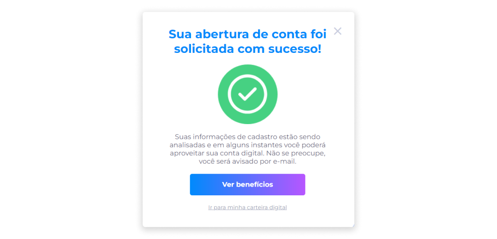

Todas as informações fornecidas serão analisadas. Assim que a [análise](../account/request_analysis.md) for concluída, o usuário será avisado por e-mail.