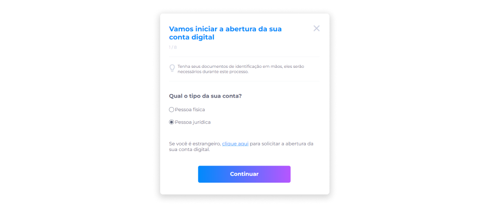
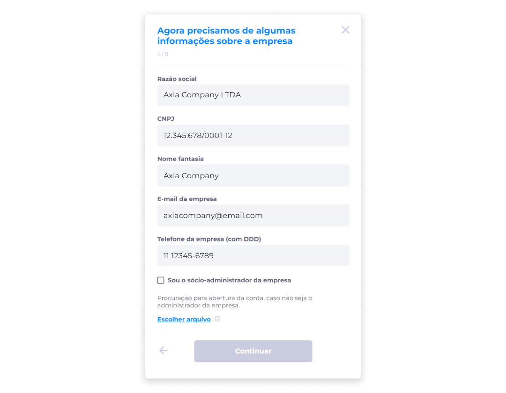
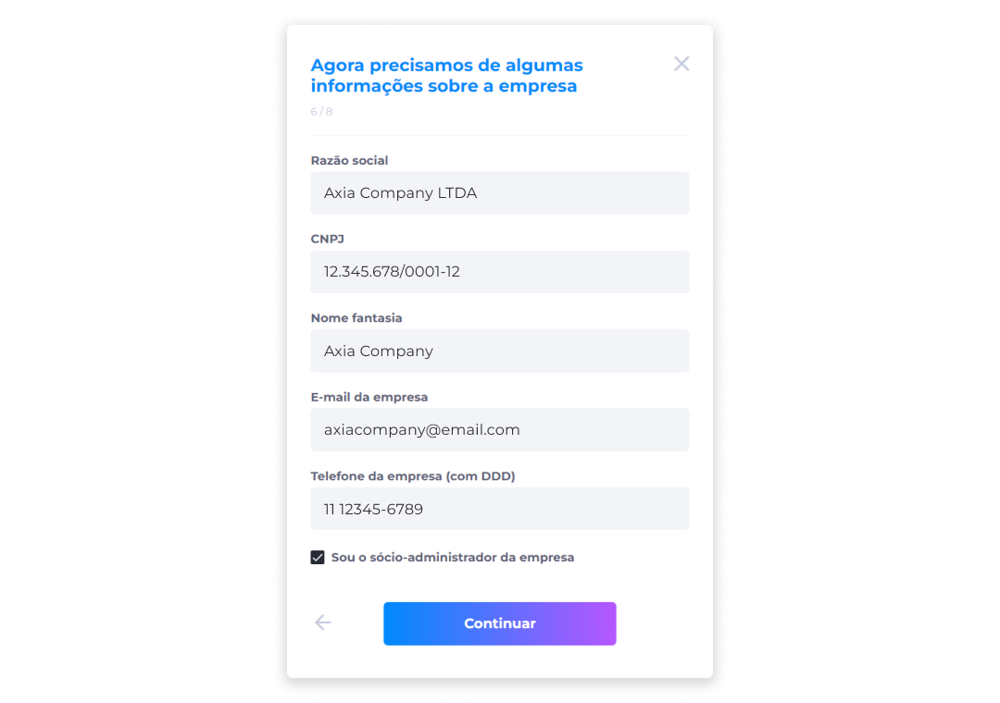
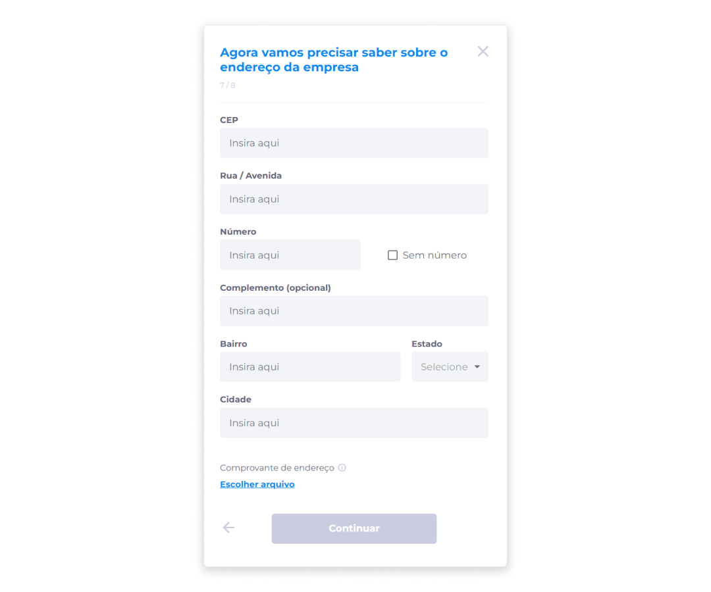
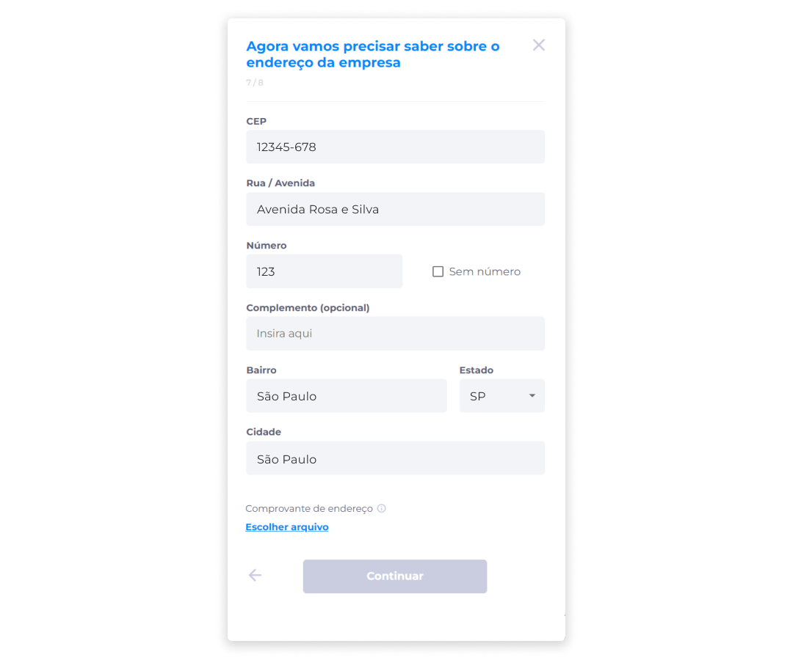
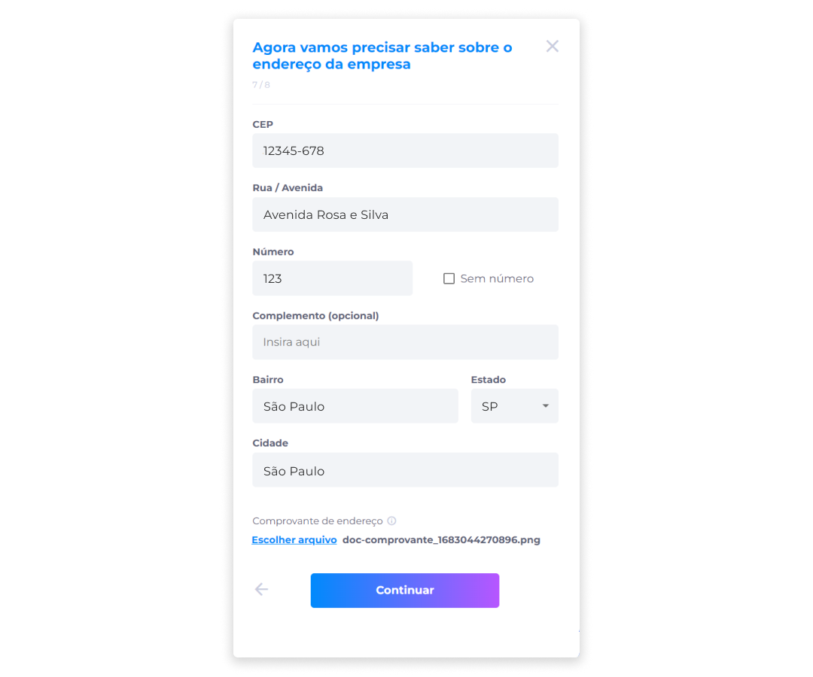

# Pessoa Jurídica
Após indicar o tipo da conta como Pessoa Jurídica:

1. Clique em **Continuar**.

> ::: warning ⚠️ <warningblocktitle>Atenção</warningblocktitle>
> <warningblocktext>Durante o cadastro no ecossistema Midas, apenas uma conta de e-mail é registrada.  Se sua conta no ecossistema tiver sido criada como Pessoa Física (utilizando o número do CPF) e você decidir abrir uma conta no banco utilizando o número do CNPJ (documento diferente do que foi anteriormente registrado na plataforma), posteriormente não será possível criar outra conta digital vinculada ao mesmo e-mail.</warningblocktext>

 
2. Confirme se deseja continuar com esta opção.

O processo de abertura para este tipo de conta será feito a partir das mesmas etapas que são solicitadas para a [abertura do tipo Pessoa Física](../account/pf.md) (**Dados Pessoais**, **Confirmação de Identidade (Configuração KYC)**, **Sobre você**, **Endereço** e **Senha de 4 Dígitos**).

Porém, para este tipo de conta, são adicionadas mais duas etapas: **Informações sobre a Empresa** e **Endereço da Empresa**.

## Informações sobre a Empresa
Após preencher a etapa **Sobre você**:

1. Informe a razão social.
2. Forneça o número do seu CNPJ.
> ::: info ℹ️ <infoblocktitle>Proteção de Dados</infoblocktitle>
> <infoblocktext>A fim de atender aos requisitos da LGPD, o número do CNPJ sempre será exibido de forma mascarada, deixando visível apenas os três primeiros e últimos dígitos para evitar a exposição deste dado.</infoblocktext>

3. Informe o nome fantasia.
4. Insira o e-mail da empresa.
5. Forneça o número do telefone da empresa (com DDD).

6. Se você for o Sócio-administrador da empresa, marque a caixa de seleção para confirmar esta informação.

Caso você não seja o sócio-administrador da empresa, será solicitado o envio de uma procuração para prosseguir com a abertura da conta. Se este for o caso:

7. Clique em **Escolher arquivo** para anexar o documento de procuração.

::: info ⚙️ <infoblocktitle>Especificações de Arquivo</infoblocktitle>
 
<infoblocktext><li><b>Formatos aceitos</b>: PDF, PNG, JPEG e JPG.</li>
<li><b>Tamanho máximo permitido</b>: 10MB.</li> 
ℹ️ Será permitido o envio de apenas um arquivo em cada anexo.</infoblocktext>
:::

8. Clique em **Continuar**.

## Endereço da Empresa
1. Insira o CEP endereço da empresa.

2. Após fornecer o CEP, os campos **Rua/Avenida**, **Bairro**, **Estado** e **Cidade** serão preenchidos automaticamente.

3. Informe o número do prédio da empresa. Caso não tenha um número, marque a caixa de seleção **Sem número** para indicar esta informação.
4. Informe o complemento (opcional).

5. Clique em **Escolher arquivo** para anexar um comprovante de endereço.

::: info ⚙️ <infoblocktitle>Especificações de Arquivo</infoblocktitle>
 
<infoblocktext><li><b>Formatos aceitos</b>: PDF, PNG, JPEG e JPG.</li>
<li><b>Tamanho máximo permitido</b>: 10MB.</li> 
ℹ️ Será permitido o envio de apenas um arquivo em cada anexo.</infoblocktext>
:::

6. Clique em **Continuar**.

> ::: warning ⚠️ <infoblocktitle>Atenção</infoblocktitle>
> <infoblocktext>Se um dos campos obrigatórios não for preenchido, o botão <b>Continuar</b> ficará desabilitado e o usuário não conseguirá avançar para a próxima etapa.</infoblocktext>

## Senha de 4 Dígitos
Tanto para contas do tipo Pessoa Física ou Pessoa Jurídica, a criação da senha de 4 dígitos será a última etapa do processo. Esta senha deverá ser utilizada para a validação de transações dentro do sistema do Banco Digital.

Para cadastrar a senha de 4 dígitos pela primeira vez:

1. Crie uma senha.

::: info ℹ️ <infoblocktitle>Requisitos para a Criação da Senha de 4 Dígitos</infoblocktitle>
<infoblocktext>Para a criação da senha de 4 dígitos, é importante entender quais formatos de senha serão permitidos e não permitidos dentro do sistema.  
✅ <b>Formatos permitidos</b> 
<li>Sequências numéricas de até três números (Ex.: 1235).</li>
<li>Repetição de até dois ou três números seguidos de um número diferente (Ex.: 2244 ou 2224).</li> 
🚫 <b>Formatos não permitidos</b>
<li>Sequências numéricas de forma crescente ou decrescente (Ex.: 1234 ou 4321).</li>
<li>Mais de três repetições do mesmo número (Ex.: 2222).</li> </infoblocktext>
:::

2. Repita a senha.

3. Clique em **Continuar**.

::: warning ⚠️ <infoblocktitle>Atenção</infoblocktitle>
<infoblocktext>Após 3 tentativas falhas, a senha será bloqueada, e todas as operações ficarão desabilitadas até que a senha seja redefinida.  O usuário poderá redefinir a senha logo após a terceira tentativa falha, ou pela página inicial do Banco, na área de alteração de dados de usuário, por meio da opção <b>Alterar senha de 4 dígitos</b>.  Depois da solicitação de redefinição, será enviado um código de verificação para o e-mail cadastrado para que o processo de alteração de senha seja concluído com segurança.</infoblocktext>
:::
 
Após a criação da senha de 4 dígitos, será exibida ao usuário a confirmação de solicitação de abertura da conta.

Todas as informações fornecidas serão analisadas. Assim que a [análise](../account/request_analysis.md) for concluída, o usuário será avisado por e-mail.