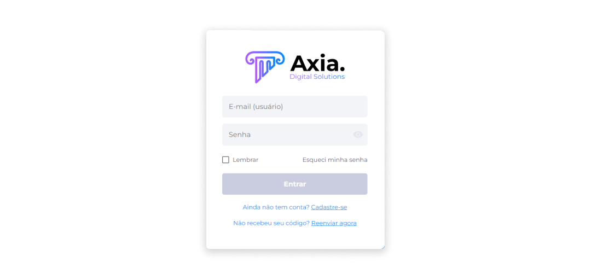
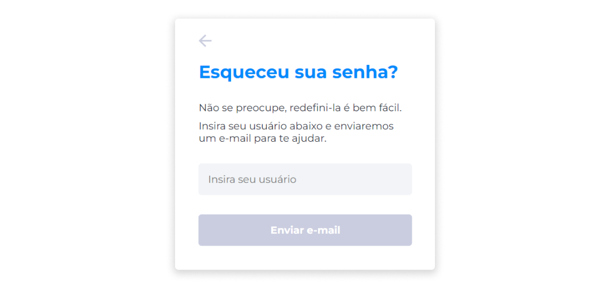
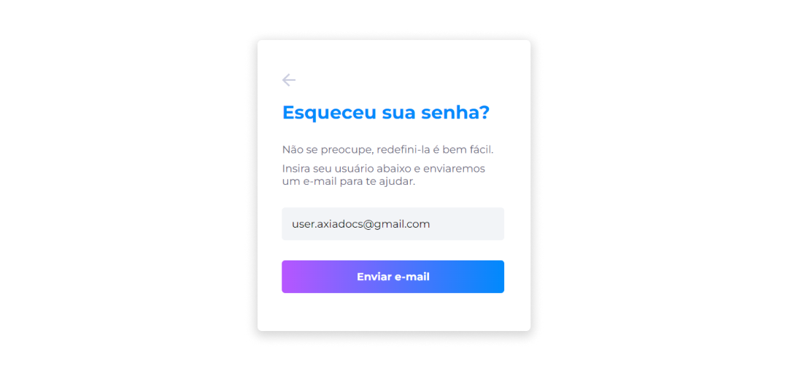
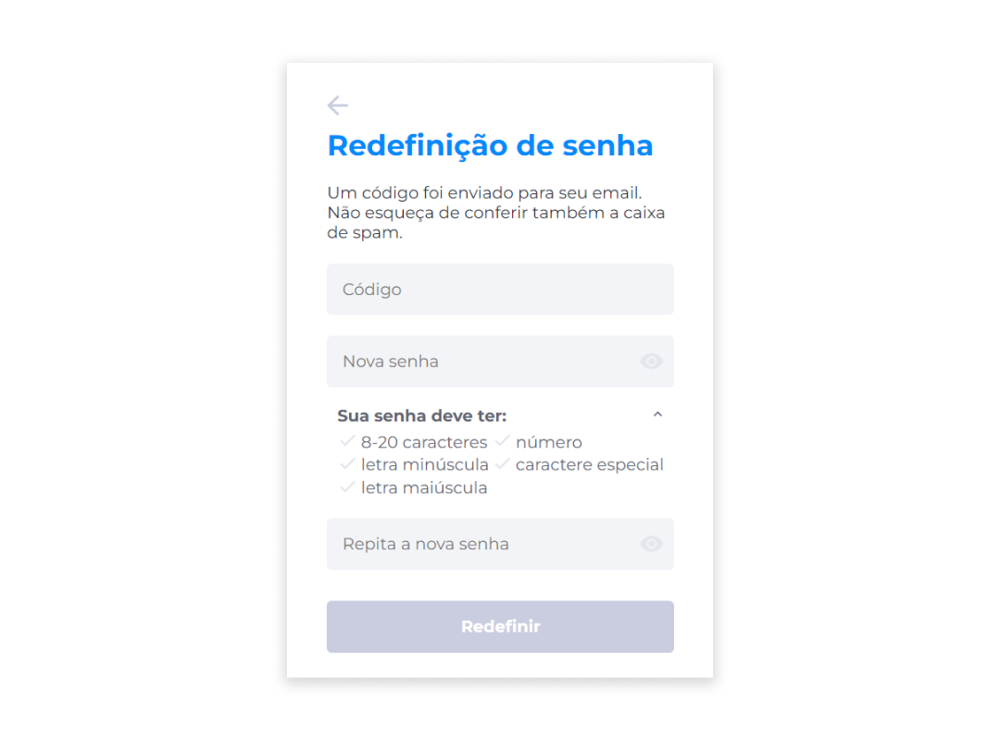
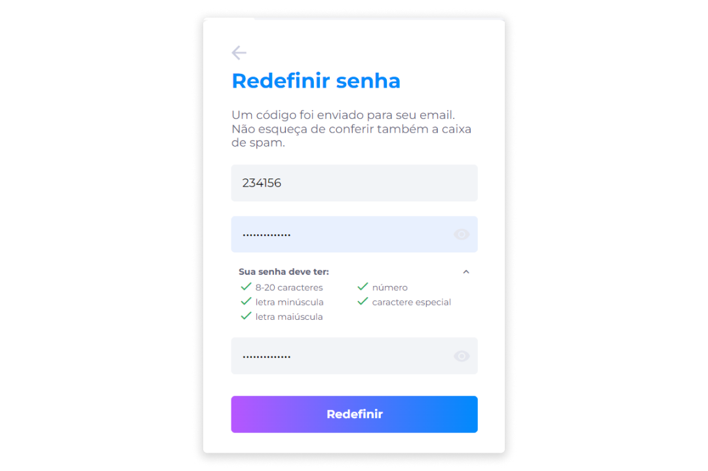

# Recuperação de Conta
Caso tenha perdido o acesso à sua conta, siga as instruções a seguir.

## Redefinição de Senha

1. Na página de login, clique em **Esqueci minha senha**.

2. Na página **Esqueci minha senha**, insira o mesmo usuário (e-mail) usado na criação da sua conta.

3. Clique em **Enviar e-mail**.

::: info ℹ️ <infoblocktitle>Info</infoblocktitle>
<infoblocktitle>Um código será enviado para seu e-mail. Não esqueça de conferir também a caixa de spam.</infoblocktitle>
:::

::: warning ⚠️ <warningblocktitle>Atenção</warningblocktitle>
<warningblocktext>O código de acesso é fornecido para garantir a autenticidade do usuário que está trocando a senha, e um novo código é gerado para cada tentativa de redefinição de senha.</warningblocktext>
:::

4. Ao obter o código recebido no e-mail, insira-o no campo de código.

5. Redefina sua senha atendendo aos critérios solicitados.
6. Repita a senha.

7. Clique em **Redefinir**.