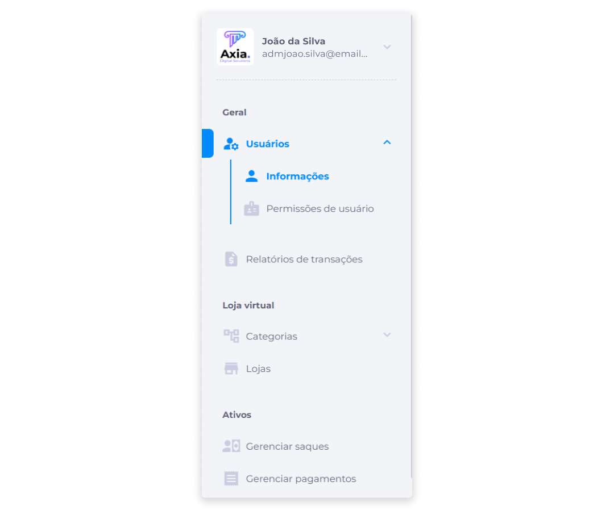
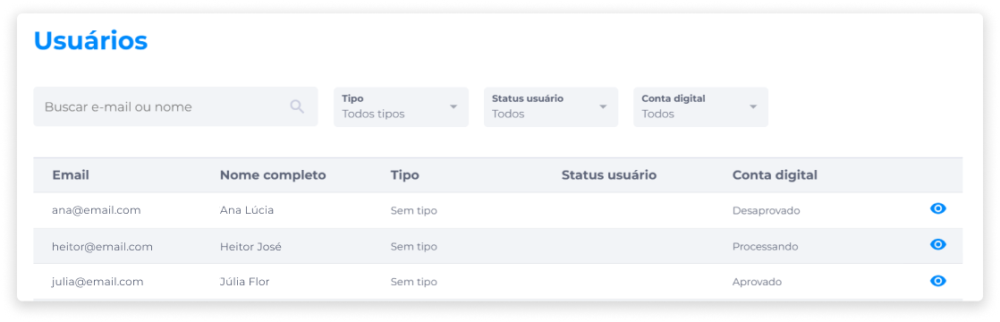
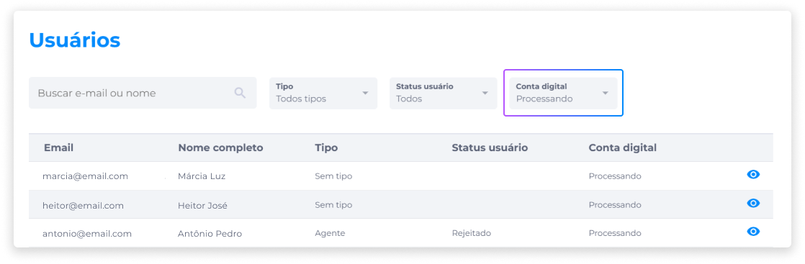
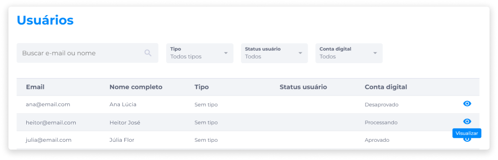
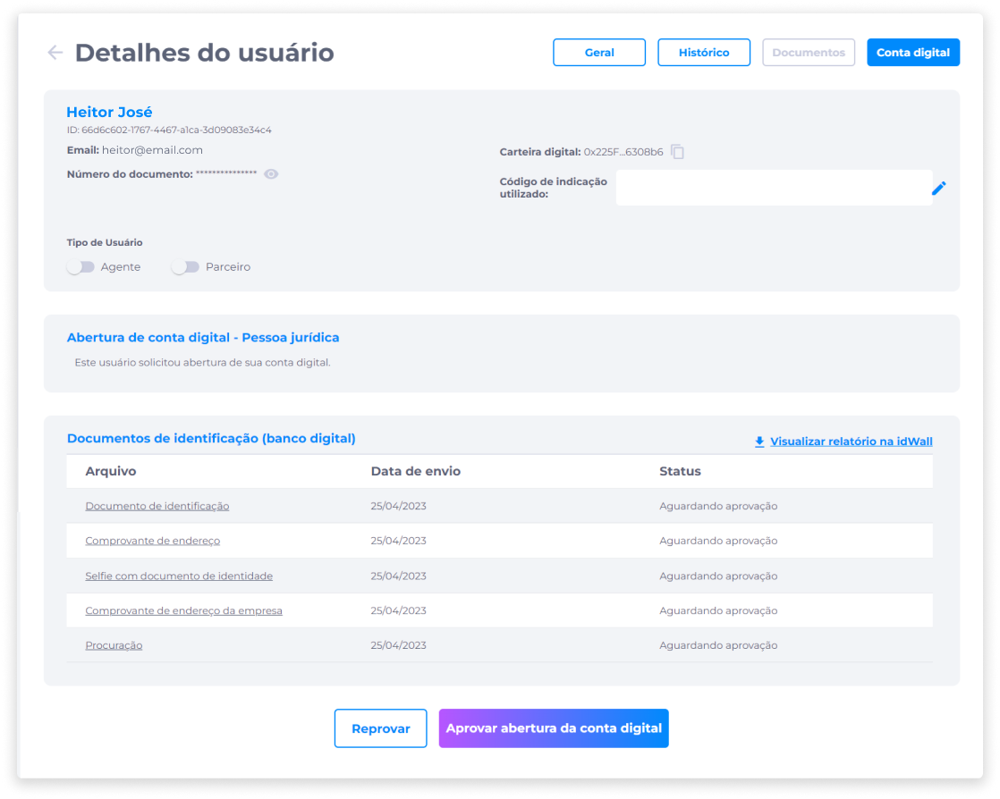
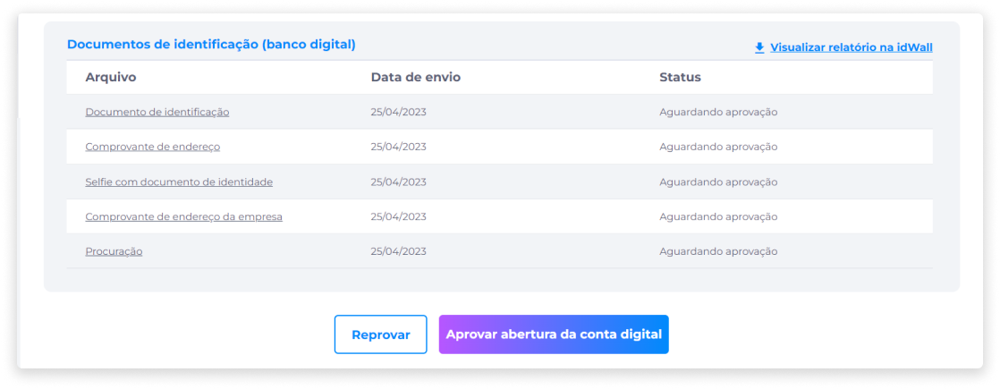
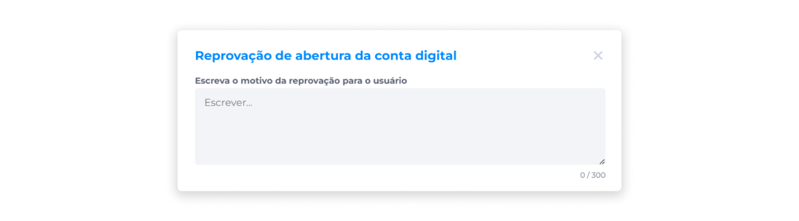
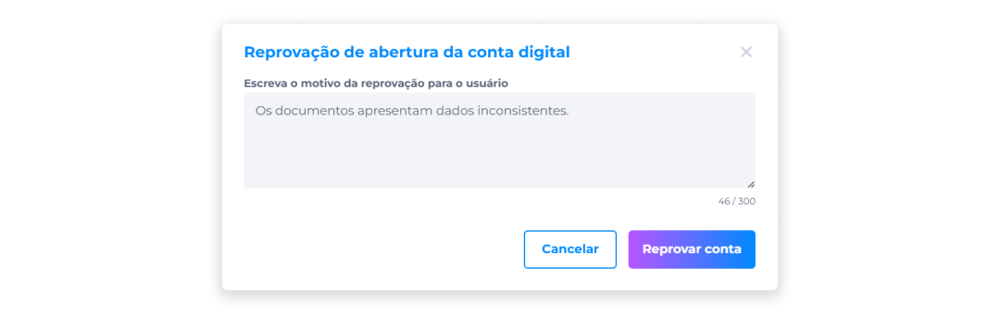

# Análise de Solicitações de Conta Digital
Através do BackOffice, o administrador do banco deverá acessar e analisar os dados e documentos enviados pelo usuário na solicitação de abertura da conta.

Além de poder consultar cada documento individualmente, o administrador também poderá ter acesso a um relatório sobre o usuário por meio da [API idWall](https://docs.idwall.co/docs/api-how-to-use), que é integrada à plataforma para gerar relatórios sobre usuários que solicitaram abertura de conta.

Se o link para visualização do relatório não abrir, o administrador será redirecionado ao ambiente idWall para inserir CPF ou CPNJ manualmente e gerar o relatório. 

Para analisar a solicitação de abertura de conta:

1. Acesse o BackOffice.
2. No painel administrativo, acesse **Usuários** > **Informações**.

3. Na lista, identifique ou busque pelo e-mail ou nome do usuário.
4. Na coluna **Conta Digital**, verifique se a solicitação de abertura de conta do usuário está indicando o status **Processando**.

Também é possível acessar apenas as solicitações pendentes através do filtro **Conta Digital**, aplicando a opção **Processando**.

5. Clique em **Visualizar**.

6. Em **Detalhes do Usuário**, na aba **Conta Digital**, verifique as informações do usuário.

7. Na seção **Documentos de Identificação (Banco Digital)**, clique sobre cada arquivo em anexo para fazer a análise dos documentos.

## Reprovação da Solicitação
Caso a análise da solicitação indique qualquer tipo de irregularidade nos documentos:

1. Clique em **Reprovar**.

2. Informe o motivo da reprovação da solicitação.

> ::: warning ⚠️ <warningblocktitle>Atenção</warningblocktitle>
> <warningblocktext> É obrigatório informar ao usuário o motivo da reprovação da solicitação.</warningblocktext>

3. Clique em **Reprovar conta**.

> ::: warning ⚠️ <warningblocktitle>Atenção</warningblocktitle>
> <warningblocktext> Se a solicitação de abertura da conta de um usuário for reprovada, ele não conseguirá fazer uma nova solicitação, a menos que entre em contato com o Suporte.</warningblocktext>

## Aprovação da Solicitação
Se a análise indicar que todas as informações são comprovadamente autênticas:

1. Clique em **Aprovar abertura da conta digital**.

2. Confirme se realmente deseja aprovar a abertura da conta.

Após o usuário receber o e-mail de confirmação de aprovação da conta, será necessário que ele efetue logout na plataforma e faça um novo login no Midas.

::: info ℹ️ <infoblocktitle>Notificações via E-mail</infoblocktitle>
<infoblocktext>Toda notificação relacionada ao processo de abertura de conta será enviada ao usuário via e-mail.</infoblocktext>
:::

## Suspensão de Conta Digital
Contas que já foram analisadas e aprovadas também podem ser suspensas pelo administrador via BackOffice.

Para suspender uma conta:

1. Acesse o BackOffice.
2. Na área de gerenciamento de Usuários, identifique ou busque pelo e-mail ou nome do usuário.
Também é possível listar apenas os usuários que já tiveram contas aprovadas, através do filtro **Conta Digital**, aplicando a opção **Aprovado**.
3. Ao identificar o usuário, clique em **Visualizar**.
4. Em **Detalhes do Usuário**, na aba **Conta Digital**, verifique a seção **Abertura de Conta Digital**.
5. Ative a opção **Suspender conta**.
6. Informe o motivo da suspensão da conta.

> ::: warning ⚠️ <warningblocktitle>Atenção</warningblocktitle>
> <warningblocktext> É obrigatório informar ao usuário o motivo da suspensão da conta digital.</warningblocktext>

7. Clique em **Suspender conta**.
8. Confirme se realmente deseja suspender a conta.

Após a suspensão, ficarão registrados na área de Detalhes do Usuário a data, a hora e o motivo da suspensão da conta informado pelo administrador.

O usuário irá receber um e-mail informando-o sobre a suspensão da conta.

Para reativar uma conta suspensa, basta clicar no seletor de alternância e confirmar a ação.

Após a reativação da conta, o usuário também irá receber uma notificação via e-mail informando sobre a mudança de status de sua conta.