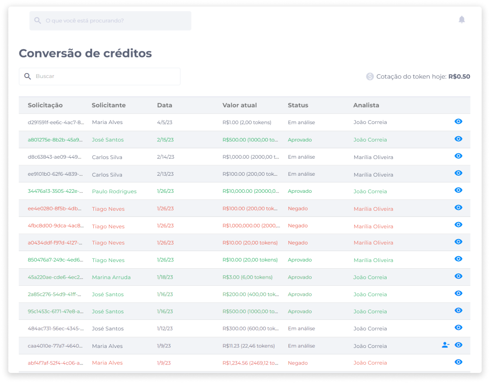

::: tip 🔐 Ativação da Licença <feature>LETTER_OF_CREDIT</feature>
O conteúdo desta página é válido somente se a licença [<feature>**LETTER_OF_CREDIT**</feature>](../about/licenses.md) estiver ativada.
:::

# Conversão de Créditos
A área de gerenciamento de conversões de crédito exibe o histórico de solicitações.

A lista inclui informações como ID da solicitação, nome do solicitante, data da solicitação, valor atual, status e nome do analista da solicitação.

Assim que um cliente faz uma solicitação, o pedido é exibido na lista de solicitações de conversão de créditos com o status **Novo**.

A partir disso, o operador do backoffice pode apenas visualizar a solicitação, ou atribuir a si mesmo a análise de tal solicitação.