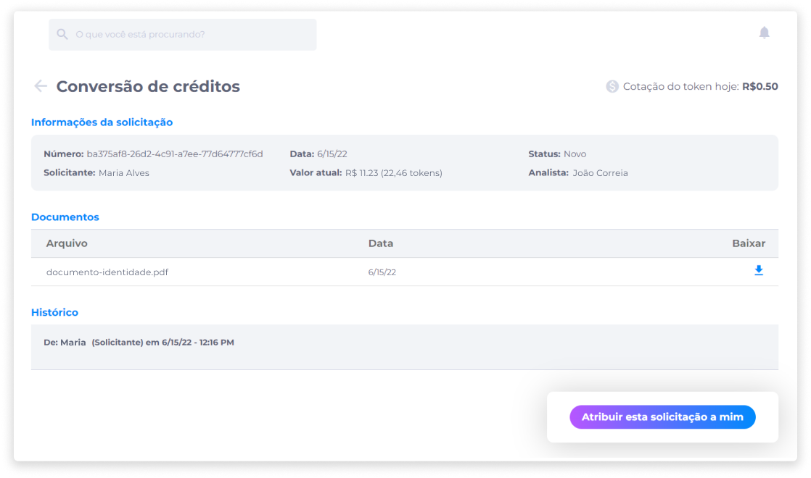
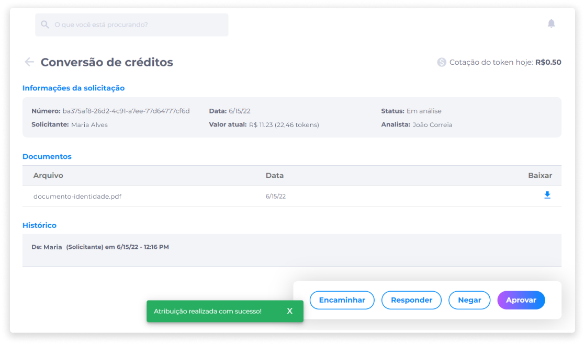
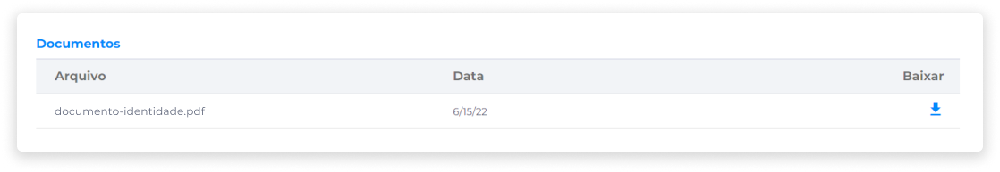
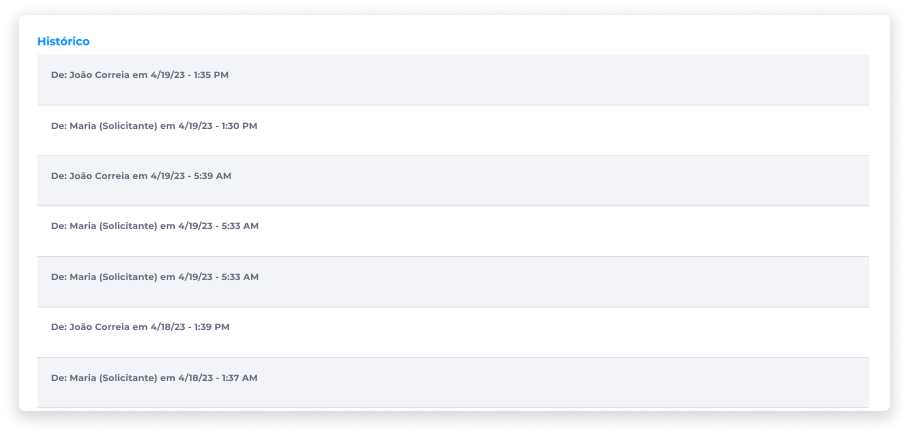
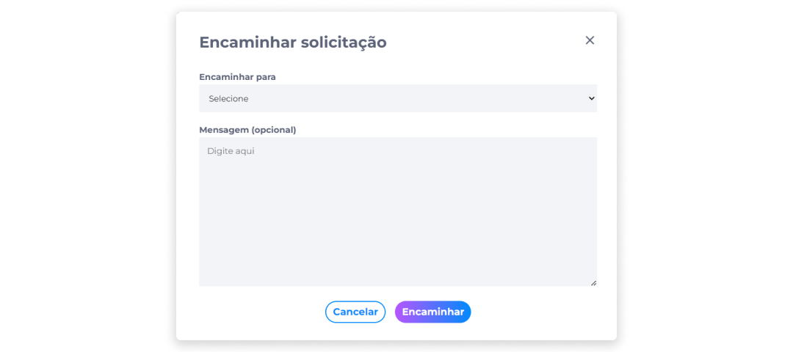
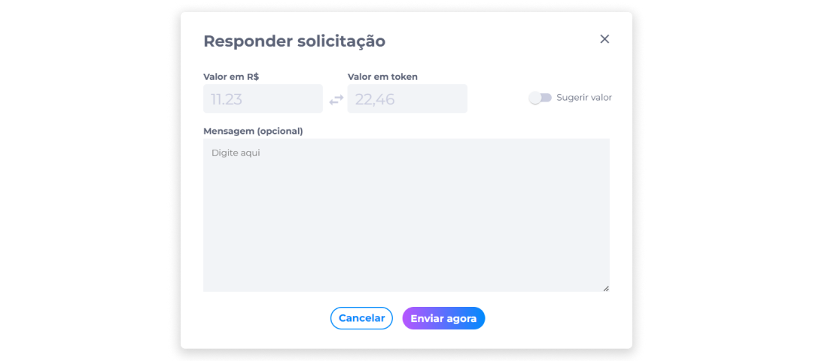
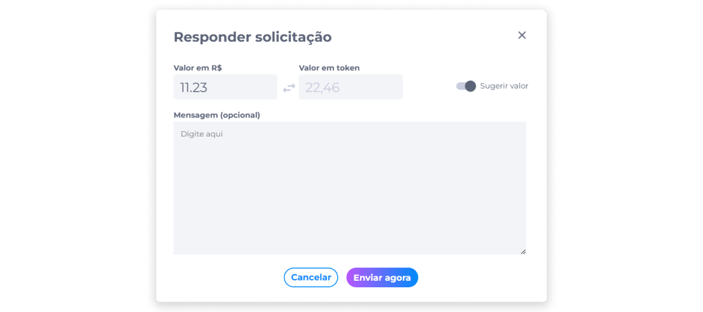
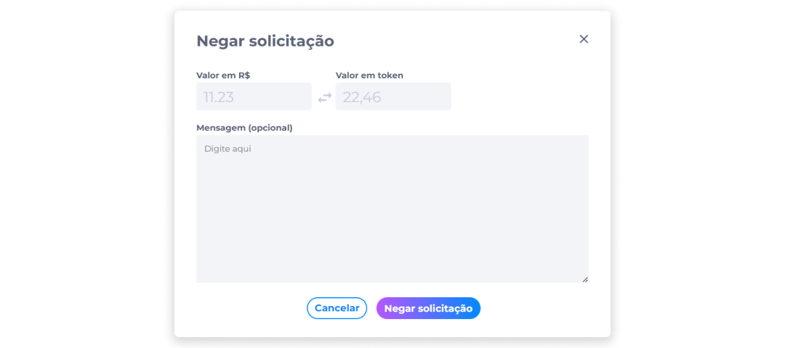
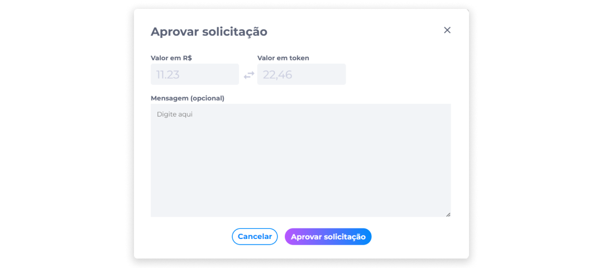

::: tip 🔐 Ativação da Licença <feature>LETTER_OF_CREDIT</feature>
O conteúdo desta página é válido somente se a licença [<feature>**LETTER_OF_CREDIT**</feature>](../about/licenses.md) estiver ativada.
:::

# Atribuição de Solicitação
Para assumir a responsabilidade pela análise de uma solicitação, o operador do backoffice deverá diretamente atribuir a ele mesmo a solicitação, clicando no ícone **Atribuir a mim**, na lista de solicitações.

Para consultar previamente os detalhes de uma solicitação antes de atribuir, clique em **Visualizar**.

Caso decida assumir a análise da solicitação, na página da solicitação, clique em **Atribuir esta solicitação a mim**.

Após atribuir solicitação a si mesmo, o administrador irá visualizar a confirmação da atribução e terá acesso a novas funções para aplicar alterações na solicitação.

A área de análise de solicitações é dividida em três seções: Informações da Solicitação, Documentos e Histórico.

### Informações da Solicitação
Nesta seção, é fornecida ao administrador uma visão geral da solicitação.

Aqui, são exibidas as seguintes informações:

- Número da solicitação
- Nome do solicitante
- Data de abertura da solicitação
- Valor atual (em moeda fiduciária e em tokens)
- Status
- Nome do analista

### Documentos
A seção Documentos exibe a lista de documentos enviados pelo solicitante. Para visualizar os documentos, é necessário baixá-los.

### Histórico
O histórico mostra o nome da pessoa solicitante, a data e a hora em que a solicitação foi enviada, além de todas as outras alterações que são feitas enquanto a solicitação estiver em aberto.

## Encaminhar Solicitação
Se durante a consulta de uma solicitação o operador identificar que a mesma já está atribuída a outra pessoa, ele tem a permissão de encaminhar a atribuição para um outro analista.

Para encaminhar uma solicitação:

1. Clique em **Encaminhar**.
2. Selecione o nome do analista a quem deseja encaminhar a solicitação.
3. Escreva uma mensagem com eventuais informações adicionais. (opcional)
4. Clique em **Encaminhar** para concluir a ação.

## Responder Solicitação
Caso haja uma oferta diferente, existe a possibilidade de o operador responder a solicitação e sugerir um outro valor para o vendedor. Neste caso, o operador deverá fazer uma proposta, a qual o vendedor poderá aceitar ou negar.

Para responder uma solicitação:

1. Clique em **Responder**.
2. Se desejar fazer uma nova proposta sobre o valor solicitado, ative a opção **Sugerir valor**.

3. Insira o novo valor sugerido.
4. Escreva uma mensagem com eventuais informações adicionais. (opcional)
5. Clique em **Enviar agora**.

## Negar Solicitação
Se por algum motivo o operador avaliar que a proposta enviada na solicitação não deve ser aprovada, ele pode proceder em negar a solicitação.

Para negar uma solicitação:

1. Clique em **Negar**.
2. Verifique o valor proposto na solicitação.
3. Escreva uma mensagem com eventuais informações adicionais. (opcional)
4. Clique em **Negar solicitação**.

## Aprovar Solicitação
Por outro lado, se o operador avaliar que a proposta enviada na solicitação atende aos critérios da loja, ele pode prosseguir com a aprovação da solicitação.

Para aprovar uma solicitação:

1. Clique em **Aprovar**.
2. Verifique o valor proposto na solicitação.
3. Escreva uma mensagem com eventuais informações adicionais. (opcional)
4. Clique em **Aprovar solicitação**.

::: info ℹ️ <infoblocktitle>Encerramento da Solicitação</infoblocktitle>
<infoblocktext>Toda proposta é encerrada assim que o operador ou o vendedor aceita ou nega uma proposta.</infoblocktext>
:::

::: info ℹ️ <infoblocktitle>Tokens adquiridos</infoblocktitle>
<infoblocktext>Os tokens adquiridos ficarão armazenados na conta do cliente que vendeu a carta de crédito. Assim, ele poderá gastar seus tokens na própria conta.
  
Caso este cliente queira vender ou transferir esses tokens, será necessário que ele possua conta em uma carteira digital, como por exemplo o Midas, que facilita na gestão de tokens para compra, venda e transferências, com facilidade e segurança.</infoblocktext>
:::