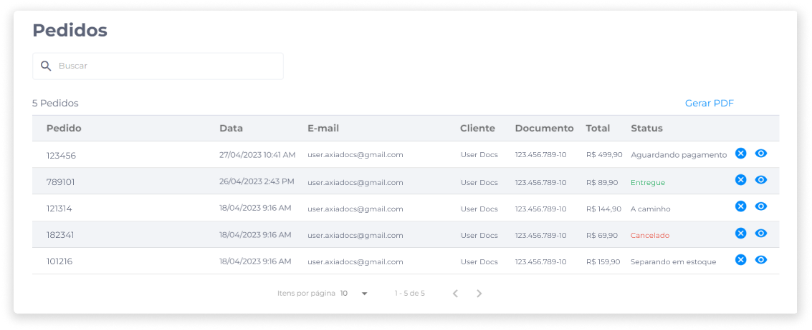
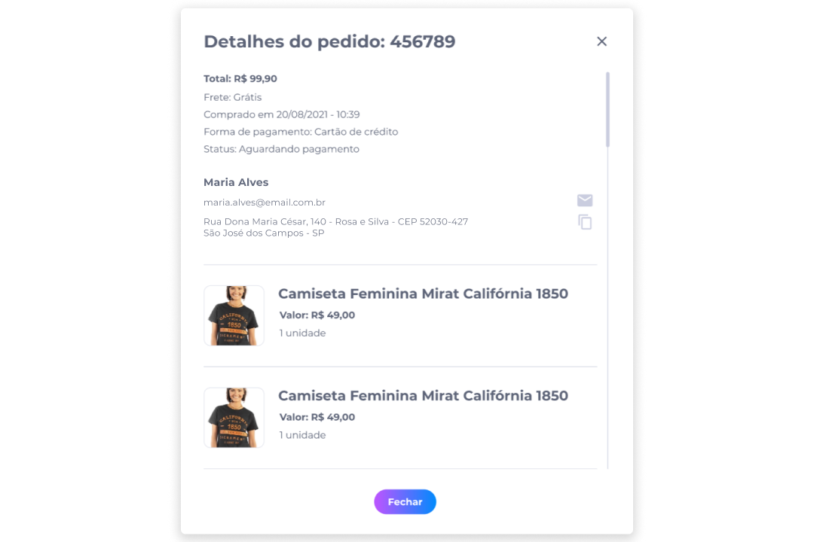

# Pedidos
A área de gerenciamento de pedidos exibe todos os pedidos da loja e possui informações essenciais, tais como o ID do pedido, a data da compra, os dados do cliente, o valor total e o status da compra.

Além disso, é o espaço onde o administrador irá se comunicar com os clientes para explicar possíveis dúvidas sobre o produto ou o processo de compra.

## Detalhes do Pedido
Para consultar os detalhes do pedido, no painel administrativo, clique em **Pedidos**.

Identifique ou busque pelo pedido que deseja consultar e clique em **Visualizar**. Na tela de detalhes, serão exibidas as seguintes informações:

- Valor total da compra
- Valor do frete
- Data e hora da compra
- Forma de pagamento
- Status da compra
- Nome, e-mail e endereço do cliente
- Produtos incluídos no pedido