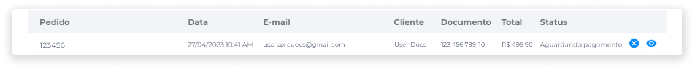
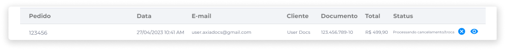

# Status de Pedidos
Na área de Pedidos, é possível consultar o status da compra. Alguns status serão atualizados automaticamente, porém, alguns terão que ser atualizados manualmente.

Abaixo estão descritos possíveis cenários de compra e cancelamento, a fim de exibir o fluxo do processo em cada tipo de status.

### Status: Criado
Quando um cliente já possui cadastro na loja e realiza uma compra, o pedido recebe o status **Criado**, que indica o registro de um pedido no sistema.

### Status: Aguardando Pagamento
Após a criação do pedido, este recebe o status **Aguardando Pagamento**, indicando que a loja está aguardando o processamento do pagamento por parte da instituição financeira. Dependendo do meio de pagamento selecionado, pode levar algum tempo até que este processamento seja concluído.

O retorno do processamento pode ser positivo (informando que o pagamento foi confirmado), ou negativo (informando que o pagamento foi recusado).

Caso o pagamento seja recusado, o cliente deverá ter a opção de tentar novamente, se desejar.

O cancelamento do pedido pelo cliente é possível nesta fase. Se cancelamento da compra for solicitado, uma vez que o pagamento ainda não foi confirmado, o pedido irá receber o status **Cancelado**.

### Status: Separando em Estoque
A loja poderá confirmar se o produto será entregue ou não. Quando o pedido receber este status, significa que o pagamento foi confirmado, cabendo à loja confirmar ou recusar a entrega por qualquer motivo.

Caso a loja decida recusar a entrega, uma vez que o pagamento já foi efetuado, a loja deverá realizar o processo de estorno, a fim de garantir que o pagamento seja devolvido ao cliente, e alterar o status do pedido para **Cancelado**.

Sempre que o estorno for confirmado pela instituição financeira, o pedido é cancelado, e a atualização deste status deve ser feita manualmente.

Também pode acontecer de o próprio cliente solicitar o cancelamento durante esta etapa. Neste caso, o pedido receberá automaticamente o status **Processando cancelamento/troca**.

### Status: A caminho
Se a loja decidir confirmar a entrega, o pedido receberá o status **A caminho**, que indica que o pagamento foi confirmado, a loja confirmou a entrega, o produto foi separado e já se encontra em processo de entrega para o endereço cadastrado pelo o cliente durante a realização do pedido.

Nesta fase, caso o cliente decida pelo cancelamento da compra, não haverá fluxo no Kairos para lidar com tal situação. Portanto, o cliente precisará entrar em contato direto com a loja para alinhar como proceder com o cancelamento.

A atualização deste status deve ser feita manualmente.

### Status: Processando cancelamento/troca
Caso o cliente solicite o cancelamento da compra, o status será alterado para **Processando cancelamento/troca**, cabendo à loja analisar se o cancelamento será possível ou não.

Este fluxo só é possível caso o produto esteja com o status **Separando em estoque** e o cliente tenha solicitado o cancelamento do pedido. Isto é necessário porque, neste caso, o pagamento já foi efetuado pelo cliente e recebido pela loja, que deverá efetuar o estorno.

Cada pedido de cancelamento deverá ser analisado manualmente pelo administrador da loja, que terá a opção de confirmar ou recusar o cancelamento.

Caso o administrador da loja recuse o cancelamento, o cliente deverá entrar em contato diretamente com a loja para definir como proceder.

Caso o administrador da loja confirme o cancelamento, o processo será finalizado somente quando o estorno for efetuado na plataforma da instituição financeira, então, a loja é comunicada sobre o reembolso e deve fazer a atualização do status manualmente.

### Status: Cancelado
Um pedido pode receber o status **Cancelado** nas seguintes situações:

- Quando o pagamento não tiver sido confirmado após alguns dias.
- Quando o usuário solicitar o cancelamento antes da confirmação do pagamento.

Caso o pagamento já tenha sido confirmado e o cliente solicite o cancelamento, se a operadora da loja concordar com a solicitação de cancelamento, o pedido de reembolso deve ser realizado por meio da plataforma da instituição financeira.

Quando a loja receber a mensagem de reembolso, o pedido é automaticamente cancelado.

### Status: Entregue
Caso a etapa de entrega ocorra normalmente e o cliente receba o produto, a empresa responsável pela entrega informa automaticamente ao Kairos que a entrega foi realizada. Então, o pedido automaticamente recebe o status **Entregue**.

::: info ℹ️ <infoblocktitle>Etapa de Entrega</infoblocktitle>
<infoblocktext>A fase de entrega não possui nenhum processo automático para realizar o cancelamento. Caso o usuário queira cancelar a compra nesta fase, deverá entrar em contato diretamente com a loja e negociar com ela.</infoblocktext>
:::