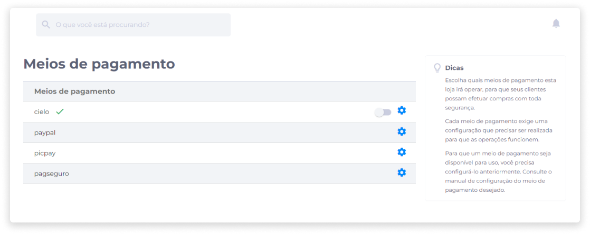
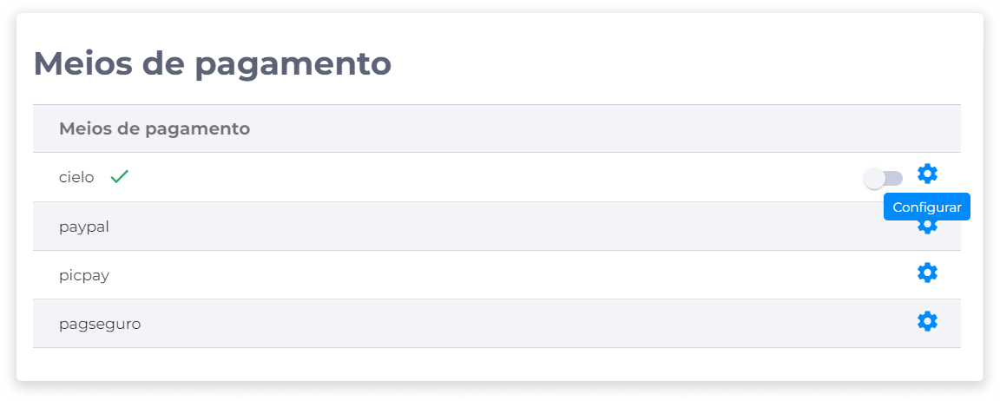
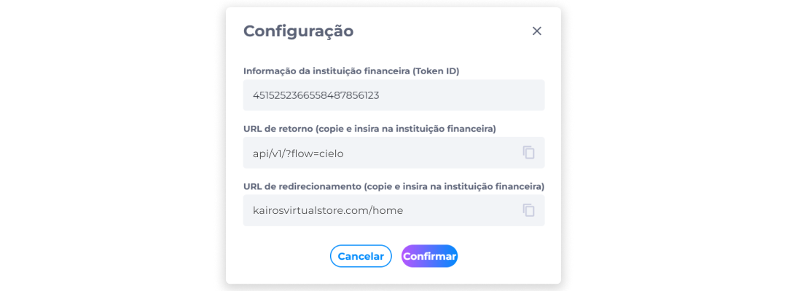

# Meios de Pagamento
Os meios de pagamento que serão aceitos pela loja deverão ser previamente configurados para que os clientes efetuem suas compras com segurança.

No Kairos, para que um meio de pagamento apareça disponível no carrinho, é exigida uma prévia configuração para que as operações funcionem corretamente.

Para definir estas configurações, identifique o meio de pagamento que deseja adicionar à loja.

1. Clique em **Configurar**.

2. Forneça a informação (Token ID) da instituição financeira.

::: info ℹ️ <infoblocktitle>Token ID</infoblocktitle>
<infoblocktext>O Token ID funciona como um identificador gerado pela instituição financeira para representar um cartão de crédito ou débito de um cliente em um sistema de pagamento que utiliza a API da instituição financeira selecionada (Cielo, PagSeguro, PayPal, PicPay etc).
  
Este recurso protege as informações do cartão do cliente durante o processo de transações, reduzindo o risco de fraudes e aumentando a confiabilidade e a privacidade dos dados.</infoblocktext>
:::
 
3. Verifique a informação sobre o URL de Retorno.

::: info ℹ️ <infoblocktitle>URL de Retorno</infoblocktitle>
<infoblocktext>Será o endereço que irá retornar informações para a plataforma após a conclusão de uma transação em outro site ou aplicação.
  
A URL de Retorno está relacionada à integração com sistemas da instituição financeira. Portanto, para configurar corretamente, é necessário consultar o manual de configuração das instituições que intermediam meios de pagamento, como Cielo, PayPal, PicPay e PagSeguro.</infoblocktext>
:::

 
4. Verifique a informação sobre o URL de Redirecionamento.

::: info ℹ️ <infoblocktitle>URL de Redirecionamento</infoblocktitle>
<infoblocktext>Será o endereço que irá redirecionar o cliente de volta à loja após a conclusão de um pagamento para que ele possa concluir a transação e receber a confirmação de compra.</infoblocktext>
:::