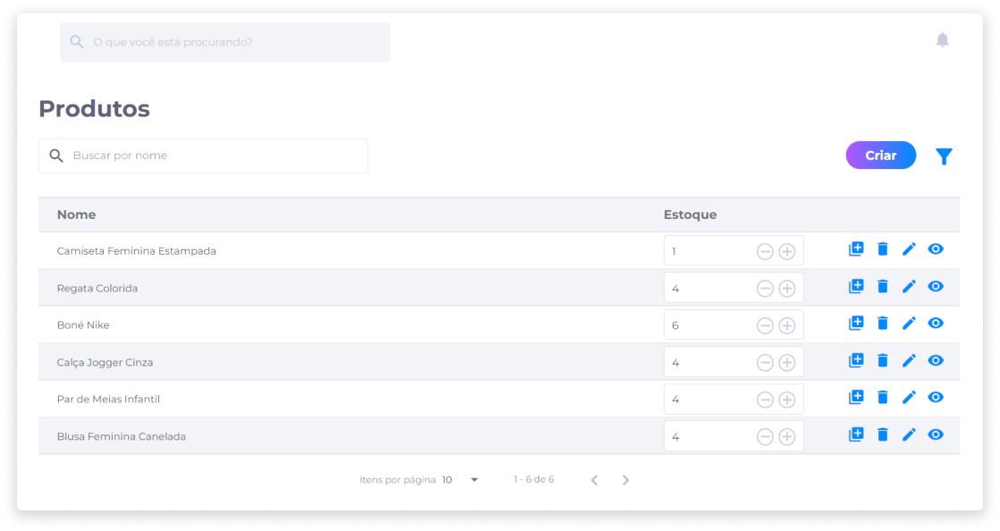

# Produtos
A área de gerenciamento de produtos possibilita ao administrador da loja cadastrar, editar, duplicar, deletar itens e visualizar os produtos cadastrados na loja, podendo filtrar a exibição dos itens através do campo de busca ou do filtro por categorias e preços.

Além disso, o gerenciamento de produtos é feito de modo que o administrador consiga ter um controle de estoque fácil, rápido e editável.

Através do campo **Estoque**, é possível aumentar ou diminuir a quantidade de itens no estoque sem que seja necessário acessar a área de edição geral do produto.

