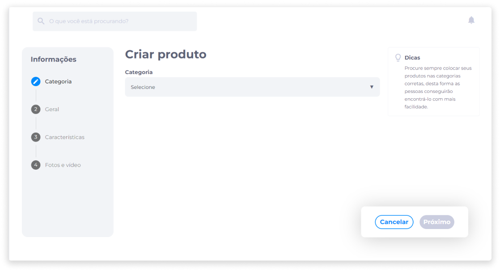
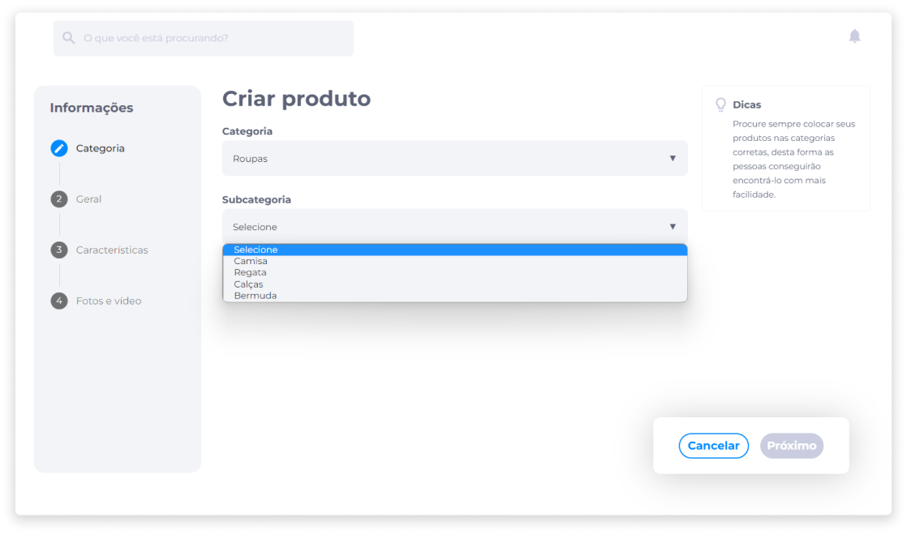
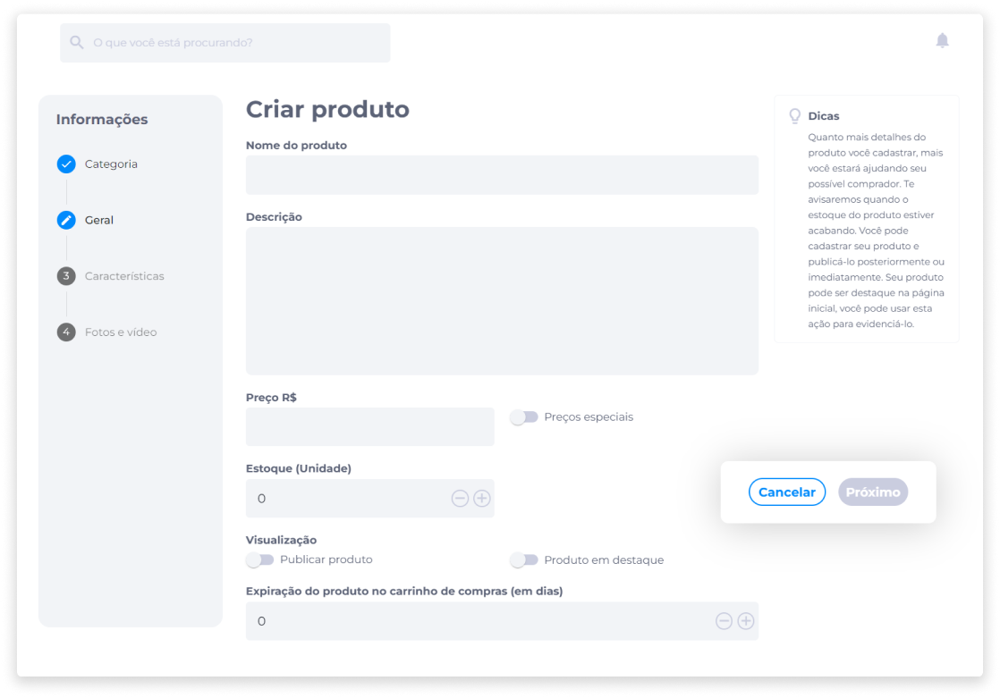
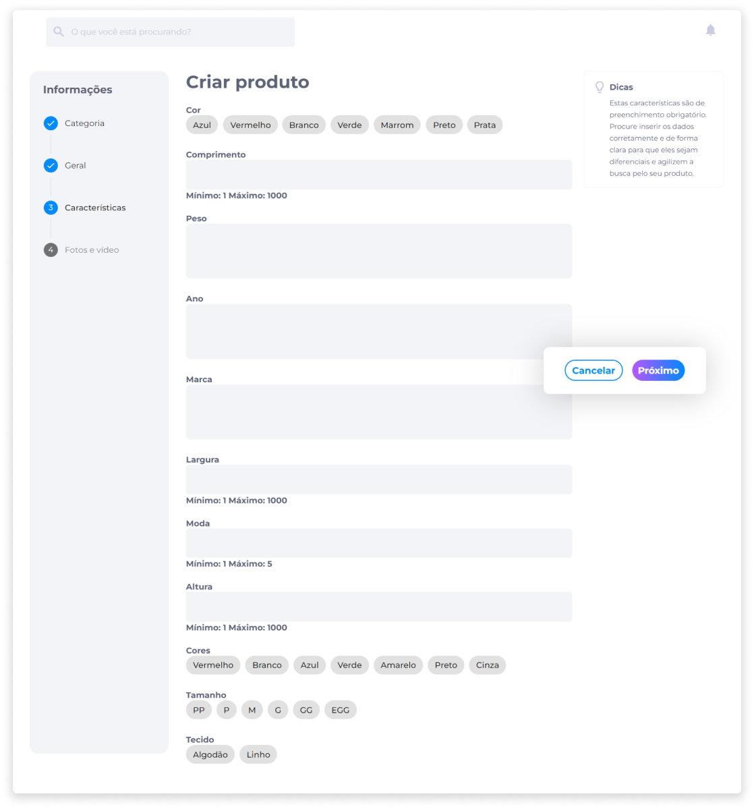
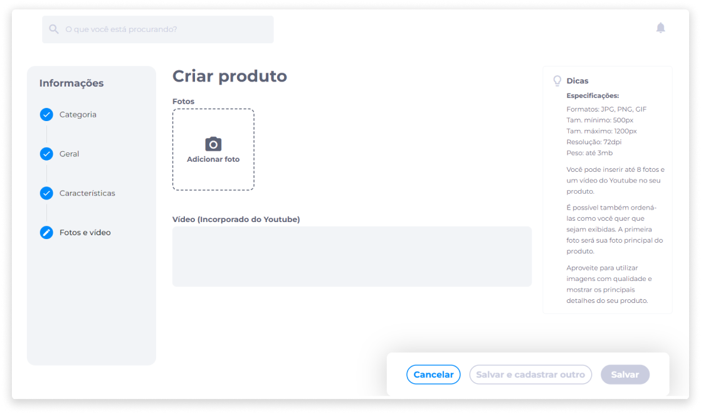
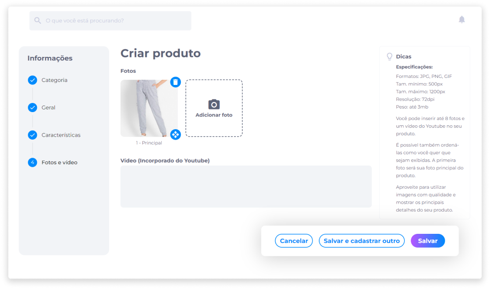

# Criar um produto
Um produto deve sempre pertencer à uma subcategoria de nível mais baixo dentro da hierarquia de categorias, e deve estar vinculado a apenas uma subcategoria.

Todos os produtos devem ser cadastrados dentro de uma categoria ou subcategoria. Portanto, nenhum produto poderá ser criado sem antes estar submetido a uma categoria, pois isto facilita para o usuário a atividade de busca por produtos na loja.

Além disso, antes de cadastrar um produto, é importante configurar as características flexíveis, pois este será um requisito obrigatório.

Para criar um novo produto, no painel administrativo, clique em **Produtos**.

Em seguida, clique em **Criar**.

### 1) Categoria
1. Selecione a categoria à qual o produto irá pertencer.

2. Selecione a subcategoria (se houver).

### 2) Geral
3. Insira o nome do produto.
4. Adicione uma descrição.
5. Insira o preço (R$).
6. [<feature><🔐 **SPECIAL_PRICE**</feature>](../about/licenses.md) Selecione se o produto receberá a aplicação de preços especiais.

::: info ℹ️ <infoblocktitle>Sobre Preços Especiais</infoblocktitle>
<infoblocktext>Com a aplicação de preços especiais, o preço final do produto é baseado nas referidas variáveis.
  
<li><b>Custos ADM (%)</b></li>
Os custos ADM (Administrativos) são custos relacionados à gestão e administração da empresa. O cálculo dos custos administrativos sobre o preço de um produto é feito através da aplicação de uma taxa percentual sobre os custos diretos de produção do produto.
  
<li><b>Margem (%)</b></li>
A margem é uma medida utilizada para calcular a margem de lucro de um produto, expressa como uma porcentagem do preço de venda. Além disso, é importante para avaliar a rentabilidade de um produto, sendo frequentemente utilizada para tomar decisões estratégicas, como determinar preços de venda, investimentos em novos produtos, entre outros.
  
<li><b>Valor (%)</b></li>
O valor é uma medida derivada da marca, que busca avaliar a força e a percepção da marca em relação aos seus concorrentes e ao mercado em geral.
  
<li><b>Reserva de Contingência (%)</b></li>
É um montante de recursos financeiros que uma empresa ou organização mantém separado de seu orçamento operacional normal, para ser usado em caso de imprevistos ou emergências.
  
<li><b>Fundos de Reserva (%)</b></li>
São reservas financeiras mantidas por uma empresa ou organização para atender a objetivos específicos, como cobrir despesas futuras, contingências ou riscos financeiros.
  
<li><b>Seguro de Carga (%) (opcional)</b></li>
É um tipo de seguro que protege os proprietários de mercadorias e empresas de transportes contra perdas financeiras resultantes de danos, roubo ou perda de carga durante o transporte de mercadorias.
</infoblocktext>
:::

[<feature> **SPECIAL_PRICE**></feature>](../about/licenses.md)

7. Indique quantas unidades do produto estarão disponíveis em estoque (se for um produto comprável).
8. Selecione se o produto deve ser publicado.
9. Selecione se o produto deve ser exibido como produto em destaque na loja.
10. Indique o tempo (em dias) de expiração do produto no carrinho de compras do cliente.

::: warning <warningblocktitle>⚠️ Atenção</warningblocktitle>
<warningblocktext>Se o limite de tempo configurado em <b>Lojas</b> for diferente, será considerado o limite configurado em <b>Produtos</b> (se o produto for do tipo comprável).</warningblocktext>
:::

### 3) Características
11. Selecione as características e parâmetros que irão definir o produto.

> <b>Exemplo</b>: Cor, Comprimento, Altura, Largura, Peso, Ano, Marca etc.

### 4) Fotos e Vídeo
12. Insira fotos do produto (máximo 8 fotos).

::: info ⚙️ <infoblocktitle>Especificações de Imagem</infoblocktitle>
 
<infoblocktext>- <b>Formatos aceitos</b>: JPG, PNG e GIF. 
- <b>Tamanho mínimo</b>: 500px. 
- <b>Tamanho máximo</b>: 1200px. 
- <b>Resolução</b>: 72dpi. 
- <b>Peso</b>: até 3MB.</infoblocktext>
:::

- Pressionando e movendo ícone **Mover**, é possível reordenar as imagens na sequência desejada.
- Para remover uma foto, clique no ícone **Deletar**.

No cadastro, será possível incluir 1 vídeo do produto, que sempre será exibido por último (após as imagens). A inclusão do vídeo não é obrigatória, porém, se for incluído no cadastro do produto, é necessário que ele esteja previamente carregado no YouTube.

Para inserir o vídeo, basta copiar a URL do YouTube e copiar no campo **Vídeo**.

13. Clique em **Salvar** para concluir o cadastro do produto. Caso deseje cadastrar um novo produto em seguida, clique em **Salvar e cadastrar outro**.