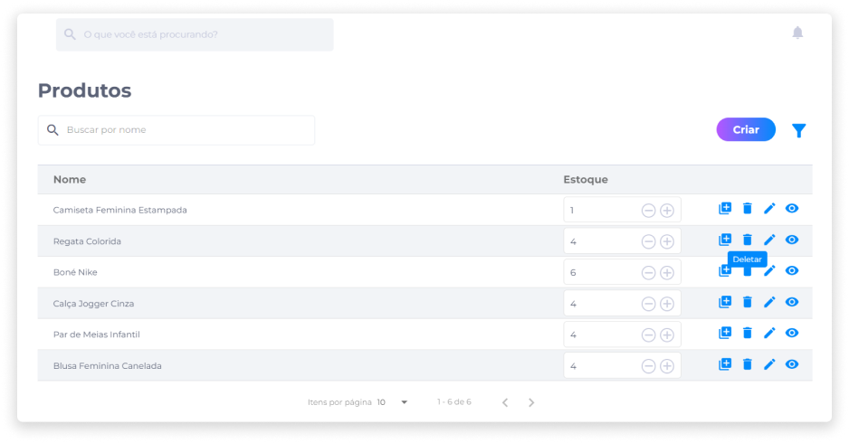

# Deletar um produto
Em **Produtos**, identifique ou busque pelo produto que deseja deletar.

1. Clique no ícone **Deletar**.

2. Confirme se realmente deseja deletar o produto.

::: danger ⚠️ <dangerblocktitle>Atenção</dangerblocktitle>
<dangerblocktext>Deletar um produto é um procedimento irreversível e fará com que todas as suas configurações sejam perdidas. Caso queira recuperá-lo, será necessário criar um novo.</dangerblocktext>
:::