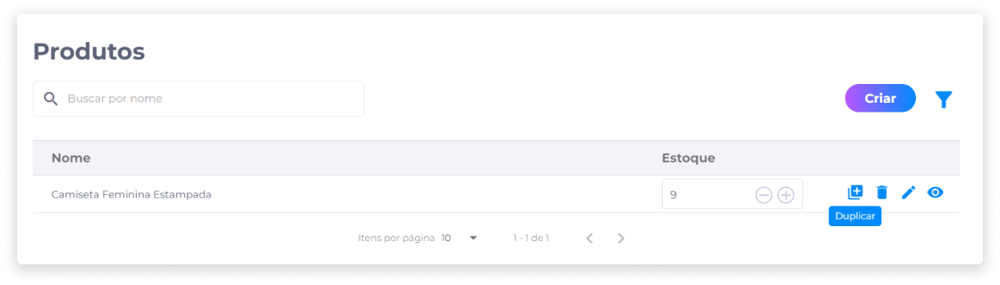

# Duplicar um produto
Outra funcionalidade disponível no gerenciamento de produtos é a ação de duplicar produtos, que adiciona uma nova unidade de um produto anteriormente cadastrado, sem a necessidade de configurar um novo produto do zero.

Esta funcionalidade contribui para a otimização de tempo do administrador no gerenciamento de seus produtos.

Com a duplicação de um item de mesma categoria, por exemplo, todas as informações previamente cadastradas podem ser mantidas e receber alterações apenas em campos específicos, de acordo com o objetivo do administrador.

Para duplicar um produto, basta identificar na lista o produto que será duplicado e clicar no ícone **Duplicar**.

