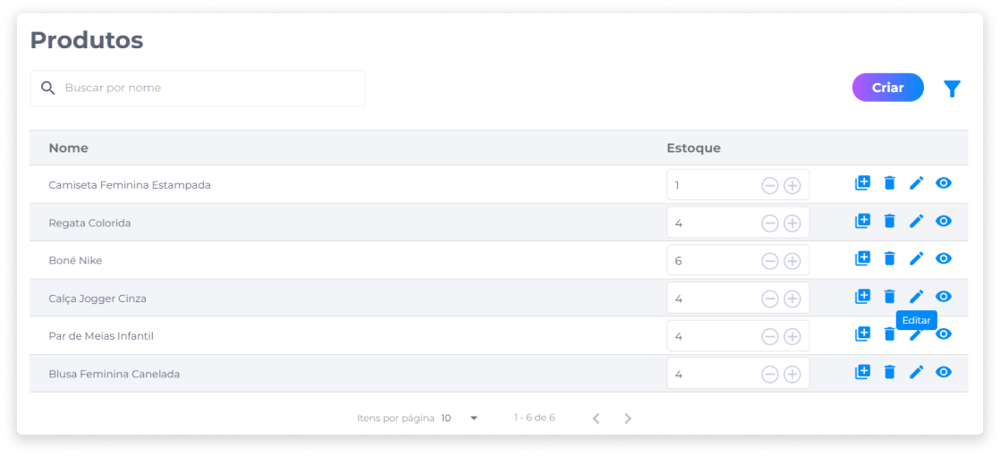
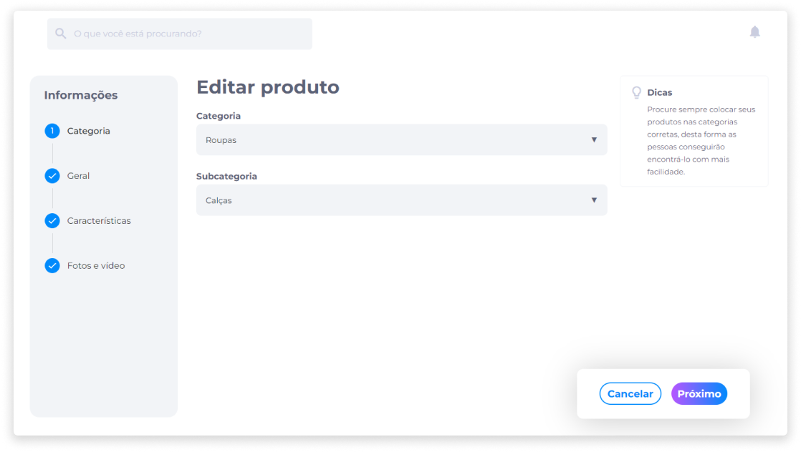

# Editar um produto
Em **Produtos**, identifique ou busque pelo produto que deseja editar.

1. Clique no ícone **Editar**.

2. Edite as informações nos campos desejados.

3. Prossiga até a última etapa da edição e clique em **Salvar** para confirmar as alterações.