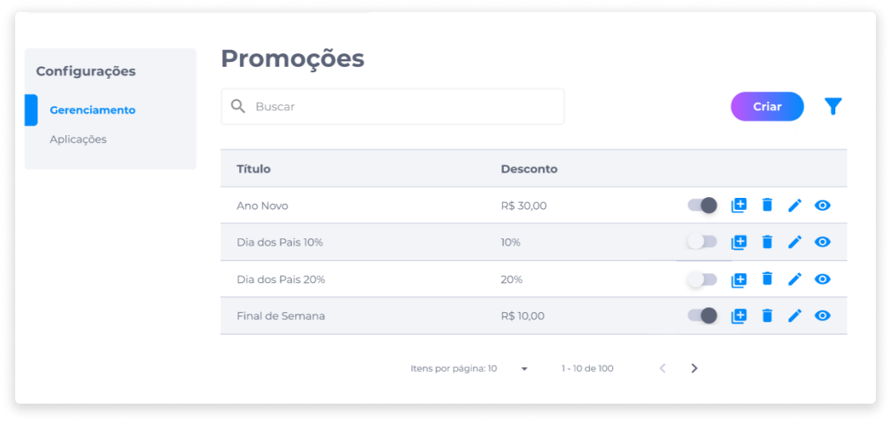

# Promoções
A funcionalidade Promoções permite ao administrador criar, editar, duplicar, ativar/desativar e deletar uma promoção, facilitando o gerenciamento destas ações.

As promoções podem ser aplicadas em valor de porcentagem ou valor absoluto.

> <b>Exemplo</b>: Se uma camiseta custa R$ 60,00 e o valor de porcentagem da promoção for 50% de desconto, a camiseta sairá por R$ 30,00.   Se a promoção for por um valor absoluto de R$ 20,00, a camiseta sairá por R$ 40,00.

A porcentagem pode variar de 0% a 100%, e o valor absoluto não pode ser maior que o valor dos produtos em promoção. 

Só pode haver apenas uma promoção ativa por produto, ou seja, a loja pode ter duas promoções em andamento, porém, cada uma deve abranger uma lista de produtos diferentes uma da outra.

Caso algum produto ou categoria de produtos que já esteja em promoção entre na lista de outra promoção, o sistema irá exibir um aviso na tela informando que os produtos daquela categoria não receberão esta promoção por já estarem em outra.