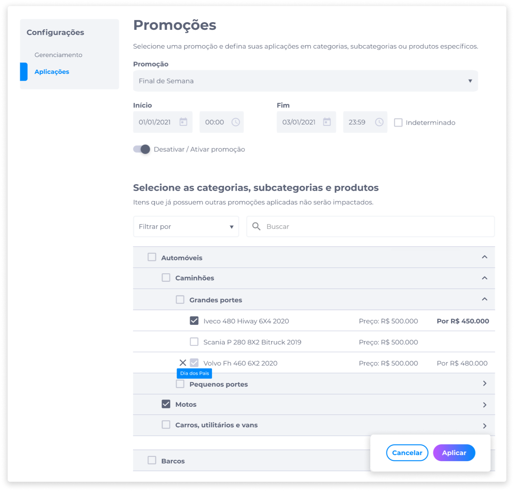

# Aplicação de Promoção
Para aplicar uma promoção, é preciso ter criado uma promoção na aba **Gerenciamento**.

Após criar uma promoção, clique em **Aplicações**:

1. Selecione o nome da promoção que será aplicada.
2. Selecione uma data e hora para o início da promoção.
3. Selecione uma data e hora para o fim da promoção. Também é possível definir o período de promoção como **Indeterminado**.
4. Selecione **Ativar/desativar** para manter a promoção ativada ou desativada.
5. Selecione as categorias, subcategorias e produtos da promoção. Podem ser selecionados:
    - Uma categoria inteira, que irá incluir todas as subcategorias (se houver).
    - Uma subcategoria inteira, que irá incluir todos os produtos.
    - Todos ou alguns produtos de uma ou mais subcategorias.
6. Clique em **Aplicar**.

::: info ℹ️ <infoblocktitle>Promoções aplicadas</infoblocktitle>
<infoblocktext>Itens que já possuem outras promoções aplicadas não serão impactados por novas aplicações.</infoblocktext>
:::