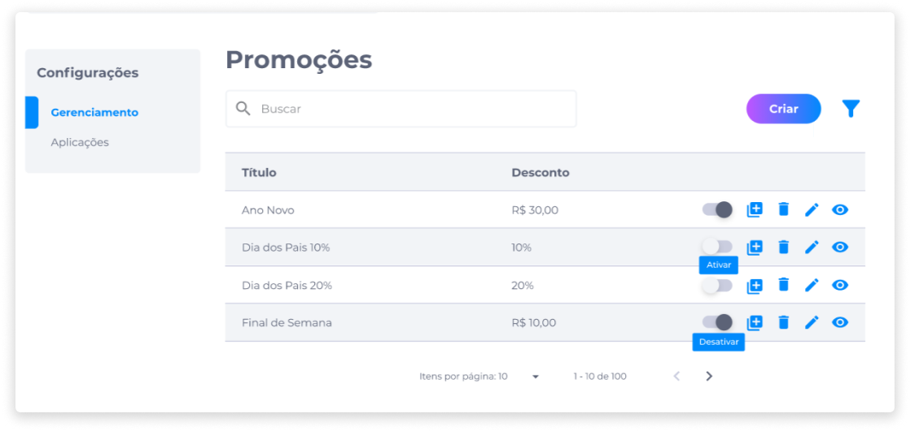
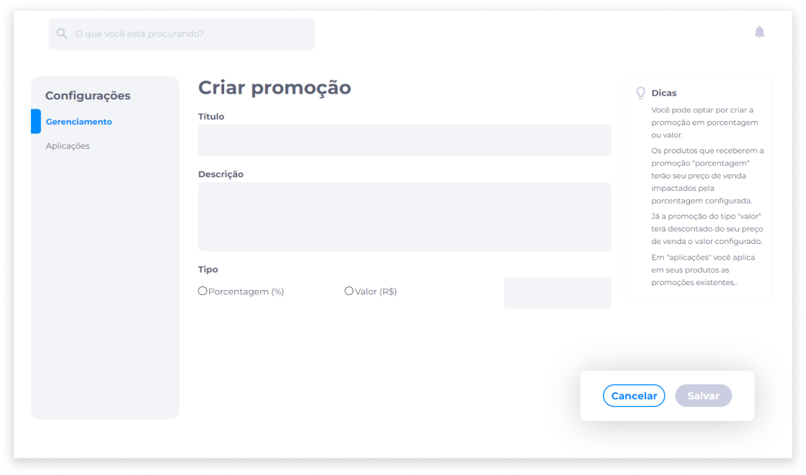
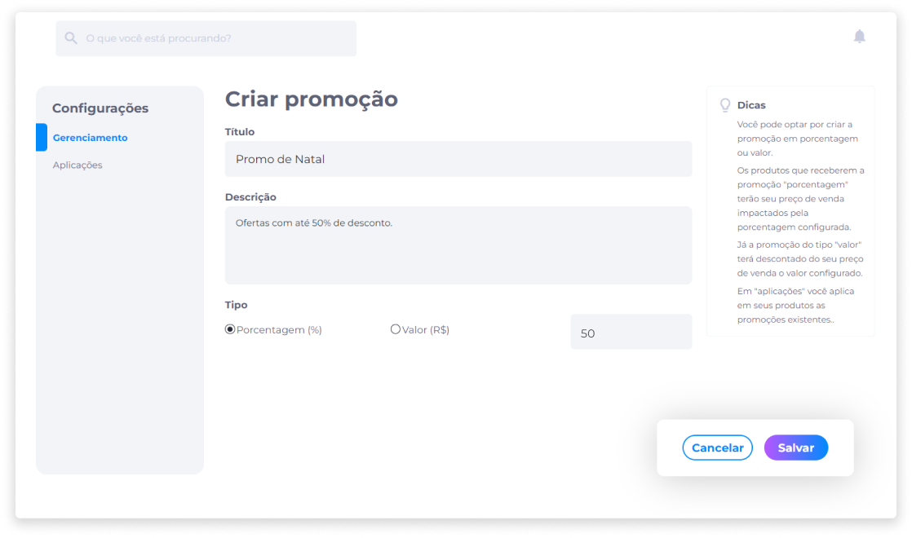
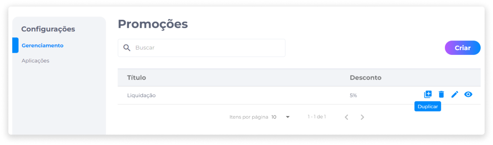
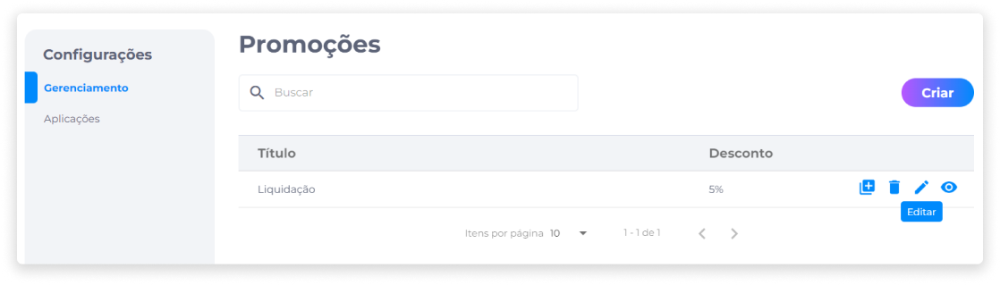
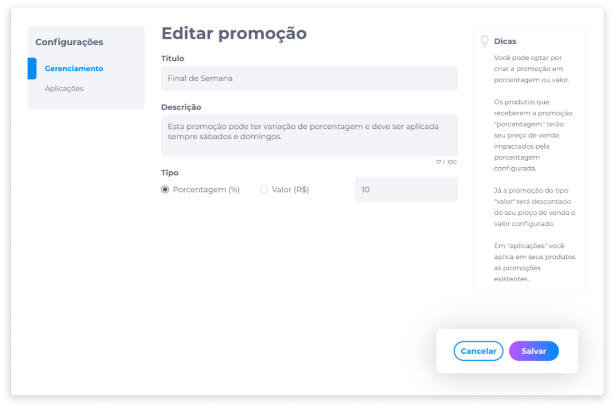
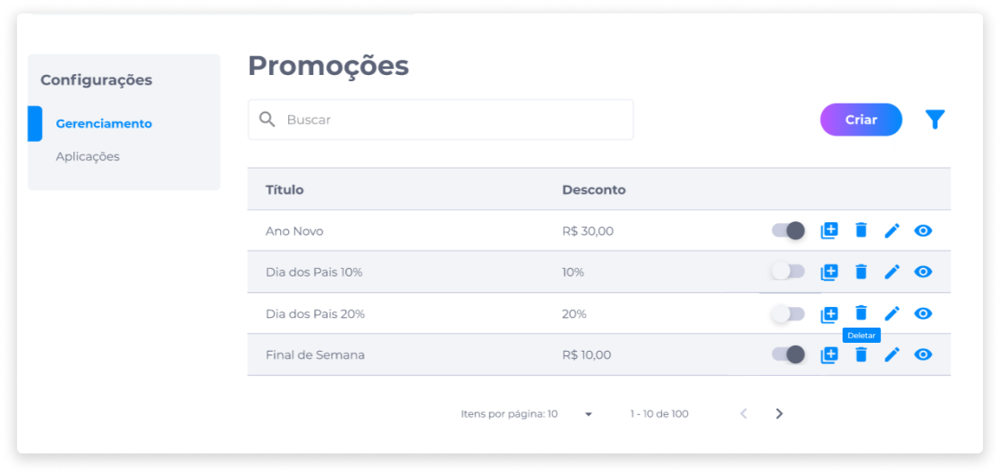

# Gerenciamento de Promoções
Na área de gerenciamento de promoções, o administrador poderá criar e editar as promoções que a loja terá. Estas configurações ficarão salvas no sistema, podendo ser ativadas quando o usuário quiser, ou seja, a loja poderá criar promoções fixas para feriados e outros eventos.

### Criar uma promoção
Para criar uma nova promoção, no painel administrativo, clique em **Promoções**.

1. Clique em **Criar**.

2. Insira o título da promoção.
3. Adicione uma descrição.
4. Selecione se a promoção será em valor de porcentagem ou valor absoluto.
	- Os produtos que receberem a promoção em porcentagem terão seu preço de venda impactados pela porcentagem configurada.
	- A promoção do tipo "valor" terá descontado do seu preço de venda o valor configurado.
5. Insira o valor em número.

6. Clique em **Salvar**.

### Duplicar uma promoção
Como parte da área de gerenciamento de promoções, a funcionalidade de duplicar promoções permite ao administrador incluir uma promoção igual a outra previamente cadastrada, sem a necessidade de configurar uma nova. Isto contribui para a otimização de tempo do administrador no gerenciamento da loja e suas operações.

Para duplicar uma promoção, basta identificar ou buscar na lista pela promoção que será duplicada e clicar no ícone **Duplicar**.

### Editar uma promoção
Na lista de promoções cadastradas, identifique ou busque pela promoção que deseja editar.

1. Clique no ícone **Editar**.

2. Edite as informações nos campos desejados.

3. Clique em **Salvar** para confirmar as alterações.

### Deletar uma promoção
Na lista de promoções cadastradas, identifique ou busque a promoção que deseja deletar.

1. Clique no ícone **Deletar**.

2. Confirme se realmente deseja deletar a promoção.

::: danger ⚠️ <dangerblocktitle>Atenção</dangerblocktitle>
<dangerblocktext>Deletar uma promoção é um procedimento irreversível e fará com que todas as suas configurações sejam perdidas. Caso queira recuperá-la, será necessário criar uma nova.</dangerblocktext>
:::