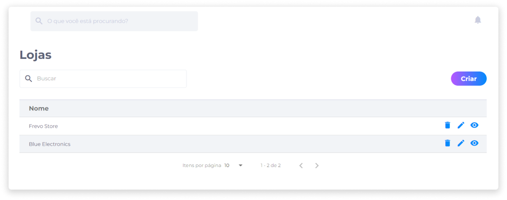

# Lojas
A criação de lojas com o Kairos permite que administradores de lojas utilizem a plataforma para comercializar seus produtos. A abertura da plataforma contará com um único proprietário, porém, através da configuração, cada loja terá seu próprio administrador e usuários específicos.

O administrador ou funcionário de uma determinada loja não poderá interferir nas configurações de outra loja.