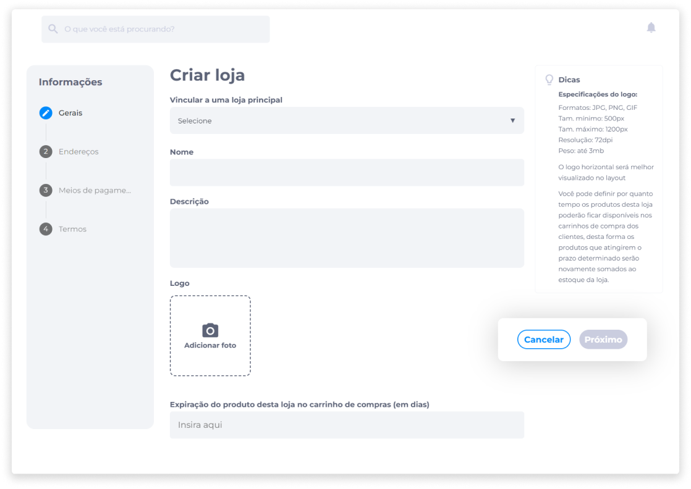
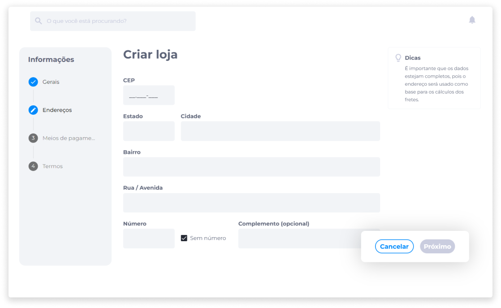
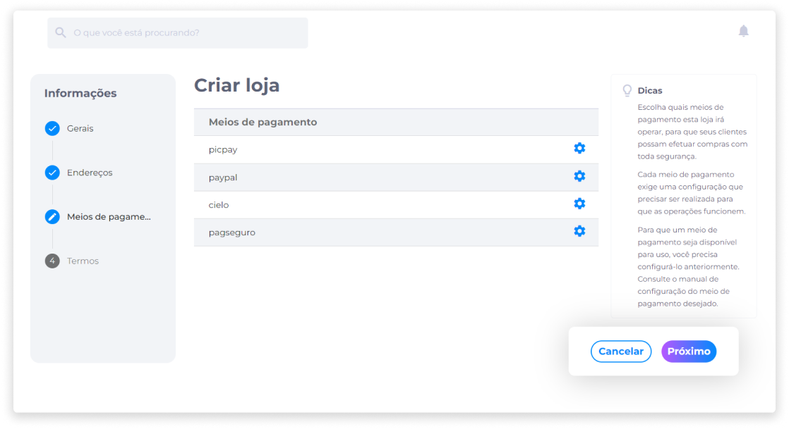
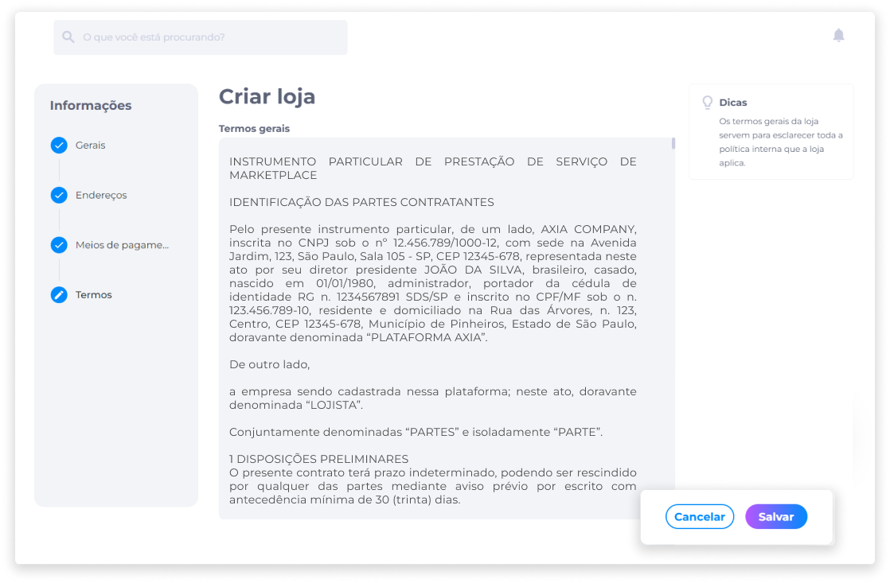

# Criar uma loja
Para criar uma loja, no painel administrativo, clique em **Lojas**.

Em seguida, clique em **Criar**.

### 1) Gerais
1. Insira o nome da loja.
2. Adicione uma descrição.
3. Adicione o logo da loja.

::: info ⚙️ <infoblocktitle>Especificações de Logo</infoblocktitle>
 
<infoblocktext>- <b>Formatos aceitos</b>: JPG, PNG e GIF. 
- <b>Tamanho mínimo</b>: 500px. 
- <b>Tamanho máximo</b>: 1200px. 
- <b>Resolução</b>: 72dpi. 
- <b>Peso</b>: até 3MB.  
💡 Se o logo estiver na posição horizontal, será melhor visualizado no layout.</infoblocktext>
:::

4. Indique o tempo (em dias) de expiração dos produtos da loja no carrinho de compras do cliente.

::: warning <warningblocktitle>⚠️ Atenção</warningblocktitle>
<warningblocktext>Se o limite de tempo configurado em <b>Lojas</b> for diferente do limite de tempo configurado em Produtos, será considerado o limite configurado em <b>Produtos</b>.</warningblocktext>
:::

### 2) Endereços
5. Forneça o CEP do endereço. Os demais campos serão preenchidos automaticamente.
6. Informe o número do endereço.
7. Informe o complemento (opcional).

::: warning ⚠️ <warningblocktitle>Dados de Endereço</warningblocktitle>
<warningblocktext>É importante que os dados estejam completos, pois o endereço será usado como base para os cálculos dos fretes.</warningblocktext>
:::

### 3) Meios de Pagamento
8. Dentre os meios de pagamento disponíveis, selecione aqueles que serão aceitos pela loja.
9. Clique no ícone **Configurar**.

10. Forneça a informação (Token ID) da instituição financeira.

::: info ℹ️ <infoblocktitle>Token ID</infoblocktitle>
<infoblocktext>O Token ID funciona como um identificador gerado pela instituição financeira para representar um cartão de crédito ou débito de um cliente em um sistema de pagamento que utiliza a API da instituição financeira selecionada (Cielo, PagSeguro, PayPal, PicPay etc).
  
Este recurso protege as informações do cartão do cliente durante o processo de transações, reduzindo o risco de fraudes e aumentando a confiabilidade e a privacidade dos dados.</infoblocktext>
:::

::: info ℹ️ <infoblocktitle>URL de Retorno</infoblocktitle>
<infoblocktext>Será o endereço que irá retornar informações para a plataforma após a conclusão de uma transação em outro site ou aplicação.</infoblocktext>
:::

::: info ℹ️ <infoblocktitle>URL de Redirecionamento</infoblocktitle>
<infoblocktext>Será o endereço que irá redirecionar o cliente de volta à loja após a conclusão de um pagamento para que ele possa concluir a transação e receber a confirmação de compra.</infoblocktext>
:::

### 4) Termos
11. Escreva os termos gerais para informar sobre a política interna da loja.

12. Clique em **Salvar**.