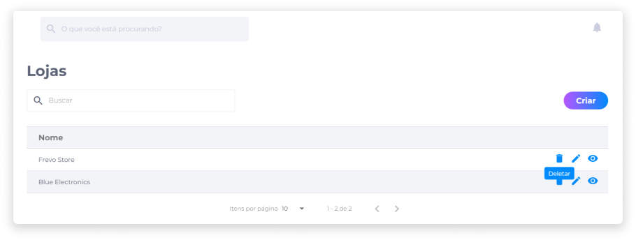

# Deletar uma loja
Em **Lojas**, identifique ou busque pela loja que deseja deletar.

1. Clique no ícone **Deletar**.

2. Confirme se realmente deseja deletar a loja.

::: danger ⚠️ <dangerblocktitle>Atenção</dangerblocktitle>
<dangerblocktext>Deletar uma loja é um procedimento irreversível e fará com que todas as suas configurações sejam perdidas. Caso queira recuperá-la, será necessário criar uma nova.</dangerblocktext>
:::